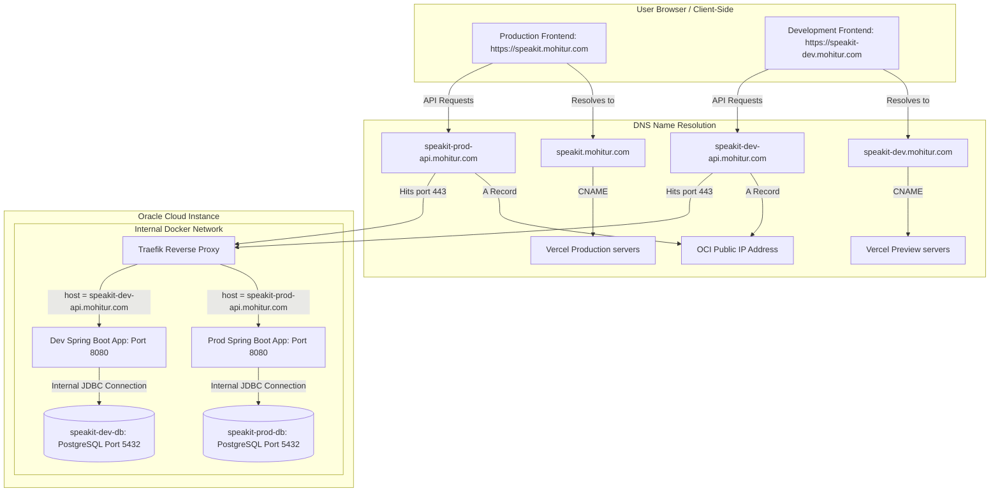
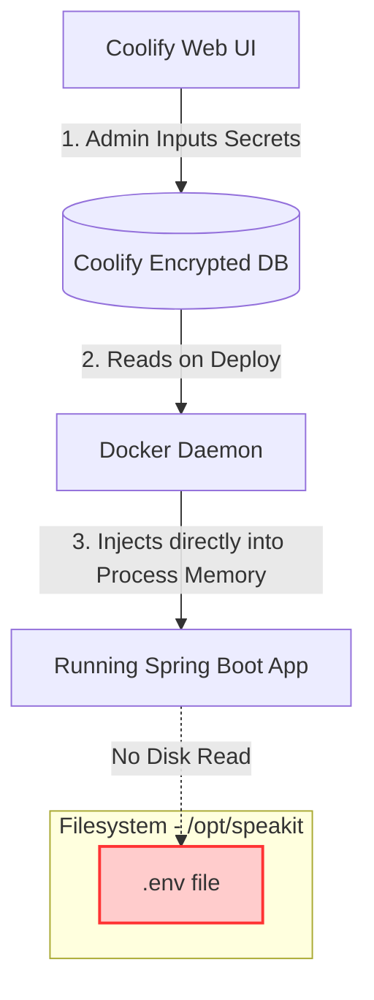

# SpeakIT Backend: Enterprise Coolify & Oracle Cloud Infrastructure (OCI) Deployment Guide

This guide provides an exhaustive, step-by-step technical manual to migrate the SpeakIT backend from Render to an **Oracle Cloud Infrastructure (OCI) Free Tier Instance** running **Coolify**.

Every single command, networking setting, and configuration variable is explained in meticulous detail to ensure a zero-friction, production-ready, fully automated deployment pipeline.

---

## Architectural Note: Why Traefik Over Nginx?
In standard deployments, Nginx is often used as a reverse proxy. However, **Coolify uses Traefik by default** as its internal proxy engine for several critical reasons:

1. **Automated SSL/TLS Management**: When you assign a custom domain like `https://speakit-prod-api.mohitur.com` in Coolify, Traefik handles the Let's Encrypt HTTP-01 challenge, generates the SSL certificate, and automatically handles 90-day renewals in the background with zero manual intervention or cron scripts.
2. **Zero-Configuration Dynamic Routing**: In a traditional Nginx setup, every time you deploy a new branch (such as `master` or `feature`), the backend container's internal IP address changes. You would have to manually update Nginx upstream blocks and run `nginx -s reload` for every deployment. Traefik queries the Docker daemon socket directly, dynamically discovering container lifecycle events and updating routing paths instantly without restarting.
3. **Seamless Multi-Branch Environments**: Traefik reads host request headers (`speakit-prod-api.mohitur.com` vs `speakit-dev-api.mohitur.com`) and matches them directly to target Docker containers with zero manual configuration files to write, maintain, or debug.

---

## Architectural Note: How Port Isolation Works (No Port Conflicts)

One common point of confusion is: **how can both database instances run on port 5432, and both Spring Boot backends run on port 8080 on the same machine without port conflicts?**

The answer lies in **Docker's Network Namespaces and Container Isolation**:

1. **Database Container Ports (`5432`)**:
   * Coolify runs the PostgreSQL databases inside separate, isolated containers (`speakit-prod-db` and `speakit-dev-db`).
   * On the internal Docker bridge network, each database container is assigned its own unique virtual IP address (e.g., `172.18.0.3` and `172.18.0.4`).
   * Because they have different IP addresses, both databases can bind to port `5432` internally without any conflicts.
   * We do **NOT** publish/expose these database ports directly to the OCI host's public IP address (meaning we don't map them like `-p 5432:5432` on the host). They remain reachable only within the internal Docker network, preventing any public port conflicts and blocking unauthorized external database connections.

2. **Application Container Ports (`8080`)**:
   * Similarly, both the Production and Development Spring Boot apps bind to port `8080` inside their respective isolated containers.
   * Because they run in separate containers with unique internal IP addresses, they do not conflict.
   * Traefik (the reverse proxy) is the only container that binds directly to the host's public ports `80` and `443`.
   * When an HTTPS request arrives at the host on port `443` for `speakit-prod-api.mohitur.com`, Traefik inspects the request header, matches it to the Production container, and forwards the packet internally to `http://<prod-container-ip>:8080`.
   * When an HTTPS request arrives for `speakit-dev-api.mohitur.com`, Traefik forwards the packet internally to `http://<dev-container-ip>:8080`.

---

## 1. System Architecture Diagram

Below is the complete network and routing topology for the SpeakIT Production and Development environments. 



### Explaining the Architecture Diagram Flow:
1. **Client Frontend Resolution**: When a user accesses the site, their browser resolves `speakit.mohitur.com` via Cloudflare to Vercel's edge servers, rendering the Production frontend. Similarly, development testing happens via `speakit-dev.mohitur.com` routed to Vercel's preview builds.
2. **API Request Routing**: The Production frontend makes HTTP API calls (like logins, TTS, and STT requests) to `https://speakit-prod-api.mohitur.com`. Cloudflare resolves this to your Oracle Cloud Instance IP address.
3. **Traefik Reverse Proxy Handshake**: The incoming request hits Traefik (running inside Docker on OCI) on port `443` (HTTPS). Traefik automatically decrypts the SSL connection using Let's Encrypt certificates, checks the hostname (header) of the incoming request, and routes the traffic internally to the correct Spring Boot backend container.
4. **Internal Database Isolation**: The Production backend container speaks to the `speakit-prod-db` container name, and the Development backend speaks to `speakit-dev-db`. Neither database exposes ports externally, ensuring total isolation and safety from public hacks.

---

## 2. Security Architecture: Zero-Disk Secret Storage (No `.env` Files)

Storing sensitive credentials in plain text `.env` files on a server's local disk is a high-risk security anti-pattern (CWE-312). If the server is compromised or backups are leaked, all secrets are exposed.

To achieve industry-standard security, **Coolify does not write `.env` files to the OCI server's disk**. Instead, it uses **Runtime Process Injection**:



### How Secret Injection Works:
1. **Encrypted Storage**: When you input environment variables in the Coolify UI, Coolify encrypts them and stores them in its internal database.
2. **Process Injection**: When starting the container, Coolify calls the Docker daemon and passes the environment variables directly into the container's namespace memory. 
3. **Zero File Footprint**: The Spring Boot application reads these variables from the operating system environment using Java's standard `System.getenv()` (which is mapped to Spring's `${VARIABLE}` properties). No `.env` file ever touches the OCI server's filesystem, preventing disk-level leaks.

---

## 3. Domain, DNS & Reverse Proxy Setup (Cloudflare)

To deploy two environments (Production and Development) on a single Coolify instance, we must configure separate subdomains for the backend APIs.

### Key Concepts Explained
* **A Record (Address Record)**: Map a subdomain (e.g., `speakit-prod-api.mohitur.com`) directly to an IPv4 address (e.g., your Oracle Cloud Instance IP).
* **CNAME Record (Canonical Name Record)**: Map a subdomain to another domain (e.g., `speakit.mohitur.com` points to `vercel-dns-017.com`). It acts as an alias.
* **Cloudflare Proxying (Orange Cloud)**: Routes traffic through Cloudflare's servers first to provide CDN caching, DDoS protection, and hiding of your backend IP.
* **DNS Only (Gray Cloud)**: Bypasses Cloudflare's network, routing traffic directly to your server's IP address.
* **HTTP-01 Challenge**: The validation method used by Let's Encrypt to issue SSL certificates. Let's Encrypt sends an HTTP request to your domain on port `80`. If it reaches your server, the certificate is issued. If Cloudflare's proxy is turned on during setup, it can block this challenge unless SSL/TLS is set to **Full** in Cloudflare.

---

### Step 1: Configure Cloudflare DNS Records

Log into your **Cloudflare Dashboard**, select **mohitur.com**, click **DNS** > **Records**, and add the following records:

#### 1. Production Backend API
* **Type**: `A`
* **Name**: `speakit-prod-api` (This creates the subdomain `speakit-prod-api.mohitur.com`)
* **IPv4 Address**: `YOUR_OCI_INSTANCE_PUBLIC_IP` (Replace with your actual OCI instance public IP address, e.g., `129.146.xx.xx`).
* **Proxy Status**: **DNS Only (Gray Cloud)**.
* **TTL**: `Auto`
* **Why**: This directs production API requests directly to your OCI instance. We keep it as **DNS Only** initially so Coolify can easily generate a Let's Encrypt SSL certificate.

#### 2. Development Backend API
* **Type**: `A`
* **Name**: `speakit-dev-api` (This creates the subdomain `speakit-dev-api.mohitur.com`)
* **IPv4 Address**: `YOUR_OCI_INSTANCE_PUBLIC_IP` (Same IP as above).
* **Proxy Status**: **DNS Only (Gray Cloud)**.
* **TTL**: `Auto`
* **Why**: This directs development API requests to the same server, which Traefik will route to the development container.

#### 3. Development Frontend Domain
* **Type**: `CNAME`
* **Name**: `speakit-dev` (This creates the subdomain `speakit-dev.mohitur.com`)
* **Target**: `cname.vercel-dns.com`
* **Proxy Status**: **Proxied (Orange Cloud)**.
* **TTL**: `Auto`
* **Why**: This routes your development frontend to Vercel (where we will map it to your `feature` branch deployment).

---

### Step 2: Configure Cloudflare SSL/TLS Encryption (Full (Strict) Mode)
1. In the Cloudflare sidebar, click **SSL/TLS** > **Overview**.
2. Set the encryption mode strictly to **Full (Strict)**.
3. **Security Justification (Strict Transit Security)**:
   * **Do not use "Flexible"**: Flexible mode causes infinite redirect loops because Cloudflare communicates with your origin via unencrypted HTTP (port 80), while Coolify automatically redirects all port 80 requests to HTTPS (port 443).
   * **Do not use "Full"**: Plain "Full" mode forces HTTPS but accepts *any* SSL certificate presented by the origin, including self-signed, invalid, or forged certificates. This leaves your backend traffic vulnerable to Man-In-The-Middle (MITM) attacks between Cloudflare edge servers and your OCI host.
   * **Use "Full (Strict)"**: This enforces valid SSL certificate checks. Since Coolify's Traefik reverse proxy automatically provisions and maintains a valid, publicly trusted Let's Encrypt SSL certificate for `speakit-prod-api.mohitur.com` and `speakit-dev-api.mohitur.com`, Full (Strict) guarantees complete, verified end-to-end encryption with no risk of MITM interception.

---

## 4. Oracle Cloud Infrastructure (OCI) Networking & Firewalls

By default, OCI blocks all incoming connections at the virtual network level (Security Lists) and at the operating system level (internal Linux firewall). We must configure these strictly to prevent unauthorized access.

### Step 1: Configure OCI Virtual Cloud Network (VCN) Ingress Rules
1. In the **OCI Console**, open the main navigation menu and click **Networking** > **Virtual Cloud Networks**.
2. Click on the name of the VCN that is attached to your compute instance.
3. Under **Resources** on the left-hand side, click **Security Lists**.
4. Click on the name of the default Security List (usually named `Default Security List for VCN_NAME`).
5. Click **Add Ingress Rules** and configure the following rules:

#### Ingress Rule 1: HTTP Traffic (Public)
* **Source Type**: `CIDR`
* **Source CIDR**: `0.0.0.0/0` (Publicly accessible)
* **IP Protocol**: `TCP`
* **Source Port Range**: `All`
* **Destination Port Range**: `80`
* **Description**: `Allow HTTP traffic to Coolify Traefik reverse proxy`

#### Ingress Rule 2: HTTPS Traffic (Public)
* **Source Type**: `CIDR`
* **Source CIDR**: `0.0.0.0/0` (Publicly accessible)
* **IP Protocol**: `TCP`
* **Source Port Range**: `All`
* **Destination Port Range**: `443`
* **Description**: `Allow HTTPS traffic to Coolify Traefik reverse proxy`

##### Ingress Rule 3: SSH Traffic (Tailscale Setup - Restricted vs Public)
> [!WARNING]
> **Why your connection failed**: Tailscale is a private VPN. When you connect to the OCI instance's **Public IP**, your traffic arrives originating from your home/office **Public ISP IP** (e.g. `203.0.113.50`), **NOT** your Tailscale IP (`100.65.240.58`).
> If you set OCI's VCN source CIDR strictly to `100.65.240.58/32` before Tailscale is installed on the OCI instance, your SSH connection will be blocked.
>
> **To fix this, choose one of these two options:**

* **Option A: Install Tailscale on the OCI Server (Highly Recommended - Static & Secure)**
  1. Set the OCI VCN Ingress rule for Port `22` temporarily to **`0.0.0.0/0`** (Anywhere) or to your local **Public ISP IP** (find by running `curl ifconfig.me` on your Mac terminal).
  2. SSH into your OCI instance using its public IP:
     `ssh -i /path/to/key ubuntu@YOUR_OCI_PUBLIC_IP`
  3. Install Tailscale on the OCI instance:
     ```bash
     curl -fsSL https://tailscale.com/install.sh | sh
     sudo tailscale up
     ```
  4. Click the link in the terminal to authenticate the OCI instance into your Tailnet.
  5. Once connected, your OCI instance will get its own Tailscale IP: **`100.66.182.36`**.
  6. From now on, you can SSH directly to the OCI instance using its **Tailscale IP**:
     `ssh -i /path/to/key ubuntu@100.66.182.36`
  7. **Harden OCI Console**: Once SSH over Tailscale is working, go to the OCI Security List, edit Port `22`, and restrict the Source CIDR to **`100.64.0.0/10`** (this allows access from any authenticated device in your Tailnet) and delete all public `0.0.0.0/0` rules for Port 22.

* **Option B: Restrict SSH to your Public ISP IP (If not using Tailscale on the server)**
  1. Run `curl ifconfig.me` on your Mac terminal to find your router's public IP (e.g. `203.0.113.50`).
  2. Set OCI's Port `22` Ingress rule Source CIDR to your public IP: `203.0.113.50/32`.
  3. Note: If your router restarts or your ISP changes your IP, you will lose access and must update this rule in the OCI console to your new public IP.

#### Ingress Rule Cleanup 1: Port 8000 (Action Required)
> [!CAUTION]
> **DELETE the existing ingress rule for Port `8000` (labeled "Coolify") from the public internet (`0.0.0.0/0`) immediately.**
> * Exposing administrative control panels over unencrypted HTTP (port 8000) allows attackers to attempt credential-stuffing and exploits.
> * You do not need this port open to the public. Access the dashboard securely using SSH tunneling instead (see Step 3 below).

#### Ingress Rule Cleanup 2: Ports 6001-6002 (Action Required)
> [!CAUTION]
> **DELETE the existing ingress rule for ports `6001-6002` (labeled "Collify2") immediately.**
> * Allowing public `TCP` traffic to ports `6001-6002` from `0.0.0.0/0` leaves your database engines exposed to public scanning and direct connection exploits.
> * Since your backend applications and databases communicate internally using Docker container names on the local bridge network, no public ingress rule for ports `6001` or `6002` is required.

---

### Step 2: Open OS Firewall Ports (Ports 80 and 443 Only)
Connect to your OCI Instance via SSH using your private key (use public IP if Tailscale is not installed yet, or Tailscale IP if installed):
```bash
ssh -i /path/to/your/private_key ubuntu@YOUR_OCI_INSTANCE_IP
```

Run the commands corresponding to your operating system to open the public web ports:

#### For Ubuntu Instances:
Ubuntu uses `ufw` (Uncomplicated Firewall). Based on your current rules, you have several security leaks (Port 8000, 6001, 6002 exposed to Anywhere) and are missing the HTTPS rule (Port 443).

Run these commands in order to clean up and apply **rock-hard security**:

1. **Delete insecure public rules**:
   ```bash
   sudo ufw delete allow 8000/tcp   # Blocks public access to Coolify Dashboard
   sudo ufw delete allow 8000       # Blocks public IPv6 access to Dashboard
   sudo ufw delete allow 6001/tcp   # Blocks public access to Dev Database forwarding
   sudo ufw delete allow 6001       # Blocks public IPv6 access to Dev DB
   sudo ufw delete allow 6002/tcp   # Blocks public access to Prod Database forwarding
   sudo ufw delete allow 6002       # Blocks public IPv6 access to Prod DB
   ```

2. **Add secure HTTPS rule**:
   ```bash
   sudo ufw allow 443/tcp           # Essential! Allows Traefik to receive secure traffic
   ```

3. **Harden SSH Port 22**:
   * *Before removing global SSH access*, add a rule strictly permitting your local Tailscale IP:
     ```bash
     sudo ufw allow from 100.65.240.58 to any port 22 proto tcp
     # (Optional) If not using Tailscale on the server, allow your public ISP IP instead:
     # sudo ufw allow from YOUR_PUBLIC_ISP_IP to any port 22 proto tcp
     ```
   * *Once your IP rule is added*, safely delete the default "Anywhere" SSH rule:
     ```bash
     sudo ufw delete allow 22/tcp     # Blocks global port 22 access (IPv4)
     sudo ufw delete allow 22         # Blocks global port 22 access (IPv6)
     ```

4. **Apply and reload UFW**:
   ```bash
   sudo ufw reload
   ```

#### For Oracle Linux Instances:
Oracle Linux uses `firewalld` (Firewall Daemon). Run:
* `sudo firewall-cmd --permanent --add-service=http`
* `sudo firewall-cmd --permanent --add-service=https`
* `sudo firewall-cmd --reload`
* *Ensure port 8000 remains closed.*

---

### Step 3: Access the Coolify Dashboard Securely (Two Options)

Since port `8000` (Coolify Admin UI) is blocked from public internet access for security, you can access the dashboard using one of these two secure methods:

#### Option A: Direct Access via Tailscale (Recommended)
If you installed Tailscale on your OCI server (Option A in Step 1):
1. Ensure Tailscale is connected on both your Mac and the OCI server.
2. Find the server's private Tailscale IP (which is **`100.66.182.36`**) by running `tailscale ip` on the OCI terminal.
3. Open your browser and go directly to: **`http://100.66.182.36:8000`**
   * *Why it works*: Tailscale builds an encrypted virtual network between your Mac and the server. No SSH tunnel is required.

#### Option B: SSH Local Port Forwarding (No Tailscale on Server)
If you are **not** running Tailscale on the OCI server (Option B in Step 1):
1. Open a terminal on your **local Mac**.
2. Run this command to create a secure SSH tunnel (replace with your private key path and OCI Public IP):
   ```bash
   ssh -N -L 8000:localhost:8000 -i /path/to/your/private_key ubuntu@YOUR_OCI_PUBLIC_IP
   ```
   * **`-N`**: Keeps the SSH tunnel open without executing remote commands or launching a terminal shell.
   * **`-L 8000:localhost:8000`**: Maps port `8000` on your local Mac to port `8000` on the OCI server.
3. Open your browser and navigate to: **`http://localhost:8000`**
4. Keep the terminal running while using Coolify. Once done, close the terminal to terminate the tunnel.

---

### 5. Provision PostgreSQL Databases in Coolify

We will create two separate PostgreSQL databases. To ensure **rock-solid persistence** (preventing data loss during restarts, redeployments, or container rebuilds), we will map the database storage directly to standard directories on your OCI server's filesystem using **Host Directory Bind Mounts**. This guarantees the OS keeps your database data safe on the disk, making it immune to Docker cleanup routines.

### Step 1: Create Host Storage Directories (Via Server Terminal)
Before configuring the database resources in the Coolify UI, SSH into your OCI server and run these commands to set up secure storage folders with exact directory traversal (`755`) and storage lockdown (`700`) permissions:
```bash
# 1. Create database directories under /opt/ system partition
sudo mkdir -p /opt/speakit/db-data/prod
sudo mkdir -p /opt/speakit/db-data/dev

# 2. Make parent folders traversable so Docker runtime can enter them
sudo chmod 755 /opt/speakit
sudo chmod 755 /opt/speakit/db-data

# 3. Hand over ownership of individual data folders to Postgres (UID 999) and lock them down
sudo chown -R 999:999 /opt/speakit/db-data/prod
sudo chown -R 999:999 /opt/speakit/db-data/dev
sudo chmod 700 /opt/speakit/db-data/prod
sudo chmod 700 /opt/speakit/db-data/dev
```

---

### Step-by-Step UI Guide (Coolify v4):

#### 1. Configure the Production Database (`speakit-prod-db`)
1. Open your local browser and access the Coolify Dashboard (via Tailscale `http://100.66.182.36:8000` or SSH Tunnel `http://localhost:8000`).
2. Go to **Projects** in the left sidebar > click on your Project (e.g. `SpeakIT`) > click on your Environment (e.g. `production` or `default`).
3. Click **"+ Add Resource"** > select **Databases** > select **PostgreSQL**.
4. Configure the parameters:
   * **Name**: `speakit-prod-db` (Display name for the resource).
   * **Initial Database**: `speakit` (The default schema).
   * **Username**: `mohitur`
   * **Password**: *[Leave blank to auto-generate a secure random password]*
   * **Do NOT click "Start Database" yet.**
5. Go to the **Persistent Storage** tab on the left menu:
   * Edit the existing volume mapping:
     * **Mount Type** (or configuration option): Choose **`Directory`** (or Host Directory Mount, not volume or file).
     * **Volume Name**: Keep the default auto-generated name.
     * **Source Path**: Enter the host directory: **`/opt/speakit/db-data/prod`**
     * **Destination Path**: Ensure it is set to: **`/var/lib/postgresql`**
   * Click **Save** to confirm the Host Bind Mount.
6. Go back to the main configuration page and click **Start Database**.

#### 2. Configure the Development Database (`speakit-dev-db`)
1. In your SpeakIT project environment page, click **"+ Add Resource"** > select **Databases** > select **PostgreSQL**.
2. Configure the parameters:
   * **Name**: `speakit-dev-db`
   * **Initial Database**: `speakit_dev`
   * **Username**: `mohitur`
   * **Password**: *[Leave blank to auto-generate a secure random password]*
   * **Do NOT click "Start Database" yet.**
3. Go to the **Persistent Storage** tab on the left menu:
   * Edit the existing volume mapping:
     * **Mount Type**: Choose **`Directory`** (Host Directory Mount).
     * **Volume Name**: Keep the default auto-generated name.
     * **Source Path**: Enter the host directory: **`/opt/speakit/db-data/dev`**
     * **Destination Path**: Ensure it is set to: **`/var/lib/postgresql`**
   * Click **Save** to confirm the Host Bind Mount.
4. Go back to the main configuration page and click **Start Database**.

---

### Step 3: Harden Database Network & Proxy Settings (Detail Page)
After starting each database, ensure the following configurations are saved on their respective detail pages:
* **Ports Mappings (Important - Avoid Port Conflicts)**:
  * For **Production Database (`speakit-prod-db`)**: Set the mapping to **`3000:5432`** and click **Save**.
  * For **Development Database (`speakit-dev-db`)**: Set the mapping to **`3001:5432`** and click **Save**.
  * *Why*: Two services cannot bind to the same host port (`3000`) simultaneously. Distinct ports allow you to connect to both databases individually from DBeaver.
* **Enable SSL** (under SSL Configuration): **Keep Unchecked (Disabled)**. Since the Java API and the database reside inside the same OCI host on a private bridge network, local traffic is already isolated.
* **Make it publicly available** (under Proxy): **Keep Unchecked (Disabled)**. Enabling this exposes your database port publicly to the internet, creating a critical security risk.
* **Postgres URL (internal)**: Click the **eye icon** to reveal your auto-generated connection password and verify the internal hostname (e.g. `speakit-prod-db` or `speakit-dev-db`) which you will use in your environment variables.

### Internal Hostname Resolution Explained:
Coolify configures Docker internal network names. Because your databases and applications run on the same network, you will connect using the database resource name as the hostname:
* Production database hostname: `speakit-prod-db` (Port: `5432`)
* Development database hostname: `speakit-dev-db` (Port: `5432`)

### Architectural Note: Data Persistence & Reboot Recovery (No Data Loss)

A critical operational concern is: **if the server crashes, reboots, or is powered down, will your database storage be lost?**

The answer is **No. Your data is 100% persistent**:

1. **Host Bind Mounts**:
   * Because we mapped the storage to `/opt/speakit/db-data/prod` and `/opt/speakit/db-data/dev`, all data is written directly as physical files on your OCI server's hard drive.
   * Unlike Docker named volumes, these folders exist independently of Docker. Even if the container is deleted, re-created, or force-deployed by Coolify, Docker simply re-mounts this directory to the new container. Your data remains perfectly intact.
   * You can inspect the files directly on the host using `ls -la /opt/speakit/db-data/prod`.

2. **Automated Database Backups (Oracle Object Storage S3 Integration)**:
   * While Host Bind Mounts protect against container updates and reboots, they do **not** protect against host hardware failures or VM deletions.
   * **Action Recommended**: Configure automated backups using **Oracle Object Storage (S3-Compatible)**. Follow these steps:
     
      #### Phase 1: Generate Credentials & Bucket in OCI Console
      1. **Get OCI Object Storage Namespace**: Go to OCI Console > **Tenancy Details** and copy the **Object Storage Namespace** (e.g. `ax3xyz`).
      2. **Create Customer Secret Key**:
         * In the OCI Console, click on your profile icon (top right) > **User Settings**.
         * On the left sidebar resources, click **Customer Secret Keys** > **Generate Secret Key**.
         * Enter a name (e.g., `coolify-backups`), click **Generate**, and copy the **Secret Key** immediately (it will not be shown again).
         * Copy the matching **Access Key** shown in the list next to the generated key.
      3. **Create Storage Bucket**: Go to **Storage** > **Object Storage** > **Buckets** > Click **Create Bucket** and configure the fields:
         * **Bucket name**: `speakit-db-backups`
         * **Default storage tier**: `Standard`
         * **Enable auto-tiering**: Unchecked
         * **Enable object versioning**: Unchecked (highly recommended to disable, preventing duplicate storage costs)
         * **Uncommitted multipart uploads cleanup**: Checked (automatically deletes failed/interrupted uploads after 7 days)
         * **Encryption**: Encrypt using Oracle managed keys (default AES-256)
         * Click **Create**.
      
      #### Phase 2: Add S3 Storage Destination in Coolify
      1. In the Coolify left sidebar, click **S3 Storages** > **"+ Add"** (or click S3 Storages tab).
      2. Fill in the parameters:
         * **Name**: `oci-object-storage`
         * **Access Key**: *[OCI Access Key generated above]*
         * **Secret Key**: *[OCI Secret Key generated above]*
         * **Region**: *[Your OCI Region, e.g. `ap-mumbai-1` or `us-ashburn-1`]*
         * **Bucket**: `speakit-db-backups`
         * **Endpoint**: `https://<object_storage_namespace>.compat.objectstorage.<region>.oraclecloud.com/` (replace with your namespace and region, e.g. `https://bmcqh18bziqd.compat.objectstorage.ap-mumbai-1.oraclecloud.com/`).
      3. Click **Save**.
      
      > [!IMPORTANT]
      > **Endpoint Formatting Tips (Avoid Validation Errors)**:
      > * **No Trailing Spaces**: Ensure there is no blank space at the end of the URL (very common when copy-pasting, causing "endpoint must be valid url" errors).
      > * **Trailing Slash**: Add a trailing slash `/` at the end of your host URL.
      > * **Region Specificity**: Make sure you enter your exact OCI region (e.g. `ap-mumbai-1`) in the Region field, matching the endpoint domain.
      
      #### Phase 3: Enable Backups on Database
      1. Go back to your PostgreSQL resource in Coolify > click **Backups**.
      2. Toggle **Backup Enabled** to **ON**.
      3. Toggle **S3 Enabled** to **ON**.
      4. Select **`oci-object-storage`** in the S3 Storage dropdown.
      5. Toggle **Disable Local Backup** to **ON** (this deletes the temporary local backup file once uploaded to OCI Object Storage, keeping the OCI host disk clean).
      6. Click **Save** and click **Backup Now** to run an immediate test!
      7. Verify the success log in the **Executions** tab at the bottom of the page.

   * **Option B: Hardened Local Backups (Alternative - No Remote Object Storage)**
     If you do not want to set up remote S3/Object Storage, you can save backups directly on your OCI server. To make this secure, follow this local hardening process:
     
     #### Phase 1: Enable Local Backups in Coolify
     1. In the database **Backups** tab:
        * Toggle **Backup Enabled** to **ON**.
        * Toggle **S3 Enabled** to **OFF** (this forces Coolify to save backups locally).
        * Set **Local Backup Retention (Days to keep backups)** to **`7`** or **`14`** (keeps your disk from filling up).
        * Click **Save** and click **Backup Now**.
     2. Coolify stores local backups on the server filesystem at:
        `/data/coolify/backups/`
     
     #### Phase 2: Lock Down Backup Permissions on the OCI Server
     SSH into the server and ensure the local backups directory is strictly inaccessible to unauthorized local users:
     ```bash
     sudo chmod -R 700 /data/coolify/backups
     sudo chown -R root:root /data/coolify/backups
     ```
     
     #### Phase 3: Offsite Sync to your Local Mac (Secure Cron over Tailscale)
     Since storing backups on the same OCI instance is vulnerable to server crashes, pull them automatically to your Mac over your secure Tailscale VPN:
     1. On your **local Mac**, create a secure directory for backups:
        `mkdir -p ~/speakit-backups`
     2. Create a nightly cron task on your Mac to pull the backups using `rsync` over your private Tailscale tunnel:
        ```bash
        # Run this periodically or schedule it as a crontab on your Mac:
        rsync -avz -e "ssh -i /path/to/your/private_key" ubuntu@100.66.182.36:/data/coolify/backups/ ~/speakit-backups/
        ```
        *This downloads all database dumps directly to your Mac securely, keeping a local offline copy.*

---

## 6. Secure Database Connection from DBeaver (Mac)

Since your database ports are blocked from public internet access for security, you must connect from your local Mac using DBeaver's built-in **SSH Tunnel** feature. DBeaver will automatically open an encrypted tunnel over SSH, execute the database requests, and close it securely.

> [!CAUTION]
> **Why Direct Connection Fails (Connection Refused)**:
> If you try to connect DBeaver directly using Host `100.66.182.36` and Port `5432` or `3000`, the connection will be **refused**.
> * The database container runs internally on port `5432` but is NOT exposed to the public Tailscale IP on that port.
> * The host maps it to port `3000` (e.g. `3000:5432` for production), but this port is only accessible locally (`127.0.0.1`) on the server.
> * You **must** configure the connection to use an SSH Tunnel so DBeaver can securely authenticate over SSH and route the traffic internally.

### Step-by-Step DBeaver Setup:

1. Open **DBeaver** on your Mac.
2. Click the plug icon (**New Connection**) in the top-left corner and select **PostgreSQL**.
3. In the **Connection Settings** window, configure the **Main** tab:
   * **Host**: **`localhost`** (Enter the word `localhost` exactly. Once the SSH tunnel connects, the query resolves locally on the OCI host).
   * **Port**: The host port from your Coolify database settings (e.g. **`3000`** for production, or your dev port).
   * **Database**: `speakit` (for Production) or `speakit_dev` (for Development).
   * **Username**: `mohitur`
   * **Password**: The password generated by Coolify (reveal by clicking the eye icon on the internal Postgres URL in Coolify).

4. Click the **SSH** tab (or **SSH Tunnel** depending on your DBeaver version) at the top of the connection window:
   * Check the **"Use SSH Tunnel"** box.
   * **Host/IP**: **`100.66.182.36`** (Your OCI server's Tailscale IP).
   * **Port**: `22` (SSH port).
   * **Username**: `ubuntu` (OCI non-root user).
   * **Authentication Method**: Select **Public Key** (or Private Key).
   * **Private Key**: Click browse and select your private key file (e.g. `/Users/yourusername/.ssh/id_rsa` or your OCI `.key`/`.pem` file).
   * **Passphrase**: Leave empty (unless your SSH key is encrypted with a passphrase).

5. Click **Test Connection** in the bottom-left corner.
   * DBeaver will authenticate via SSH to `100.66.182.36`, tunnel into localhost port `3000`, and establish a successful database connection!
6. Click **Finish** to save.

---

## 7. GitHub Integration & Webhooks for Auto-Deployments

To achieve complete automation (zero manual setup during code changes), you must connect Coolify to your GitHub repository via webhooks. This triggers automatic rebuilds on git pushes.

### Step 1: Set up the GitHub App Connection (Automatic Webhook Setup)
1. In the Coolify left sidebar, click **Sources** > click **"+ Add"** > select **GitHub App**.
2. Configure the **New GitHub App** parameters exactly as follows:
   * **Name**: `speakit-github`
   * **Organization (on GitHub)**: *[Leave blank if using your personal account, or enter your GitHub organization name]*
   * **HTML Url**: `https://github.com` (Keep default)
   * **API Url**: `https://api.github.com` (Keep default)
   * **Custom Git User**: `git` (Keep default)
   * **Custom Git Port**: *[Leave blank - defaults to SSH port 22]*
3. Click **Save** (or Register).
4. Coolify will reload the page. Click the **"Register GitHub App"** (or **"Install"**) button.
5. You will be redirected to GitHub:
   * Select your personal account or organization.
   * Under repository access, choose **"Only select repositories"** and select your **`speakit`** repository.
   * Click **Install & Authorize**.
6. GitHub will redirect you back to Coolify.

---

### Step 2: Set up Manual Webhooks (If Automatic Setup is Skipped/Fails)
If automatic webhook registration did not occur, you must link it manually:
1. In Coolify, go to your **GitHub Source** settings (left sidebar **Sources** > click `speakit-github`).
2. Copy the **Webhook URL** and **Webhook Secret** displayed on the configuration page.
3. Open your GitHub Repository in your browser:
   * Navigate to **Settings** > **Webhooks** (left sidebar).
   * Click **Add Webhook** (top right).
4. Configure the Webhook parameters:
   * **Payload URL**: Paste the Webhook URL from Coolify.
   * **Content type**: Change to **`application/json`** (critical).
   * **Secret**: Paste the Webhook Secret from Coolify.
   * **Which events**: Select **`Just the push event.`**
   * **Active**: Checked.
5. Click **Add webhook**.
6. Refresh the page after a few seconds and ensure the webhook shows a green checkmark next to the URL.

---

### Step 3: Configure "Watch Paths" (Avoid Unnecessary Backend Builds)
Since both the backend and frontend exist in the same repository (monorepo), a change to frontend code would normally trigger an unnecessary, expensive Java Maven rebuild in Coolify. We prevent this using **Watch Paths**:
1. Open your application configuration page in Coolify (do this for both `speakit-prod-backend` and `speakit-dev-backend`).
2. Go to **Settings** > scroll down to the **Git Source** / **Watch Paths** section.
3. In the **Watch Paths** field, enter:
   ```text
   backend/**
   ```
4. Click **Save**.
5. **Why it matters**: Now, Coolify will inspect every incoming push webhook. It will only execute a rebuild and deploy if a file inside the `/backend` folder has changed. Frontend-only commits will be skipped entirely.

---

### Step 4: How to Verify if Webhooks are Active & Healthy
If you are unsure if webhooks are already configured, check your GitHub repository settings:
1. Open your repository on GitHub.
2. Go to **Settings** (top tab navigation) > select **Webhooks** in the left-hand menu.
3. Look at your active Webhooks list:
   * **If no webhook exists**: Follow **Step 2** above to add it manually.
   * **If a webhook URL matching your Coolify domain/IP is listed**: It is already configured!
4. Check the **Status Indicator Icon** next to the webhook URL:
   * **Green Checkmark**: The webhook is active and successfully delivering push events (status code `200 OK`).
   * **Red Exclamation Mark**: The webhook is failing to reach your server. Click on the webhook, scroll to the **Recent Deliveries** tab at the bottom, select a failed delivery request, and inspect the response payload/error (e.g. `Connection Refused` due to firewall blocks, or `403 Forbidden` due to secret mismatches).
   * **Grey Warning Icon**: The webhook is registered but no commits have been pushed yet to trigger a test delivery.

---

## 8. Deploy Backend Applications

We will now create and configure the two backend deployments.

### 1. Production Backend (`speakit-prod-api.mohitur.com`)
1. Go to **Projects** > select your Project (e.g. `SpeakIT`) > select your Environment (e.g., `production` or `default`).
2. Click **"+ Add Resource"** > select **Private Repository (with GitHub App)**.
3. Select the GitHub integration source you configured in Phase 6.
4. Select the `speakit` repository.
5. In the application configuration page, set the following parameters:
   * **Name**: Change the display name to **`speakit-prod-backend`** (keeps your dashboard neat and recognizable).
   * **Branch**: `master` (This deployment tracks production code).
   * **Build Pack**: Choose `Dockerfile` (Instructs Coolify to build the container using our Dockerfile).
   * **Base Directory**: `/backend` (This is critical: setting the Base Directory to `/backend` maps the build root to the Java backend subdirectory, making files like `pom.xml` visible to the Maven builder).
   * **Dockerfile Location** (or Path): `/Dockerfile` (Since Base Directory is `/backend`, the path `/Dockerfile` translates to `/backend/Dockerfile`).
6. Under **Domain**, enter:
   * **Domains**: `https://speakit-prod-api.mohitur.com` (Must include the secure protocol `https://` to trigger SSL provisioning via Cloudflare/Let's Encrypt).
7. Under **Network**:
   * **Ports Exposes**: Change this from `3000` to **`8080`** (Crucial! The Java Spring Boot app runs on port `8080` internally. If kept as `3000`, the health checks will fail).
   * **Port Mappings**: **Leave empty** (Delete `3000:3000` if auto-populated. The reverse proxy maps routes internally, exposing host ports directly is a security risk).
8. Under **Pre/Post Deployment Commands**:
   * **Pre-deployment**: **Delete `php artisan migrate`** (Must be left completely empty! This is a PHP Laravel template default. Keeping it will crash your Java container deployment).
9. Click **Save** and then **Deploy**.

---

### 2. Development Backend (`speakit-dev-api.mohitur.com`)
1. Go to your `SpeakIT` project environment page.
2. Click **"+ Add Resource"** > select **Private Repository (with GitHub App)**.
3. Select the `speakit` repository.
4. Configure the parameters:
   * **Name**: Change display name to `speakit-dev-backend`.
   * **Branch**: `feature` (Tracks your feature development branch).
   * **Build Pack**: `Dockerfile`
   * **Base Directory**: `/backend`
   * **Dockerfile Location**: `/Dockerfile`
5. Under **Domain**, enter:
   * **Domains**: `https://speakit-dev-api.mohitur.com`
6. Under **Network**:
   * **Ports Exposes**: Change this from `3000` to **`8080`**.
   * **Port Mappings**: **Leave empty**.
7. Under **Pre/Post Deployment Commands**:
   * **Pre-deployment**: **Delete `php artisan migrate`** (Must be left empty).
8. Click **Save** and then **Deploy**.

---

## 9. Detailed Environment Variables Breakdown

To save time and avoid clicking "Add Variable" 20+ times, you can add all environment variables at once using Coolify's **Developer View** (Raw Edit):
1. Navigate to the **Environment Variables** tab of your application in Coolify.
2. In the top-right corner, click **Developer View** (this toggles the interface into a single large text box).
3. Copy the entire raw `.env` block below, paste it directly into the text box, edit the placeholder values, and click **Save**. Coolify will automatically parse all the variables into separate entries!

### 1. Production Backend Variables (`speakit-prod-api.mohitur.com`)

#### Raw Copy-Pasteable `.env` Block:
```env
SPRING_DATASOURCE_URL=jdbc:postgresql://speakit-prod-db:5432/speakit
SPRING_DATASOURCE_USERNAME=mohitur
SPRING_DATASOURCE_PASSWORD=your_speakit_prod_db_password
SPRING_DATASOURCE_MAX_POOL_SIZE=10
SPRING_DATASOURCE_MIN_IDLE=5
JWT_SECRET=your_production_jwt_secret_hash_value
JWT_EXPIRATION=86400000
CORS_ALLOWED_ORIGINS=https://speakit.mohitur.com
AWS_ACCESS_KEY_ID=your_aws_access_key
AWS_SECRET_ACCESS_KEY=your_aws_secret_key
AWS_REGION=ap-south-1
ELEVENLABS_API_KEY=your_elevenlabs_api_key
SARVAM_API_KEY=your_sarvam_api_key
RAZORPAY_KEY_ID=rzp_live_xxxxxxxxxxxx
RAZORPAY_KEY_SECRET=production_razorpay_secret
RAZORPAY_WEBHOOK_SECRET=production_webhook_secret
MAIL_HOST=email-smtp.ap-south-1.amazonaws.com
MAIL_PORT=587
MAIL_USERNAME=your_ses_smtp_username
MAIL_PASSWORD=your_ses_smtp_password
MAIL_FROM=noreply@mohitur.com
EMAIL_PROVIDER=SMTP
OTP_EXPIRY_MINUTES=10
```

#### Detailed Breakdown Table:

| Variable Key | Value / Example | Why it Matters & What it Means |
| :--- | :--- | :--- |
| **`SPRING_DATASOURCE_URL`** | `jdbc:postgresql://speakit-prod-db:5432/speakit` | JDBC (Java Database Connectivity) connection string pointing to the production database container name on the internal Docker network. |
| **`SPRING_DATASOURCE_USERNAME`** | `mohitur` | The restricted owner username configured for the production database. |
| **`SPRING_DATASOURCE_PASSWORD`** | `your_speakit_prod_db_password` | The strong password generated for the production database container. |
| **`SPRING_DATASOURCE_MAX_POOL_SIZE`** | `10` | The maximum number of active database connections HikariCP maintains. Capped to prevent connection saturation. |
| **`SPRING_DATASOURCE_MIN_IDLE`** | `5` | The minimum number of idle database connections HikariCP keeps alive to handle sudden traffic spikes. |
| **`JWT_SECRET`** | `your_production_jwt_secret_hash_value` | A 256-bit cryptographically secure hexadecimal string used to sign and verify JSON Web Tokens. Must be kept secret. |
| **`JWT_EXPIRATION`** | `86400000` | Expiration time of the JWT in milliseconds (e.g., `86400000` = 24 hours). |
| **`CORS_ALLOWED_ORIGINS`** | `https://speakit.mohitur.com` | Strictly permits only your production frontend hosted on Vercel to make cross-origin API requests to the backend. |
| **`AWS_ACCESS_KEY_ID`** | `your_aws_access_key` | AWS IAM Access Key ID required to access AWS Polly (for voice synthesis) and AWS SES (for transactional emails). |
| **`AWS_SECRET_ACCESS_KEY`** | `your_aws_secret_key` | AWS IAM Secret Access Key matching the Access Key ID. |
| **`AWS_REGION`** | `ap-south-1` | The AWS region where your Polly and SES services run (e.g., `ap-south-1` for Mumbai). |
| **`ELEVENLABS_API_KEY`** | `your_elevenlabs_api_key` | Integration API key to query high-quality natural voices from ElevenLabs. |
| **`SARVAM_API_KEY`** | `your_sarvam_api_key` | Integration API key to query regional Indian voices from Sarvam AI. |
| **`RAZORPAY_KEY_ID`** | `rzp_live_xxxxxxxxxxxx` | Production API Key ID issued by Razorpay. |
| **`RAZORPAY_KEY_SECRET`** | `production_razorpay_secret` | Production Secret Key issued by Razorpay. |
| **`RAZORPAY_WEBHOOK_SECRET`** | `production_webhook_secret` | Unique secret string used to verify the signature of webhook payloads arriving from Razorpay. |
| **`MAIL_HOST`** | `email-smtp.ap-south-1.amazonaws.com` | SMTP server address for sending transactional emails (AWS SES SMTP endpoint). |
| **`MAIL_PORT`** | `587` | Standard port for secure email transmission using STARTTLS. |
| **`MAIL_USERNAME`** | `your_ses_smtp_username` | SMTP credentials generated from your AWS IAM console. |
| **`MAIL_PASSWORD`** | `your_ses_smtp_password` | SMTP password generated from your AWS IAM console. |
| **`MAIL_FROM`** | `noreply@mohitur.com` | The verified sender email address in your Amazon SES account. |
| **`EMAIL_PROVIDER`** | `SMTP` | Configures the email engine strategy (SMTP or SES_API). |
| **`OTP_EXPIRY_MINUTES`** | `10` | The lifespan of sign-up and password reset verification codes. |

---

### 2. Development Backend Variables (`speakit-dev-api.mohitur.com`)

#### Raw Copy-Pasteable `.env` Block:
```env
SPRING_DATASOURCE_URL=jdbc:postgresql://speakit-dev-db:5432/speakit_dev
SPRING_DATASOURCE_USERNAME=mohitur
SPRING_DATASOURCE_PASSWORD=your_speakit_dev_db_password
SPRING_DATASOURCE_MAX_POOL_SIZE=5
SPRING_DATASOURCE_MIN_IDLE=2
JWT_SECRET=your_development_jwt_secret_hash_value
JWT_EXPIRATION=86400000
CORS_ALLOWED_ORIGINS=http://localhost:4200,https://speakit-dev.mohitur.com
AWS_ACCESS_KEY_ID=your_dev_aws_key
AWS_SECRET_ACCESS_KEY=your_dev_aws_secret
AWS_REGION=ap-south-1
ELEVENLABS_API_KEY=your_dev_elevenlabs_key
SARVAM_API_KEY=your_dev_sarvam_key
RAZORPAY_KEY_ID=rzp_test_xxxxxxxxxxxx
RAZORPAY_KEY_SECRET=test_razorpay_secret
RAZORPAY_WEBHOOK_SECRET=test_webhook_secret
MAIL_HOST=email-smtp.ap-south-1.amazonaws.com
MAIL_PORT=587
MAIL_USERNAME=your_ses_smtp_username
MAIL_PASSWORD=your_ses_smtp_password
MAIL_FROM=noreply@mohitur.com
EMAIL_PROVIDER=SMTP
OTP_EXPIRY_MINUTES=10
```

#### Detailed Breakdown Table:
| Variable Key | Value / Example | Why it Matters & What it Means |
| :--- | :--- | :--- |
| **`SPRING_DATASOURCE_URL`** | `jdbc:postgresql://speakit-dev-db:5432/speakit_dev` | JDBC connection string pointing to the development database container name. |
| **`SPRING_DATASOURCE_USERNAME`** | `mohitur` | The restricted owner username configured for the development database. |
| **`SPRING_DATASOURCE_PASSWORD`** | `your_speakit_dev_db_password` | The password generated for the development database container. |
| **`SPRING_DATASOURCE_MAX_POOL_SIZE`** | `5` | Lower connection pool limit to save RAM on the OCI instance. |
| **`SPRING_DATASOURCE_MIN_IDLE`** | `2` | Lower idle pool limit to minimize resource footprints. |
| **`JWT_SECRET`** | `your_development_jwt_secret_hash_value` | Separate secret key used for development tokens. |
| **`JWT_EXPIRATION`** | `86400000` | Expiration time of dev tokens (24 hours). |
| **`CORS_ALLOWED_ORIGINS`** | `http://localhost:4200,https://speakit-dev.mohitur.com` | Allows both your local development environment (`localhost:4200`) and your Vercel preview domain to access this API. |
| **`AWS_ACCESS_KEY_ID`** | `your_dev_aws_key` | Development/sandbox AWS IAM Access Key. |
| **`AWS_SECRET_ACCESS_KEY`** | `your_dev_aws_secret` | Development/sandbox AWS IAM Secret Key. |
| **`AWS_REGION`** | `ap-south-1` | AWS region. |
| **`ELEVENLABS_API_KEY`** | `your_dev_elevenlabs_key` | Dev/sandbox ElevenLabs key. |
| **`SARVAM_API_KEY`** | `your_dev_sarvam_key` | Dev/sandbox Sarvam AI key. |
| **`RAZORPAY_KEY_ID`** | `rzp_test_xxxxxxxxxxxx` | Razorpay **Test Mode** API Key ID. |
| **`RAZORPAY_KEY_SECRET`** | `test_razorpay_secret` | Razorpay **Test Mode** Secret Key. |
| **`RAZORPAY_WEBHOOK_SECRET`** | `test_webhook_secret` | Razorpay **Test Mode** Webhook signature verification secret. |
| **`MAIL_HOST`** | `email-smtp.ap-south-1.amazonaws.com` | SMTP server address. |
| **`MAIL_PORT`** | `587` | SMTP port. |
| **`MAIL_USERNAME`** | `your_ses_smtp_username` | SMTP username. |
| **`MAIL_PASSWORD`** | `your_ses_smtp_password` | SMTP password. |
| **`MAIL_FROM`** | `noreply@mohitur.com` | Email sender address. |
| **`EMAIL_PROVIDER`** | `SMTP` | Email strategy. |
| **`OTP_EXPIRY_MINUTES`** | `10` | Verification code lifespan. |

---

## Architectural Note: How Spring Boot Binds Environment Variables (Relaxed Binding)

Another critical question is: **how does Spring Boot bind Docker/Coolify environment variables to your Java code's `@Value` annotations (like `@Value("${auth.session-duration-ms:7200000}")`)?**

### The Spring Boot Property Overlay Order:
Spring Boot reads properties from several sources in a strictly defined order. The higher sources override lower ones:
1. **Operating System Environment Variables** (Injected by Docker/Coolify) - **HIGHEST**
2. Java System Properties (`System.getProperties()`)
3. `application.properties` (inside the built JAR) - **LOWEST**

### 1. Relaxed Binding (Hyphen to Underscore translation):
Spring Boot uses **Relaxed Binding** rules. It automatically translates kebab-case or dot-notation properties into uppercase underscore-separated names commonly used in operating system environment variables:

| Java property key / `@Value` placeholder | Matching Environment Variable Key |
| :--- | :--- |
| `auth.session-duration-ms` | `AUTH_SESSION_DURATION_MS` |
| `auth.idle-timeout-ms` | `AUTH_IDLE_TIMEOUT_MS` |
| `app.otp.expiry-minutes` | `APP_OTP_EXPIRY_MINUTES` |

### 2. Placeholder Default Fallbacks:
If the environment variable is **not** set in the Coolify dashboard, Spring Boot falls back to the default value specified after the colon (`:`) in your code:
* For `@Value("${auth.session-duration-ms:7200000}")`:
  * If `AUTH_SESSION_DURATION_MS` is set to `3600000` in Coolify, `sessionDurationMs` will be `3600000`.
  * If the variable is missing from Coolify, it falls back to `7200000`.

* In SpeakIT's [`application.properties`](file:///home/cyberbully/Documents/Desktop/git-projects/speakit/backend/src/main/resources/application.properties), we have already linked these keys to clean names:
  * `auth.session-duration-ms=${SESSION_DURATION_MS:7200000}`
  * `auth.idle-timeout-ms=${IDLE_TIMEOUT_MS:60000}`
  * `app.otp.expiry-minutes=${OTP_EXPIRY_MINUTES:10}`
  
Therefore, you can inject them as environment variables (e.g., `SESSION_DURATION_MS`) directly in Coolify, and Spring Boot will bind them flawlessly.

---

## 10. Connect Vercel Frontends to the New Backends

Since the Angular frontend reads the backend URL dynamically from environment variables, we must update the variables in Vercel to complete the migration.

1. Log into your **Vercel Dashboard**.
2. Select your SpeakIT frontend project.
3. Click **Settings** > **Environment Variables** in the top navigation menu.
4. Locate the environment variable named **`API_URL`** (or click **Add New** if not present).
5. Configure the values as follows:
   * **Key**: `API_URL`
   * **Production Value** (applied to `Production` environment): `https://speakit-prod-api.mohitur.com`
   * **Development/Preview Value** (applied to `Preview` and `Development` environments): `https://speakit-dev-api.mohitur.com`
6. Click **Save**.
7. **Important**: Environment variables are baked into static Angular assets during Vercel's build phase. You **must redeploy** for these changes to take effect:
   * Go to **Deployments** > Click on the latest deployment > Click the three dots (options menu) > Select **Redeploy**.

---

## 11. Razorpay Webhook Configuration & Migration

Since your application uses Razorpay to process subscriptions and billing, migrating from Render to OCI requires updating the webhook URL inside your Razorpay Dashboard. This ensures payments trigger plan upgrades without delay.

The SpeakIT backend exposes a dedicated endpoint to process Razorpay webhooks at:
* **Path**: `/api/v1/webhooks/razorpay`

### Webhook URLs to Configure:
* **Production**: `https://speakit-prod-api.mohitur.com/api/v1/webhooks/razorpay`
* **Development**: `https://speakit-dev-api.mohitur.com/api/v1/webhooks/razorpay`

### Step-by-Step Dashboard Setup:
1. Log into your **Razorpay Dashboard**.
2. Switch to **Live Mode** (for Production) or **Test Mode** (for Development/Testing).
3. In the left navigation sidebar, click **Settings** > **Webhooks**.
4. Click **Add New Webhook** (or select your existing webhook and click **Edit**).
5. Configure the following fields:
   * **Webhook URL**: Enter the appropriate URL (e.g., `https://speakit-prod-api.mohitur.com/api/v1/webhooks/razorpay` for Live mode).
   * **Secret**: Enter the value configured in your backend environment variables as `RAZORPAY_WEBHOOK_SECRET`. This secret is used to sign the webhook payloads, protecting your server against spoofing attacks.
   * **Alert Email**: Enter your administrative contact email to receive webhook failure notifications.
6. Under **Active Events**, select the following events (matching SpeakIT's billing flow):
   * `order.paid`
   * `payment.authorized`
   * `payment.captured`
   * `subscription.charged`
   * `subscription.activated`
   * `subscription.cancelled`
7. Click **Save** to activate.

---

## 12. Verification & Troubleshooting Steps

* **Out of Memory (OOM) Build Failures**:
  * *The Problem*: Oracle Cloud Free Tier AMD instances have limited memory, which can cause Maven compilation (`mvn clean package`) to crash with `Exit Code 137` (Linux Out-Of-Memory kill signal).
  * *The Fix*: Create a swap file on your OCI server to provide virtual RAM:
    ```bash
    sudo fallocate -l 4G /swapfile
    sudo chmod 600 /swapfile
    sudo mkswap /swapfile
    sudo swapon /swapfile
    echo '/swapfile none swap sw 0 0' | sudo tee -a /etc/fstab
    ```
* **Database Connection Timeouts**:
  * *The Problem*: Spring Boot fails to boot, logging `HikariPool-1 - Connection is not available`.
  * *The Fix*: Verify `SPRING_DATASOURCE_URL` utilizes the container names `speakit-prod-db` / `speakit-dev-db` and not `localhost` or public IP addresses. Inspect if the database container is running using `docker ps` on your server.
* **CORS Blocks**:
  * *The Problem*: Requests fail in the browser with `Access-Control-Allow-Origin header is missing`.
  * *The Fix*: Verify `CORS_ALLOWED_ORIGINS` in your Coolify environment settings contains the exact origin (including `https://` and without any trailing slash).
* **Automated Webhook Logs**:
  * *The Problem*: Pushes to GitHub do not trigger builds.
  * *The Fix*: Go to your GitHub repository > **Settings** > **Webhooks** and verify the webhook configured by Coolify shows a green checkmark indicating successful delivery. If it shows red, check the delivery payload details for timeout or DNS errors.

---

## 13. OCI Host & Container Security Hardening Checklist

Implement these production-grade security controls to harden your OCI server against attackers.

### 1. SSH Host Hardening & Privilege Separation (Non-Root SSH User)
* **Log in as OCI Non-Root User**: Never log into your OCI instance directly as `root` via SSH. Always log in using OCI's default non-root administrative user:
  * Use **`ubuntu`** for Ubuntu Linux images.
  * Use **`opc`** for Oracle Linux (RHEL) images.
  Once logged in, perform administrative actions using `sudo`.
* **Disable SSH Root Login & Passwords**: Enforce key-only authentication and disable direct root access. Edit `/etc/ssh/sshd_config` and set:
  ```text
  PasswordAuthentication no
  PubkeyAuthentication yes
  PermitRootLogin no
  ```
  Restart the SSH daemon: `sudo systemctl restart sshd`.
* **Fail2Ban**: Install Fail2Ban to block IP addresses showing malicious behavior (like too many authentication failures):
  ```bash
  sudo apt-get install fail2ban -y
  ```

### 2. Docker & Container Security (No Socket Mounting)
* **Do not expose Docker Socket**: Ensure that none of your application containers (Production or Development backends) mount `/var/run/docker.sock` in their volumes. Exposure of the Docker socket gives a container full root-level execution capability on the host OS, making container breakout attacks trivial.
* **Non-Root Execution**: The SpeakIT backend runs using `USER appuser` (configured in `/backend/Dockerfile`). Keep this active so that even in case of an application-level vulnerability (e.g., arbitrary file write), the attacker does not execute code as root inside the container.

### 3. Database Backup Encryption & Storage
* Do not store raw database backups on the same OCI compute instance. If the server is compromised, the backups are also stolen.
* Configure a secure cron task to pipe pg_dump outputs directly to an encrypted Oracle Cloud Object Storage bucket (or Amazon S3) with restricted IAM write-only access policies and lifecycle expiration rules.

### 4. Application Secrets Auditing
* Regularly run scans on your git repository using tools like `git-secrets` or `trufflehog` to ensure no developer has accidentally committed API tokens or credentials to your Git history.

