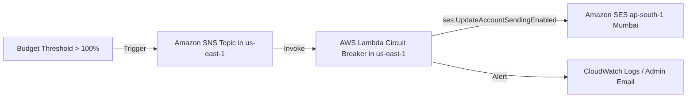
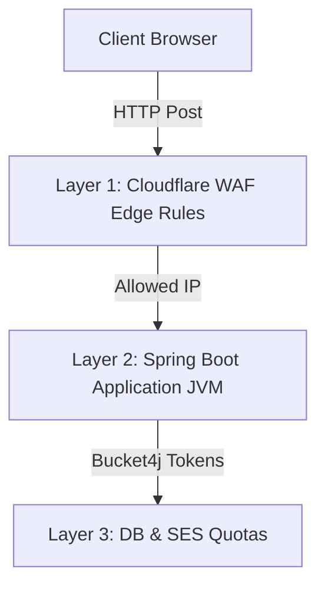

# Production Email Setup: Cloudflare + Amazon SES + Gmail Storage

This guide provides click-by-click instructions to manually configure a secure, high-deliverability email infrastructure for your application domain `mohitur.com`.

---

## Architecture Overview

```mermaid
graph TD
    subgraph Inbound Emails
        Sender[Customer / Internet] -->|Send email to support@mohitur.com| CF[Cloudflare Email Routing]
        CF -->|Auto-forward| Gmail[yourpersonalgmail@gmail.com]
    end

    subgraph Outbound Emails
        Backend[Spring Boot Backend] -->|SMTP TLS Port 587| SES[Amazon SES ap-south-1]
        SES -->|DKIM Signed & SPF Aligned| Customer[Customer Inbox]
    end
```

---

## PART 1: Cloudflare Inbound Email Routing

Cloudflare Email Routing lets you receive emails at custom addresses (like `support@mohitur.com`, `billing@mohitur.com`) and automatically forward them to your personal Gmail.

### Step 1.1: Configure Destination Address
1. Log in to the [Cloudflare Dashboard](https://dash.cloudflare.com/).
2. Select your account and click on the domain **mohitur.com**.
3. In the left navigation sidebar, select **Email** -> **Email Routing**.
4. Click on the **Destination addresses** tab.
5. Click **Add destination address**.
6. Enter your destination email address (e.g., `yourpersonalgmail@gmail.com`).
7. Click **Save**.
8. **Check your Gmail Inbox:** Cloudflare will send a verification email with the subject *"Verify email address for Email Routing"*. Open it and click **Verify email address**.
9. Refresh your Cloudflare console; the status should change to **Verified**.

### Step 1.2: Enable Email Routing & DNS Records
1. Go back to the **Email Routing** landing page in Cloudflare.
2. Under the **Settings** or **Overview** tab, click **Enable Email Routing**.
3. If Cloudflare prompts you to add/replace DNS records, click **Add records automatically** (this configures the standard MX and SPF entries for Cloudflare inbound routing automatically).
4. Verify the MX records added in your **DNS** -> **Records** section:
   - `route1.mx.cloudflare.net` (Priority 10)
   - `route2.mx.cloudflare.net` (Priority 20)
   - `route3.mx.cloudflare.net` (Priority 30)

### Step 1.3: Set Up Specific Routing Rules
Create rules to route specific aliases to your verified Gmail:
1. In the **Email Routing** dashboard, select the **Routing rules** tab.
2. Click **Create rule**.
3. Configure the following rules (repeat for each active alias):
   - **Rule Name:** `Forward Contact Address`
   - **Action Trigger:** `Custom address`
   - **Custom Address:** `contact` (Domain: `mohitur.com`)
   - **Action:** `Forward to destination address`
   - **Destination Address:** Select `yourpersonalgmail@gmail.com` from the dropdown list.
4. Click **Save**.
5. Repeat for:
   - `support@mohitur.com`
   - `billing@mohitur.com`
   - `security@mohitur.com`

---

## PART 2: Amazon SES Setup (ap-south-1 Mumbai)

Amazon SES in Mumbai (`ap-south-1`) will handle secure outgoing transactional emails.

### Step 2.1: Create Domain Identity & Configure DKIM
1. Log in to the [AWS Management Console](https://aws.amazon.com/console/).
2. In the top navigation bar, locate the Region Selector and switch to **Asia Pacific (Mumbai) / ap-south-1**.
3. Search for **Amazon Simple Email Service** (SES) in the search bar and select it.
4. In the left-hand sidebar under **Configuration**, click **Verified identities**.
5. Click the orange **Create identity** button.
6. Under **Identity details**:
   - Select **Identity type**: `Domain`.
   - **Domain**: `mohitur.com`.
   - **Use custom mail domain**: *Leave unchecked for now* (we will configure this in Step 2.3).
7. Under **DKIM (DomainKeys Identified Mail)**:
   - **Identity type**: Select `Easy DKIM`.
   - **DKIM key length**: Select `RSA 2048-bit` (recommended).
   - **DKIM signatures**: Ensure it is set to `Enabled`.
8. Under **Tags**: *Optional (leave empty)*.
9. Click **Create identity** at the bottom.

### Step 2.2: Add DKIM Tokens to Cloudflare DNS
1. After identity creation, you will be redirected to the identity page for `mohitur.com`.
2. Under the **Authentication** tab, look for **DKIM** settings.
3. You will see 3 generated CNAME records with Name and Value matching `[Token]._domainkey.mohitur.com`.
4. Log in to your **Cloudflare Dashboard** -> **DNS** -> **Records**.
5. Click **Add record** for each DKIM record:
   - **Type:** `CNAME`
   - **Name:** Enter only the prefix: `[Token]._domainkey` (do NOT include `.mohitur.com` as Cloudflare appends it automatically).
   - **Target:** `[Token].dkim.amazonses.com`
   - **Proxy status:** **DNS Only (Unproxied)** *(Crucial! Grey cloud icon)*.
   - **TTL:** `Auto`
6. Click **Save**. Wait 5-10 minutes. Go back to AWS SES identity and refresh. The status should change to **Verified**.

### Step 2.3: Configure Custom MAIL FROM Domain (DMARC Alignment)
This aligns the MAIL FROM domain (`mail.mohitur.com`) with the Header FROM domain (`mohitur.com`), achieving a **DMARC Pass / Alignment**.

1. In the **AWS SES Console**, go to **Verified identities** and click `mohitur.com`.
2. Go to the **Authentication** tab.
3. Scroll down to the **MAIL FROM domain** section and click **Edit**.
4. Check the checkbox for **Use a custom MAIL FROM domain**.
5. In the **MAIL FROM domain** input box, type `mail` (the full subdomain is `mail.mohitur.com`).
6. **Behavior on MX failure**: Select **Use default execution** (falls back to using the default SES domain if custom routing fails).
7. Click **Save changes**.
8. Go back to the **Authentication** tab. Under **MAIL FROM domain**, AWS will display the required DNS records for Cloudflare:
   - **MX Record:**
     - Name: `mail`
     - Target/Value: `feedback-smtp.ap-south-1.amazonses.com`
     - Priority: `10`
   - **TXT Record (SPF):**
     - Name: `mail`
     - Target/Value: `v=spf1 include:amazonses.com ~all`
9. Go to your **Cloudflare Dashboard** -> **DNS** -> **Records** and add these two entries:
   - Add **MX**: Name = `mail`, Server = `feedback-smtp.ap-south-1.amazonses.com`, Priority = `10`.
   - Add **TXT**: Name = `mail`, Value = `v=spf1 include:amazonses.com ~all`.

### Step 2.4: Set Up SPF & DMARC for Root Domain (Merged Record)
A domain can only have **one** SPF TXT record. Since Cloudflare Email Routing and AWS SES both require authorization, you must **merge** them into a single record to prevent conflicts.

1. Log in to your **Cloudflare Dashboard** -> **DNS** -> **Records**.
2. If you have separate TXT records for `v=spf1 include:_spf.mx.cloudflare.net ~all` and `v=spf1 include:amazonses.com ~all`, **delete the duplicate/conflicting records**.
3. Create or edit a single root SPF TXT record:
   - **Type:** `TXT`
   - **Name:** `@` (Root)
   - **Value:** `v=spf1 include:_spf.mx.cloudflare.net include:amazonses.com ~all`
4. Configure a strict DMARC record to protect your brand:
   - **Type:** `TXT`
   - **Name:** `_dmarc`
   - **Value:** `v=DMARC1; p=quarantine; pct=100; rua=mailto:dmarc-reports@mohitur.com; adkim=s; aspf=s;`

### Step 2.5: Configure SES Configuration Set & Event Publishing (Email Tracking)
AWS SES allows you to track outgoing email delivery events (Send, Reject, Delivery, Bounce, Complaint) by configuring and assigning a **Configuration Set**. This is essential for monitoring sending stats and reputation.

1. **Create the Configuration Set:**
   - In the **AWS SES Console** sidebar, select **Configuration sets**.
   - Click **Create set**.
   - **Configuration set name**: Enter `Speakit-Monitoring-Set`.
   - **Sending IP pool**: Choose `Default`.
   - **TLS policy**: Select `Require` (forces secure TLS transmission for all outgoing mail).
   - Click **Create set**.
2. **Configure Event Destinations (Optional but recommended):**
   - Click on `Speakit-Monitoring-Set` from the configuration sets list.
   - Go to the **Event destinations** tab and click **Add destination**.
   - Select the events you want to track (e.g. `Send`, `Reject`, `Bounce`, `Complaint`, `Delivery`). Click **Next**.
   - Choose a destination: **Amazon CloudWatch**.
   - Configure the CloudWatch Destination form with these values:
     - **Name:** `CloudWatch-Metrics-Destination`
     - **Event publishing:** Checked (`Enabled`)
     - **Amazon CloudWatch dimensions:**
       - **Value source:** Select `Message Tag` from the dropdown list.
       - **Dimension name:** Enter `ses:configuration-set` (this matches the auto-generated SES message tag).
       - **Default value:** Enter `Speakit-Monitoring-Set` (or the lowercase name `speakit-monitoring-set`).
   - Click **Next** and click **Create destination**.
3. **Assign the Configuration Set to your Domain Identity:**
   - In the sidebar, click **Verified identities** and select `mohitur.com`.
   - Scroll down to the **Configuration set** section and click **Assign configuration set** (or **Edit** -> check the configuration set assignment box).
   - Select `Speakit-Monitoring-Set` from the dropdown list.
   - Click **Save changes** / **Assign**.
   - *Note: By assigning this configuration set directly to the domain identity in AWS, all emails sent from `@mohitur.com` will automatically be monitored and tracked without requiring any code modifications!*

---

## PART 3: Create SMTP Credentials (IAM User)

AWS SES SMTP servers require specific credentials generated from the AWS IAM SMTP manager.

1. In the **AWS SES Console**, select **SMTP settings** from the left navigation bar.
2. Locate the **SMTP endpoint** (e.g., `email-smtp.ap-south-1.amazonaws.com`) and port `587`.
3. Click the button **Create SMTP credentials**.
4. In the IAM User Creation page:
   - **IAM User Name**: Enter `ses-smtp-user.mohitur` (or leave the auto-generated name).
5. Click **Create** in the bottom right.
6. **CRITICAL STEP:** Click **Show User SMTP Credentials** or click **Download Credentials** to download the CSV.
   - **SMTP Username:** Copy the username (looks like `AKIA...`).
   - **SMTP Password:** Copy the password (looks like a long string of letters/digits).
   *Note: These are your production credentials. Keep them secret.*

---

## PART 4: Get Out of AWS SES Sandbox

All new AWS SES accounts start in a Sandbox environment. In this mode, you can *only* send emails to verified domains or verified destination addresses. To send to arbitrary users, you must request sandbox exit.

1. Go to the **AWS SES Console** -> **Account dashboard** (or click the warning banner at the top of the console).
2. Look for the box **Sandbox status** and click **Request production access**.
3. In the Request Production Access wizard, fill out the details:
   - **Mail type:** `Transactional`.
   - **Website URL:** `https://mohitur.com`
   - **Use case description:**
     > "We want to send transaction emails from our application domain mohitur.com. These include One-Time Passwords (OTPs) for registration, account activation links, password resets, and subscription/invoice alerts. All recipients are authenticated users who register an account on our platform. We do not send marketing emails or bulk newsletters. We will track and handle bounces/complaints using CloudWatch."
   - Check the acknowledgement checkbox and click **Submit request**.
4. AWS typically approves requests within 24 hours.

---

## PART 5: Code Integration (Spring Boot Backend)

The backend code has been updated to support SMTP configuration. You only need to plug in the credentials you generated in **Part 3** inside the production environment variable config.

### 5.1 Project Properties (`application.properties`)
The application is preconfigured to map Spring Mail settings dynamically to environment variables:

```properties
# Spring Mail Properties
spring.mail.host=${MAIL_HOST}
spring.mail.port=${MAIL_PORT}
spring.mail.username=${MAIL_USERNAME}
spring.mail.password=${MAIL_PASSWORD}

# SMTP Transport Protocol & Security
spring.mail.protocol=smtp
spring.mail.properties.mail.smtp.auth=true
spring.mail.properties.mail.smtp.starttls.enable=true
spring.mail.properties.mail.smtp.starttls.required=true

# Connection Timeouts
spring.mail.properties.mail.smtp.connectiontimeout=5000
spring.mail.properties.mail.smtp.timeout=5000
spring.mail.properties.mail.smtp.writetimeout=5000

# Custom Application Default Sender Fields
app.mail.from=${MAIL_FROM}
app.mail.reply-to=support@mohitur.com
```

### 5.2 Environment Values (Local `.env` File)
Locate your local file [backend/.env](file:///home/cyberbully/Documents/Desktop/git-projects/speakit/backend/.env) and populate the values:

```properties
# Amazon SES SMTP Settings (ap-south-1 Mumbai)
MAIL_HOST=email-smtp.ap-south-1.amazonaws.com
MAIL_PORT=587
MAIL_USERNAME=AKIA... [Replace with Username from Part 3]
MAIL_PASSWORD=wJal... [Replace with Password from Part 3]
MAIL_FROM=noreply@mohitur.com
```

### 5.3 Triggering Emails in Java (`EmailService`)
We have created [EmailService.java](file:///home/cyberbully/Documents/Desktop/git-projects/speakit/backend/src/main/java/com/tts/service/EmailService.java) to provide high-quality HTML templates:

- **Send OTP:** `emailService.sendOtpEmail(email, username, otpCode, 5);`
- **Send Verification Link:** `emailService.sendVerificationEmail(email, username, url);`
- **Send Password Reset:** `emailService.sendPasswordResetEmail(email, username, url);`
- **Send Welcome Message:** `emailService.sendWelcomeEmail(email, username);`

---

## PART 6: Testing & Deliverability Matrix

Once the manual setups are done:
1. Use a tool like [Mail-Tester](https://www.mail-tester.com/) or send a test verification email to an external Gmail.
2. Open the email header analysis inside Gmail (*"Show Original"*):
   - **SPF:** Must show `PASS` with domain `mail.mohitur.com`.
   - **DKIM:** Must show `PASS` with domain `mohitur.com`.
   - **DMARC:** Must show `PASS` with domain `mohitur.com` (showing alignment).

---

## PART 7: AWS Budget Alerts & Billing Circuit Breaker (AWS Budgets + SNS + Lambda)

> [!IMPORTANT]
> **Global and Multi-Region Context Requirement:**
> AWS Budgets is a global billing management service, and its metric/alert reporting runs strictly in the **N. Virginia (`us-east-1`)** region. Consequently, AWS Budgets **can only trigger SNS topics created in N. Virginia (`us-east-1`)**. 
> - The **SNS Topic** MUST be created in `us-east-1`.
> - The **AWS Lambda function** MUST be created in `us-east-1` so that it can subscribe to the `us-east-1` SNS topic.
> - However, the Lambda function execution code will target your application's actual SES region (e.g., **Mumbai `ap-south-1`**) when disabling outbound sending.

To protect your AWS account against runaway costs caused by application abuse, mail loop failures, or DDoS attacks, configure a proactive budget alert that triggers an automated Lambda function in `us-east-1`. When a budget threshold is exceeded, this Lambda function executes a global regional override to disable AWS SES outbound sending in your production region immediately.



### Step 7.1: Create the SNS Topic in `us-east-1`
1. Log in to the [Amazon SNS Console](https://console.aws.amazon.com/sns/v3/home).
2. **CRITICAL:** Use the Region Selector in the top navigation bar to switch to **N. Virginia (`us-east-1`)**.
3. In the left navigation pane, select **Topics**.
4. Click the orange **Create topic** button.
5. In the topic setup wizard (New UI):
   - **Type:** Select **Standard**.
   - **Name:** Enter `SES-Billing-Circuit-Breaker-Topic`.
   - **Display name:** Enter `SES-Breaker`.
6. Leave other configurations at their defaults and click **Create topic** at the bottom.
7. Copy the generated **ARN** (looks like `arn:aws:sns:us-east-1:123456789012:SES-Billing-Circuit-Breaker-Topic`).

### Step 7.2: Create IAM Policy & Execution Role
Before creating the Lambda function, you need to grant it permission to disable SES account-level sending in Mumbai (`ap-south-1`) and write logs to CloudWatch.
1. Open the [IAM Console](https://console.aws.amazon.com/iam/).
2. In the left navigation pane, click **Policies**, then click **Create policy** in the top right.
3. Click the **JSON** button on the policy editor and replace the JSON block with the following policy:
```json
{
    "Version": "2012-10-17",
    "Statement": [
        {
            "Sid": "SESDisableSending",
            "Effect": "Allow",
            "Action": [
                "ses:UpdateAccountSendingEnabled",
                "ses:GetAccountSendingStatus"
            ],
            "Resource": "*"
        },
        {
            "Sid": "CloudWatchLogs",
            "Effect": "Allow",
            "Action": [
                "logs:CreateLogGroup",
                "logs:CreateLogStream",
                "logs:PutLogEvents"
            ],
            "Resource": "arn:aws:logs:*:*:*"
        }
    ]
}
```
4. Click **Next**, name the policy `SES-Circuit-Breaker-Policy`.
5. Enter the description: `Permissions to disable SES sending and write CloudWatch logs.`
6. Click **Create policy** at the bottom.
7. In the left navigation pane, click **Roles**, then click **Create role**.
8. **Select trusted entity:**
   - **Trusted entity type:** Select **AWS service**.
   - **Service or use case:** Select **Lambda** from the dropdown list.
9. Click **Next**.
10. **Add permissions:** Search for `SES-Circuit-Breaker-Policy` and check the checkbox next to it.
11. Click **Next**.
12. **Role name:** Enter `SES-Circuit-Breaker-Lambda-Role`.
13. Click **Create role**.

### Step 7.3: Create the AWS Lambda Function in `us-east-1`
1. Open the [AWS Lambda Console](https://console.aws.amazon.com/lambda/).
2. **CRITICAL:** Use the Region Selector in the top navigation bar to switch to **N. Virginia (`us-east-1`)**.
3. Click **Create function** in the top right.
4. Select **Author from scratch**.
5. Configure basic settings:
   - **Function name:** `SES-Billing-Circuit-Breaker`
   - **Runtime:** Select **Python 3.12** (latest recommended Python environment).
   - **Architecture:** `x86_64`
6. Under **Permissions**:
   - Expand **Change default execution role**.
   - Select **Use an existing role**.
   - In the dropdown list, search and select `SES-Circuit-Breaker-Lambda-Role`.
7. Click **Create function** at the bottom.
8. In the **Code source** editor tab, double-click `lambda_function.py` and replace its contents with the following script. Notice that we hardcode the target region as `ap-south-1` (Mumbai) because that is where SpeakIT's outbound emails are active:
```python
import os
import json
import boto3
import logging

# Set up logging
logger = logging.getLogger()
logger.setLevel(logging.INFO)

# Hardcode or default the client target region to ap-south-1 (Mumbai) where SES is hosted
SES_REGION = os.environ.get('SES_TARGET_REGION', 'ap-south-1')
ses = boto3.client('ses', region_name=SES_REGION)

def lambda_handler(event, context):
    logger.info("Received Event: %s", json.dumps(event))
    
    # Process each record in the SNS event payload
    for record in event.get('Records', []):
        sns_message = record.get('Sns', {}).get('Message', '')
        logger.info("Raw SNS Message: %s", sns_message)
        
        budget_name = "N/A"
        actual_cost = "N/A"
        budget_limit = "N/A"
        
        # Try parsing AWS Budgets SNS notification details
        try:
            budget_details = json.loads(sns_message)
            budget_name = budget_details.get('BudgetName', 'Unknown')
            actual_cost = budget_details.get('NewState', {}).get('ActualAmount', 'Unknown')
            budget_limit = budget_details.get('NewState', {}).get('Threshold', 'Unknown')
            logger.info("Parsed budget details: Name=%s, Actual=%s, Limit=%s", budget_name, actual_cost, budget_limit)
        except Exception as e:
            logger.warning("Could not parse SNS message as AWS Budgets JSON: %s", str(e))
        
        # Disable sending at account level in the region
        try:
            logger.warning("ALARM TRIGGERED: Budget '%s' breached (Actual: $%s, Limit: $%s). Proceeding to disable SES sending...", budget_name, actual_cost, budget_limit)
            
            # Disable sending for the entire SES account in the target region (ap-south-1)
            response = ses.update_account_sending_enabled(Enabled=False)
            
            logger.critical("SUCCESS: AWS SES outbound email sending has been DISABLED for this account in region %s.", SES_REGION)
            logger.info("AWS SES API response: %s", json.dumps(response))
        except Exception as e:
            logger.error("CRITICAL ERROR: Failed to disable AWS SES sending in region %s: %s", SES_REGION, str(e))
            raise e
            
    return {
        'statusCode': 200,
        'body': json.dumps('SES sending disabled successfully.')
    }
```
9. Click **Deploy** in the menu bar to save and deploy the Lambda code changes.

### Step 7.4: Link Lambda to the SNS Topic
To execute the Lambda function automatically when the SNS topic receives a budget breach alert:
1. In the **Lambda Console** for your `SES-Billing-Circuit-Breaker` function in `us-east-1`, click **Add trigger** in the Function Overview diagram.
2. Select **SNS** from the trigger source dropdown.
3. In the **SNS topic** field, search for and select `SES-Billing-Circuit-Breaker-Topic` (ensure the ARN matches the one copied in Step 7.1).
4. Click **Add**.
5. Go to the **SNS Console** in `us-east-1` -> **Topics** -> `SES-Billing-Circuit-Breaker-Topic`, and confirm a subscription now lists your Lambda function ARN.

### Step 7.5: Create the AWS Cost Budget (New UI Layout)
Now, configure AWS Budgets to trigger the SNS topic if actual costs exceed the defined safety limit.
1. Open the [AWS Billing and Cost Management Console](https://console.aws.amazon.com/billing/home).
2. In the left navigation sidebar under **Cost Management**, click **Budgets**.
3. Click the orange **Create budget** button.
4. Choose **Cost budget - Recommended** (or customize) and click **Next**.
5. Configure the budget details:
   - **Name:** `Monthly-Email-Infrastructure-Budget`
   - **Period:** `Monthly`
   - **Budget planning method:** `Fixed`
   - **Budgeted amount ($):** Enter your monthly limit (e.g., `20.00` to prevent runaway charges).
6. Click **Next** to configure alarms.
7. Under **Threshold 1** / **Alert threshold**:
   - Set threshold to `100%` (triggers immediately when the monthly cost limit is hit).
   - **Trigger:** Select **Actual** cost.
   - Under **Notification preferences**:
     - **Email contacts:** Enter administrative emails (e.g., `billing@mohitur.com`, `yourpersonalgmail@gmail.com`).
     - **Amazon SNS topic:**
       - Select the checkbox to **Use Amazon SNS topic**.
       - Enter the SNS Topic ARN: `arn:aws:sns:us-east-1:123456789012:SES-Billing-Circuit-Breaker-Topic` (make sure to replace `123456789012` with your actual AWS Account ID).
       - Select region `us-east-1` from the dropdown list.
8. Click **Next**, review the configuration, and click **Create budget**.

### Step 7.6: Troubleshooting SNS Topic Policies (Permission Verification)
AWS Budgets must have permissions to publish alerts to your SNS Topic. If it wasn't auto-configured:
1. In the **SNS Console** in `us-east-1`, select **Topics** -> `SES-Billing-Circuit-Breaker-Topic`.
2. Select the **Access policy** tab and click **Edit**.
3. Add the following statement block inside the `"Statement": [...]` list:
```json
{
  "Sid": "AllowBudgetsToPublish",
  "Effect": "Allow",
  "Principal": {
    "Service": "budgets.amazonaws.com"
  },
  "Action": "SNS:Publish",
  "Resource": "arn:aws:sns:us-east-1:123456789012:SES-Billing-Circuit-Breaker-Topic"
}
```
*(Remember to replace the Account ID and Topic Name in the Resource ARN with your actual topic's ARN)*
4. Click **Save changes**.

### Step 7.7: Testing and Simulating the Circuit Breaker
Since waiting for an actual billing breach is impractical, you can simulate a trigger to verify the integration:
1. In the **Lambda Console** in `us-east-1` for `SES-Billing-Circuit-Breaker`, click the **Test** tab.
2. Create a new test event named `SimulateSNSBillingAlert`.
3. Use the following JSON payload, which mocks a standard budget threshold breach:
```json
{
  "Records": [
    {
      "EventSource": "aws:sns",
      "EventVersion": "1.0",
      "EventSubscriptionArn": "arn:aws:sns:us-east-1:123456789012:SES-Billing-Circuit-Breaker-Topic:sub-id",
      "Sns": {
        "Type": "Notification",
        "MessageId": "mock-msg-id-123",
        "TopicArn": "arn:aws:sns:us-east-1:123456789012:SES-Billing-Circuit-Breaker-Topic",
        "Subject": "Alert: Monthly-Email-Infrastructure-Budget has exceeded its threshold",
        "Message": "{\"BudgetName\":\"Monthly-Email-Infrastructure-Budget\",\"BudgetLimitType\":\"COST\",\"NewState\":\"ALARM\",\"Threshold\":\"20.00\",\"ActualAmount\":\"24.50\",\"SubscriptionType\":\"EMAIL\"}",
        "Timestamp": "2026-06-21T12:00:00.000Z",
        "SignatureVersion": "1",
        "MessageAttributes": {}
      }
    }
  ]
}
```
4. Click **Save** and then click **Test**.
5. Review the execution output details. You should see `SUCCESS: AWS SES outbound email sending has been DISABLED for this account...` in the log tail, showing it disabled the SES account in region `ap-south-1`.
6. Verify in the **AWS SES Console** (switching to **ap-south-1 Mumbai**) -> **Account dashboard**: The **Sending status** indicator should now read **Disabled** (displaying a warning/alarm status).

### Step 7.8: How to Re-Enable SES Sending
Once the billing alert has been investigated and the issue is resolved, you can resume outbound email delivery:
1. Open the AWS CloudShell or your local terminal configured with AWS CLI.
2. Run the following AWS CLI command to verify the current account sending status in Mumbai:
   ```bash
   aws ses get-account-sending-status --region ap-south-1
   ```
3. Run the following command to re-enable outbound sending:
   ```bash
   aws ses update-account-sending-enabled --enabled --region ap-south-1
   ```
4. Alternatively, you can run a temporary AWS Lambda script with `Enabled=True`, or manually call it using Boto3 to restore normal operations in your production region.

---

## PART 8: Production-Grade DDoS & Abuse Protection (Rate Limiting)

To prevent attackers from using your public endpoints (e.g., SignUp, Forgot Password, Profile Email Update) to flood the AWS SES service, you must deploy a multi-layered rate-limiting defense.



### Layer 1: Network/Edge Protection (Cloudflare WAF)
Configure Cloudflare to throttle requests before they reach your backend server, saving CPU resources and bandwidth:
1. Log in to your **Cloudflare Dashboard** and select **mohitur.com**.
2. Go to **Security** -> **WAF** -> **Rate limiting rules**.
3. Click **Create rate limiting rule**.
4. Configure the following rules:
   - **Rule Name:** `Throttle Auth Endpoints`
   - **If incoming requests match:**
     - Field: `URI Path`
     - Operator: `starts with`
     - Value: `/api/auth/`
   - **Choose action:** `Block` or `Managed Challenge` (JS verification challenge, recommended).
   - **With rate limit:**
     - Request count: `10`
     - Period: `1 minute` (Any single IP requesting auth endpoints more than 10 times in a minute is challenged/blocked).
5. Add a rule for OTP resend:
   - **URI Path:** `/api/auth/resend-otp` or `/api/user/profile/email`
   - Request count: `3`
   - Period: `1 minute`

### Layer 2: JVM Application Layer Protection (Bucket4j)
Our Spring Boot backend enforces advanced, multi-layered rate-limiting on sensitive controller endpoints using `Bucket4j` and Spring AOP:

| Endpoint Action | Bucket4j Rate Limit | Scope / Identifier | Protection Against IP Rotation |
| :--- | :--- | :--- | :--- |
| `OTP_RESEND` | 1 request / 60 seconds | **Dual-Signal:** IP + Email (Independent) | IP-based limit blocks IP floods; Email-based limit blocks resends targeting a single user via rotated IPs. |
| `OTP_VERIFY` | 5 attempts / 60 seconds | **Dual-Signal:** IP + Email/User (Independent) | IP-based limit blocks brute-forcing from single IP; Identity-based limit blocks brute-forcing a single user via rotating IPs. |
| `PASSWORD_RESET` | 3 requests / 5 minutes | **Dual-Signal:** IP + Email (Independent) | IP-based limit blocks spam resets; Email-based limit blocks spamming one user's inbox from rotating botnets. |
| `PUBLIC` | 100 requests / 1 minute | **Dual-Signal:** IP + Email (Independent) | standard API scraping and brute force protection. |
| `TTS` & `STT` | 5 requests / 1 hour (STT) | User ID (Authenticated) or IP | Costs are protected by binding tokens to the authenticated JWT User ID, ignoring IP changes. |

#### Security Best Practice: Preventing IP Rotating & Spoofing Attacks
To completely neutralize IP rotating attacks (where an attacker distributes requests across a proxy network to bypass IP-based thresholds):
1. **Dual-Signal Rate Limiting:** All endpoints involving credentials or outgoing email triggers (login, password reset, OTP request, OTP verify) evaluate **two distinct buckets in sequence**:
   - An IP-level bucket (`[ACTION]_IP_[clientIp]`) to protect the server from general load.
   - An Identity-level bucket (`[ACTION]_USER_[userHash]` or `[ACTION]_EMAIL_[emailHash]`) to protect individual accounts from being locked, brute-forced, or spammed, regardless of how many IPs the attacker rotates.
2. **Reverse Proxy Trust:** In `application.properties`, configure Spring Boot to trust the proxy headers properly:
   ```properties
   server.forward-headers-strategy=FRAMEWORK
   ```
3. **Genuine Client IP Resolution:** The custom `RateLimitAspect.java` resolves client IPs safely using standard Spring APIs matching the trusted proxies (like Cloudflare or Render), rendering IP-header manipulation attempts useless.

### Layer 3: Hard SES Sending Limits (Service Quotas)
To guarantee your account cannot exceed a maximum send limit even in a worst-case scenario:
1. In the **AWS SES Console**, review your **Sending limits**:
   - **Daily sending quota:** Maximum number of emails you can send in a 24-hour period (e.g., 50,000 emails).
   - **Maximum sending rate:** Maximum number of emails you can send per second (e.g., 14/second).
2. Do not request unnecessary increases for sending quotas. Keep these quotas strictly aligned with your realistic peak usage to act as a hard safety net against massive DDoS email volume.
