# SpeakIT — Production API Specification & Feature Documentation

> **Authoritative Developer & Agent Blueprint**  
> **Document Version:** `2.0.0` | **Environment Target:** `Spring Boot 3.x (Java 21) & Angular 21`  
> **Last Updated:** `September 2026` | **Source Branch:** `feature`  

---

## 1. System Overview

SpeakIT is a production-grade Software-as-a-Service (SaaS) platform engineered for low-latency Text-to-Speech (TTS) synthesis, high-accuracy Speech-to-Text (STT) transcription, multi-language speech translation, and tiered subscription management. The platform is architected for sub-second audio generation, zero-trust subscription enforcement, and enterprise-grade security.

The platform serves web clients (Angular 21 standalone client), mobile/API consumers, and automated integration pipelines. Core infrastructure features include:
- **Multi-Engine Audio Generation:** Seamless routing between AWS Polly (Standard & Neural engines), ElevenLabs (high-fidelity generative voices), and Sarvam AI (Indian language neural synthesis).
- **Speech Processing Pipeline:** Audio transcription with MIME/magic-byte validation, malware shielding, and neural translation.
- **Stateless Distributed Security:** HMAC-SHA256 JWT tokens with database-backed `session_version` validation to guarantee immediate global revocation upon logout or password modification.
- **Rate Limiting & Abuse Protection:** Multi-tiered Bucket4j token bucket rate limiting applied via Spring Aspect-Oriented Programming (AOP), honeypot traps, and atomic replay protection for public sinks.
- **Billing & Subscriptions:** Full integration with Razorpay orders, webhook signature verification, and automated subscription lifecycle management.
- **Real-Time Operational Alerts:** Dedicated asynchronous Telegram notification pipeline (`TelegramService`) transmitting MarkdownV2-escaped, injection-shielded administrative alerts for public inquiries with exponential backoff retries.

---

## 2. System-Level Architecture

The diagram below illustrates the end-to-end request flow, security boundary enforcement, service orchestration, database layer, and external cloud provider integrations.

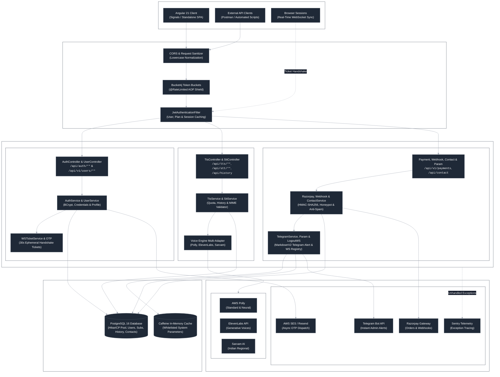

---

## 3. Cross-Cutting Engineering Conventions

### 3.1 Authentication & Session Management
- **Token Standard:** JSON Web Token (JWT), signed with HMAC-SHA256 (`jwt.secret`).
- **Header Format:** `Authorization: Bearer <jwt_token>`
- **Stateless Invalidation (`session_version`):** Every user entity contains a `session_version` counter (numeric `BIGINT`). The JWT payload embeds this version (`sessionVersion`). On every authenticated request, `JwtAuthenticationFilter` resolves the user and asserts that the token's `sessionVersion` strictly matches the database. Modifying passwords or invoking logout atomically increments `session_version`, invalidating all previously issued tokens across all devices.
- **Request Attribute Caching:** To eliminate redundant database queries, `JwtAuthenticationFilter` pre-caches `userId`, `username`, `planType`, `subscriptionStatus`, and `planExpiry` into `HttpServletRequest` attributes. Downstream controllers read these cached attributes directly.
- **WebSocket Tickets:** To prevent exposing JWTs in URL query strings during browser WebSocket handshakes, clients call `POST /api/auth/ws-ticket` to receive an ephemeral 30-second single-use ticket. The WebSocket handshake (`/ws/logout?ticket=...`) verifies and consumes this ticket atomically.

### 3.2 Environments & Base URLs
| Environment | Base HTTP URL | Base WebSocket URL | Purpose |
|---|---|---|---|
| **Local Development** | `http://localhost:8080` | `ws://localhost:8080` | Local Spring Boot development instance |
| **Production / Render** | `https://api.mohitur.com` | `wss://api.mohitur.com` | Production cloud deployment |

### 3.3 Standard Error Envelope (`ApiErrorResponse`)
All unhandled and business exceptions are intercepted by `GlobalExceptionHandler` and serialized into a uniform error envelope:

```json
{
    "timestamp": "2026-09-22T14:30:00.123456",
    "status": 400,
    "error": "Validation Error",
    "message": "Invalid input data",
    "path": "/api/auth/register",
    "validationErrors": {
        "email": "Invalid email format",
        "password": "Password must be at least 8 characters long"
    }
}
```

### 3.4 Rate Limiting & Abuse Prevention
The backend enforces token-bucket rate limiting via the `@RateLimited` aspect and Bucket4j:
| Action Identifier | Target Endpoints | Default Bucket Capacity | Refill Duration | Scope |
|---|---|---|---|---|
| `AUTH` | `/api/auth/login`, `/api/auth/register` | 5 requests | 1 minute | Per Client IP |
| `OTP_VERIFY` | `/api/auth/verify-email`, `/api/v1/users/me/verify-email-change` | 5 requests | 1 minute | Per Client IP |
| `OTP_RESEND` | `/api/auth/resend-otp`, `/api/v1/users/me/resend-profile-otp` | 3 requests | 1 minute | Per Client IP |
| `PASSWORD_RESET` | `/api/auth/forgot-password`, `/api/auth/reset-password` | 3 requests | 1 minute | Per Client IP |
| `TTS` | `/api/tts/synthesize`, `/api/tts/synthesize-stream` | Dynamic by Plan | 1 minute | Per User ID |
| `STT` | `/api/stt/transcribe`, `/api/stt/transcribe-live`, `/api/stt/translate` | Dynamic by Plan | 1 minute | Per User ID |
| `LIVE_PARAM` | `/api/system-parameters/**` | 100 requests | 1 minute | Per Client IP |
| `PING` | `/api/auth/ping` | 60 requests | 1 minute | Global / IP |
| `PUBLIC` | `/api/contact`, `/api/auth/check-*` | 10 requests | 1 minute | Per Client IP |

When a rate limit is breached, the API returns HTTP `429 Too Many Requests` along with a `Retry-After: <seconds>` response header.

---

## 4. Clickable Table of Contents

- [1. System Overview](#1-system-overview)
- [2. System-Level Architecture](#2-system-level-architecture)
- [3. Cross-Cutting Engineering Conventions](#3-cross-cutting-engineering-conventions)
- [4. Clickable Table of Contents](#4-clickable-table-of-contents)
- [5. Authentication & Security Domain](#5-authentication--security-domain)
  - [5.1 POST /api/auth/register — Register New User Account](#51-post-apiauthregister--register-new-user-account)
  - [5.2 POST /api/auth/login — User Authentication & Session Issuance](#52-post-apiauthlogin--user-authentication--session-issuance)
  - [5.3 POST /api/auth/verify-email — Account Email Verification via OTP](#53-post-apiauthverify-email--account-email-verification-via-otp)
  - [5.4 POST /api/auth/resend-otp — Resend Registration Verification OTP](#54-post-apiauthresend-otp--resend-registration-verification-otp)
  - [5.5 POST /api/auth/forgot-password — Request Password Reset OTP](#55-post-apiauthforgot-password--request-password-reset-otp)
  - [5.6 POST /api/auth/reset-password — Complete Password Reset with OTP](#56-post-apiauthreset-password--complete-password-reset-with-otp)
  - [5.7 GET /api/auth/me — Retrieve Authenticated User Profile](#57-get-apiauthme--retrieve-authenticated-user-profile)
  - [5.8 GET /api/auth/ping — Infrastructure Health Check & Spin-Down Prevention](#58-get-apiauthping--infrastructure-health-check--spin-down-prevention)
  - [5.9 POST /api/auth/ws-ticket — Issue Ephemeral WebSocket Handshake Ticket](#59-post-apiauthws-ticket--issue-ephemeral-websocket-handshake-ticket)
  - [5.10 POST /api/auth/logout — Global Session Invalidation](#510-post-apiauthlogout--global-session-invalidation)
  - [5.11 GET /api/auth/check-username — Check Username Availability](#511-get-apiauthcheck-username--check-username-availability)
  - [5.12 GET /api/auth/check-email — Check Email Registration Status](#512-get-apiauthcheck-email--check-email-registration-status)
  - [5.13 GET /api/auth/check-phone — Check Phone Number Registration Status](#513-get-apiauthcheck-phone--check-phone-number-registration-status)
- [6. User Profile Management Domain](#6-user-profile-management-domain)
  - [6.1 GET /api/v1/users/me — Get Detailed User Profile](#61-get-apiv1usersme--get-detailed-user-profile)
  - [6.2 POST /api/v1/users/profile/request-update — Initiate Profile Modification OTP](#62-post-apiv1usersprofilerequest-update--initiate-profile-modification-otp)
  - [6.3 PUT /api/v1/users/profile — Update Profile Information](#63-put-apiv1usersprofile--update-profile-information)
  - [6.4 POST /api/v1/users/me/verify-email-change — Confirm Email Modification OTP](#64-post-apiv1usersmeverify-email-change--confirm-email-modification-otp)
  - [6.5 POST /api/v1/users/me/resend-profile-otp — Resend Profile Modification OTP](#65-post-apiv1usersmeresend-profile-otp--resend-profile-modification-otp)
  - [6.6 POST /api/v1/users/password — Change Password for Logged-In User](#66-post-apiv1userspassword--change-password-for-logged-in-user)
  - [6.7 POST /api/v1/users/me/cancel-profile-changes — Cancel Pending Profile Modifications](#67-post-apiv1usersmecancel-profile-changes--cancel-pending-profile-modifications)
- [7. Text-to-Speech (TTS) Synthesis Domain](#7-text-to-speech-tts-synthesis-domain)
  - [7.1 GET /api/tts/voices — Retrieve Plan-Entitled Synthesis Voices](#71-get-apittsvoices--retrieve-plan-entitled-synthesis-voices)
  - [7.2 GET /api/tts/usage — Retrieve Daily Synthesis Quota & Usage](#72-get-apittsusage--retrieve-daily-synthesis-quota--usage)
  - [7.3 POST /api/tts/synthesize — Generate Buffered Audio Synthesis](#73-post-apittssynthesize--generate-buffered-audio-synthesis)
  - [7.4 POST /api/tts/synthesize-stream — Stream Low-Latency Audio Synthesis](#74-post-apittssynthesize-stream--stream-low-latency-audio-synthesis)
- [8. Speech-to-Text (STT) & Translation Domain](#8-speech-to-text-stt--translation-domain)
  - [8.1 POST /api/stt/transcribe — Transcribe Audio File (PRO+)](#81-post-apistttranscribe--transcribe-audio-file-pro)
  - [8.2 POST /api/stt/transcribe-live — Transcribe Live Microphone Recording (PRO_PLUS+)](#82-post-apistttranscribe-live--transcribe-live-microphone-recording-pro_plus)
  - [8.3 POST /api/stt/translate — Translate Transcribed Text](#83-post-apistttranslate--translate-transcribed-text)
- [9. Analytics & Synthesis History Domain](#9-analytics--synthesis-history-domain)
  - [9.1 GET /api/history — Retrieve Paginated Synthesis History](#91-get-apihistory--retrieve-paginated-synthesis-history)
  - [9.2 DELETE /api/history/delete — Batch Delete Specific History Records](#92-delete-apihistorydelete--batch-delete-specific-history-records)
  - [9.3 DELETE /api/history/clear-all — Purge All Synthesis History](#93-delete-apihistoryclear-all--purge-all-synthesis-history)
- [10. Billing & Subscriptions Domain](#10-billing--subscriptions-domain)
  - [10.1 POST /api/v1/payments/create-order — Create Razorpay Payment Order](#101-post-apiv1paymentscreate-order--create-razorpay-payment-order)
  - [10.2 POST /api/v1/payments/verify — Verify Razorpay Payment Signature & Upgrade](#102-post-apiv1paymentsverify--verify-razorpay-payment-signature--upgrade)
  - [10.3 GET /api/v1/payments/history — Get Paginated Payment & Invoice History](#103-get-apiv1paymentshistory--get-paginated-payment--invoice-history)
- [11. Webhook Integrations Domain](#11-webhook-integrations-domain)
  - [11.1 POST /api/v1/webhooks/razorpay — Inbound Razorpay Webhook Event Processor](#111-post-apiv1webhooksrazorpay--inbound-razorpay-webhook-event-processor)
- [12. Contact & Inquiries Domain](#12-contact--inquiries-domain)
  - [12.1 POST /api/contact — Public Contact Form Submission](#121-post-apicontact--public-contact-form-submission)
- [13. System Parameters & Feature Flags Domain](#13-system-parameters--feature-flags-domain)
  - [13.1 GET /api/system-parameters/bulk — Bulk Query Whitelisted Parameters](#131-get-apisystem-parametersbulk--bulk-query-whitelisted-parameters)
  - [13.2 GET /api/system-parameters/live/{name} — Query Live Database Parameter](#132-get-apisystem-parameterslivename--query-live-database-parameter)
  - [13.3 GET /api/system-parameters/cached/{name} — Query In-Memory Cached Parameter](#133-get-apisystem-parameterscachedname--query-in-memory-cached-parameter)
- [14. Real-Time WebSockets Domain](#14-real-time-websockets-domain)
  - [14.1 GET /ws/logout — WebSocket Session Termination Stream](#141-get-wslogout--websocket-session-termination-stream)
- [15. Appendices & References](#15-appendices--references)
  - [15.1 Entity Relationship Model (ERD)](#151-entity-relationship-model-erd)
  - [15.2 Domain Terminology Glossary](#152-domain-terminology-glossary)
  - [15.3 Security & Role-Based Access Control (RBAC) Matrix](#153-security--role-based-access-control-rbac-matrix)

---

## 5. Authentication & Security Domain

The Authentication domain manages registration, identity verification, multi-device sessions, password lifecycle, and WebSocket ticket generation. All password hashes utilize BCrypt (`$2a$10$`), and session invalidation operates through an atomic `session_version` integer counter.

### 5.1 `POST /api/auth/register` — Register New User Account

**Summary:** Registers a new user account in `PENDING_VERIFICATION` status, persists credentials securely, and dispatches a 6-digit email OTP.

**Auth:** Public (`permitAll`)

**Request**
| Location | Field | Type | Required | Constraints | Description |
|---|---|---|---|---|---|
| `body` | `username` | String | Yes | Alphanumeric, lowercase normalized, unique | Unique handle for user login |
| `body` | `email` | String | Yes | Valid email RFC 5322, lowercase normalized, unique | User email address for notifications & OTP |
| `body` | `password` | String | Yes | Min 8 chars, mixed case, numbers | Cleartext password (hashed with BCrypt) |
| `body` | `phoneNumber` | String | Yes | E.164 phone format, unique | Phone number for user identification |

```json
{
    "username": "johndoe",
    "email": "john.doe@example.com",
    "password": "SecurePass123!",
    "phoneNumber": "+14155552671"
}
```

**Response**
- **Success (`200 OK`)**:
```json
{
    "username": "johndoe",
    "email": "john.doe@example.com",
    "phoneNumber": "+14155552671",
    "role": "ROLE_USER",
    "planType": "FREE",
    "sessionVersion": 1,
    "sessionDurationMs": 7200000,
    "idleTimeoutMs": 60000,
    "emailVerified": false
}
```
- **Errors**:
| Status | Error Code | Condition |
|---|---|---|
| `400 Bad Request` | `Validation Error` | Missing required field, malformed email, or invalid phone |
| `400 Bad Request` | `DUPLICATE_RESOURCE` | Username, email, or phone number already taken |
| `429 Too Many Requests` | `RATE_LIMIT_EXCEEDED` | Exceeded 5 registration attempts per minute per IP |

**Business Logic / Working Spec**
1. `Sanitizer.sanitize()` normalizes input; `username` and `email` are forced to lowercase.
2. Verifies uniqueness via `UserRepository.findByUsername()`, `findByEmail()`, and `findByPhoneNumber()`.
3. Hashes cleartext password using Spring Security `PasswordEncoder` (BCrypt).
4. Persists `User` entity with `role="ROLE_USER"`, `planType="FREE"`, `emailVerified=false`, and `accountStatus="PENDING_VERIFICATION"`.
5. Generates cryptographically secure 6-digit random numeric OTP via `SecureRandom`.
6. Computes SHA-256 hash of OTP and persists `OtpVerification` entity with 10-minute expiry.
7. Dispatches asynchronous email with raw OTP via `EmailService`.
8. Returns `AuthResponse` with user metadata (`emailVerified: false`). No JWT authentication token is issued at registration; the client must verify their email OTP via `POST /api/auth/verify-email` to receive their initial authentication token.

**Data Flow Diagram (Mermaid)**
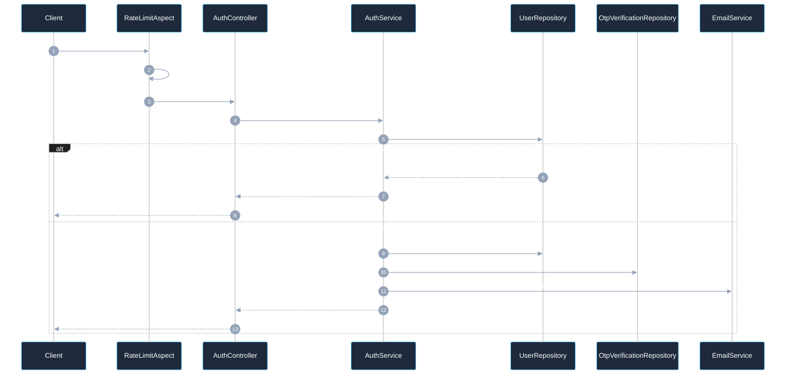

**Architecture Diagram (Mermaid)**
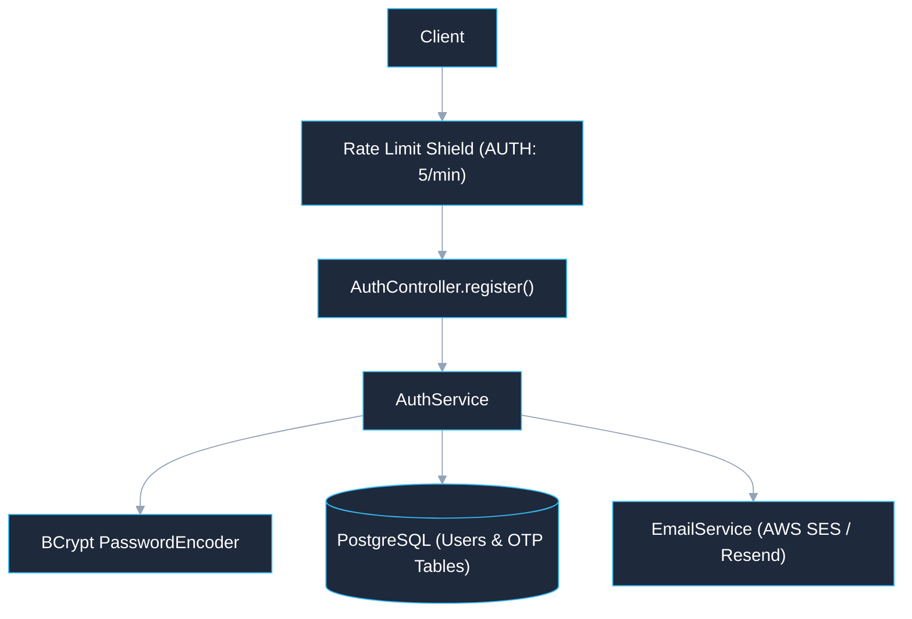

**Edge Cases & Error Handling**
- If email delivery fails upstream, account remains created; caller triggers `POST /api/auth/resend-otp`.
- Race condition on simultaneous duplicate registrations prevented by DB unique constraints on `username`, `email`, and `phone_number`.

**Rate Limits / Timeouts:** Max 5 requests / minute per IP (`RateLimitAction.AUTH`).

**Example Request / Response**
```bash
curl -X POST http://localhost:8080/api/auth/register \
  -H "Content-Type: application/json" \
  -d '{"username":"johndoe","email":"john.doe@example.com","password":"SecurePass123!","phoneNumber":"+14155552671"}'
```

**Related Endpoints:** [5.3 POST /api/auth/verify-email](#53-post-apiauthverify-email--account-email-verification-via-otp), [5.4 POST /api/auth/resend-otp](#54-post-apiauthresend-otp--resend-registration-verification-otp)

---

### 5.2 `POST /api/auth/login` — User Authentication & Session Issuance

**Summary:** Authenticates credentials, provisions a fresh JWT token, increments `session_version` to invalidate concurrent browser sessions, and broadcasts WebSocket termination to superseded sessions.

**Auth:** Public (`permitAll`)

**Request**
| Location | Field | Type | Required | Constraints | Description |
|---|---|---|---|---|---|
| `body` | `username` | String | Yes | Non-blank | Username or registered email address |
| `body` | `password` | String | Yes | Non-blank | User password |

```json
{
    "username": "johndoe",
    "password": "SecurePass123!"
}
```

**Response**
- **Success (`200 OK`)**:
```json
{
    "token": "eyJhbGciOiJIUzI1NiJ9...",
    "username": "johndoe",
    "email": "john.doe@example.com",
    "phoneNumber": "+14155552671",
    "role": "ROLE_USER",
    "planType": "FREE",
    "sessionVersion": 2,
    "sessionDurationMs": 7200000,
    "idleTimeoutMs": 60000,
    "emailVerified": true
}
```
- **Errors**:
| Status | Error Code | Condition |
|---|---|---|
| `400 Bad Request` | `BAD_CREDENTIALS` | Invalid username or password |
| `429 Too Many Requests` | `RATE_LIMIT_EXCEEDED` | Exceeded 5 login attempts per minute per IP |

**Business Logic / Working Spec**
1. Queries user by username or email.
2. Validates password hash with `BCryptPasswordEncoder.matches()`.
3. Atomically increments `session_version` on the user entity in PostgreSQL.
4. Triggers WebSocket disconnect notification via `WebSocketConfig.notifySessionInvalidated()` to disconnect any existing sessions.
5. Generates new signed JWT token with updated `sessionVersion`.
6. Returns `AuthResponse` containing fresh JWT.

**Data Flow Diagram (Mermaid)**
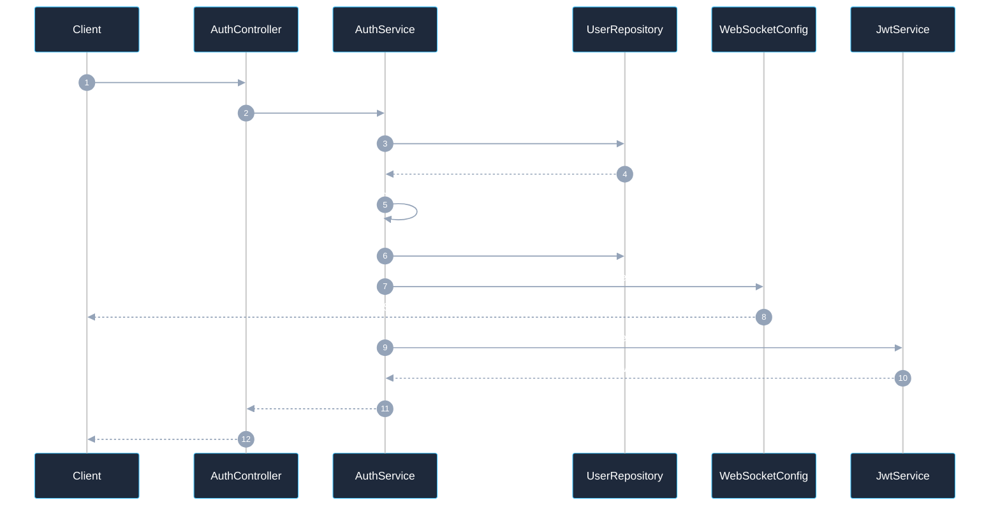

**Edge Cases & Error Handling**
- Accounts marked `PENDING_VERIFICATION` can log in, but `emailVerified` flag in JWT remains `false`, blocking restricted endpoints.
- Prevents password-timing enumeration attacks by using standard BCrypt execution time.

**Rate Limits / Timeouts:** Max 5 requests / minute per IP (`RateLimitAction.AUTH`).

**Example Request / Response**
```bash
curl -X POST http://localhost:8080/api/auth/login \
  -H "Content-Type: application/json" \
  -d '{"username":"johndoe","password":"SecurePass123!"}'
```

**Related Endpoints:** [5.7 GET /api/auth/me](#57-get-apiauthme--retrieve-authenticated-user-profile), [5.10 POST /api/auth/logout](#510-post-apiauthlogout--global-session-invalidation)

---

### 5.3 `POST /api/auth/verify-email` — Account Email Verification via OTP

**Summary:** Validates the 6-digit registration verification OTP sent to user's email, activates account status to `ACTIVE`, and marks email as verified.

**Auth:** Public (`permitAll`)

**Request**
| Location | Field | Type | Required | Constraints | Description |
|---|---|---|---|---|---|
| `body` | `email` | String | Yes | Valid email | Registered email address |
| `body` | `otp` | String | Yes | 6-digit numeric string | Registration OTP |

```json
{
    "email": "john.doe@example.com",
    "otp": "123456"
}
```

**Response**
- **Success (`200 OK`)**: Updated `AuthResponse` with `emailVerified: true`.
- **Errors**:
| Status | Error Code | Condition |
|---|---|---|
| `400 Bad Request` | `INVALID_OTP` | Incorrect OTP code or OTP expired (>10 mins) |
| `429 Too Many Requests` | `RATE_LIMIT_EXCEEDED` | Exceeded 5 OTP verification attempts per minute |

**Business Logic / Working Spec**
1. Retrieves latest unverified `OtpVerification` record for the given email.
2. Computes SHA-256 hash of submitted OTP and checks match against stored `otp_hash`.
3. Asserts current timestamp < `expires_at`.
4. Sets `user.emailVerified = true` and `user.accountStatus = "ACTIVE"`.
5. Deletes used OTP record and issues refreshed JWT token.

**Data Flow Diagram (Mermaid)**
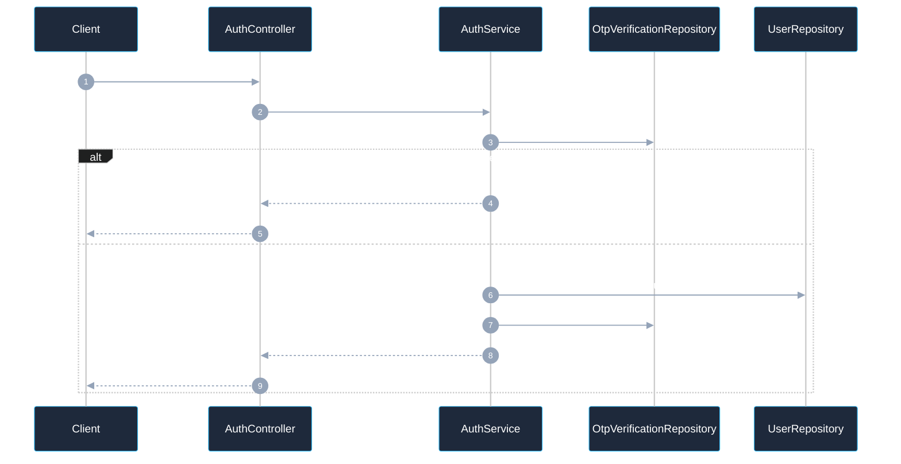

**Rate Limits / Timeouts:** Max 5 requests / minute (`RateLimitAction.OTP_VERIFY`).

**Example Request / Response**
```bash
curl -X POST http://localhost:8080/api/auth/verify-email \
  -H "Content-Type: application/json" \
  -d '{"email":"john.doe@example.com","otp":"123456"}'
```

**Related Endpoints:** [5.4 POST /api/auth/resend-otp](#54-post-apiauthresend-otp--resend-registration-verification-otp)

---

### 5.4 `POST /api/auth/resend-otp` — Resend Registration Verification OTP

**Summary:** Generates and dispatches a fresh 6-digit verification code to the registered email address.

**Auth:** Public (`permitAll`)

**Request**
| Location | Field | Type | Required | Constraints | Description |
|---|---|---|---|---|---|
| `body` | `email` | String | Yes | Valid email | Target email address |

```json
{
    "email": "john.doe@example.com"
}
```

**Response**
- **Success (`200 OK`)**: Empty body (`Void`).
- **Errors**: `400 Bad Request` (User not found or already verified), `429 Too Many Requests` (Bucket: 3/min).

**Business Logic / Working Spec**
1. Verifies user exists and `emailVerified == false`.
2. Generates new 6-digit secure OTP, computes SHA-256 hash, and updates `OtpVerification`.
3. Sends email asynchronously via `EmailService`.

**Data Flow Diagram (Mermaid)**
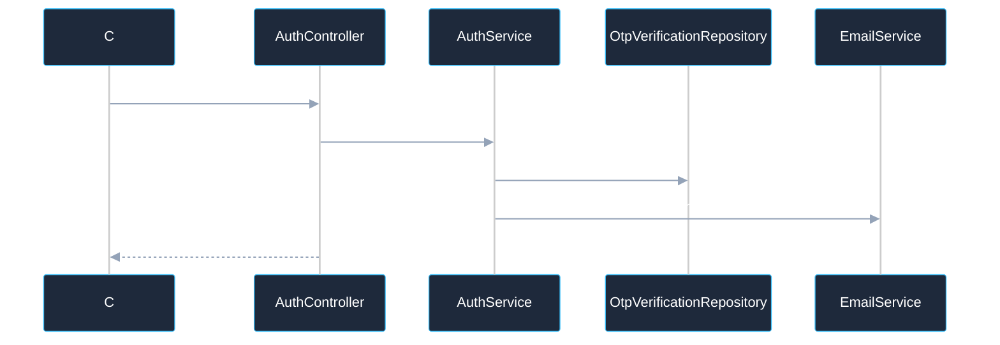

**Rate Limits / Timeouts:** Max 3 requests / minute (`RateLimitAction.OTP_RESEND`).

**Related Endpoints:** [5.3 POST /api/auth/verify-email](#53-post-apiauthverify-email--account-email-verification-via-otp)

---

### 5.5 `POST /api/auth/forgot-password` — Request Password Reset OTP

**Summary:** Initiates the password recovery workflow by emailing a time-sensitive 6-digit password reset code.

**Auth:** Public (`permitAll`)

**Request**
| Location | Field | Type | Required | Constraints | Description |
|---|---|---|---|---|---|
| `body` | `email` | String | Yes | Valid email format | Registered user email |

```json
{
    "email": "john.doe@example.com"
}
```

**Response**
- **Success (`200 OK`)**: Empty body (`Void`). Note: returns 200 even if email does not exist to prevent account enumeration.

**Data Flow Diagram (Mermaid)**
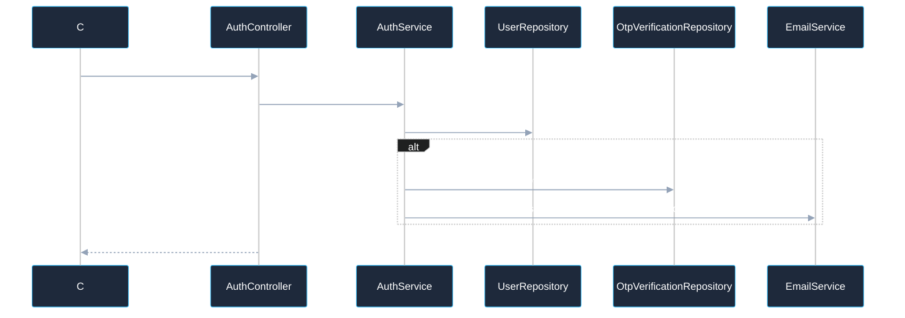

**Rate Limits / Timeouts:** Max 3 requests / minute (`RateLimitAction.PASSWORD_RESET`).

**Related Endpoints:** [5.6 POST /api/auth/reset-password](#56-post-apiauthreset-password--complete-password-reset-with-otp)

---

### 5.6 `POST /api/auth/reset-password` — Complete Password Reset with OTP

**Summary:** Verifies password reset OTP and sets a new password, automatically revoking all active user sessions.

**Auth:** Public (`permitAll`)

**Request**
| Location | Field | Type | Required | Constraints | Description |
|---|---|---|---|---|---|
| `body` | `email` | String | Yes | Valid email | User email |
| `body` | `otp` | String | Yes | 6 digits | Reset verification code |
| `body` | `newPassword` | String | Yes | Min 8 chars | New cleartext password |

```json
{
    "email": "john.doe@example.com",
    "otp": "123456",
    "newPassword": "BrandNewSecurePass456!"
}
```

**Response**
- **Success (`200 OK`)**: Empty body (`Void`).
- **Errors**: `400 Bad Request` (Invalid/expired OTP), `429 Too Many Requests`.

**Business Logic / Working Spec**
1. Validates OTP against stored hash in `OtpVerification`.
2. Encodes `newPassword` with BCrypt and saves to `User`.
3. Increments `user.session_version` to invalidate all issued JWTs globally.
4. Dispatches WebSocket session invalidation notice.

**Data Flow Diagram (Mermaid)**
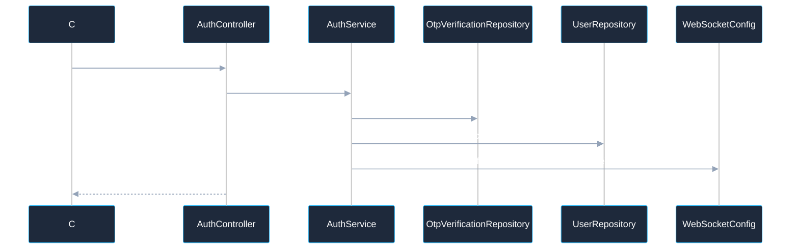

**Rate Limits / Timeouts:** Max 3 requests / minute (`RateLimitAction.PASSWORD_RESET`).

**Related Endpoints:** [5.2 POST /api/auth/login](#52-post-apiauthlogin--user-authentication--session-issuance)

---

### 5.7 `GET /api/auth/me` — Retrieve Authenticated User Profile

**Summary:** Returns identity, active plan type, subscription expiration, and session parameters for the current authenticated caller.

**Auth:** Bearer JWT (`anyRequest().authenticated()`)

**Response**
- **Success (`200 OK`)**:
```json
{
    "token": null,
    "username": "johndoe",
    "email": "john.doe@example.com",
    "phoneNumber": "+14155552671",
    "role": "ROLE_USER",
    "planType": "PRO",
    "sessionVersion": 3,
    "sessionDurationMs": 7200000,
    "idleTimeoutMs": 60000,
    "emailVerified": true
}
```
- **Errors**: `401 Unauthorized` (Invalid/expired JWT or session version mismatch).

**Data Flow Diagram (Mermaid)**
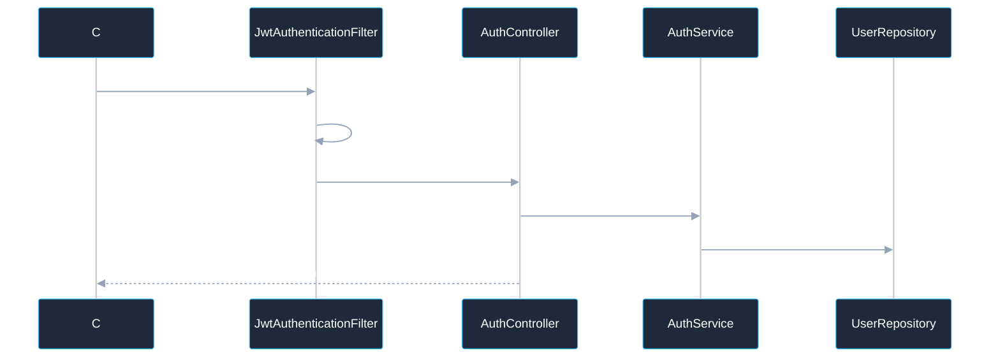

**Related Endpoints:** [6.1 GET /api/v1/users/me](#61-get-apiv1usersme--get-detailed-user-profile)

---

### 5.8 `GET /api/auth/ping` — Infrastructure Health Check & Spin-Down Prevention

**Summary:** Lightweight public health ping used by cron jobs and GitHub Actions to prevent Render backend instances from spinning down.

**Auth:** Public (`permitAll`)

**Response**
- **Success (`200 OK`)**: Empty body (`Void`).

**Data Flow Diagram (Mermaid)**
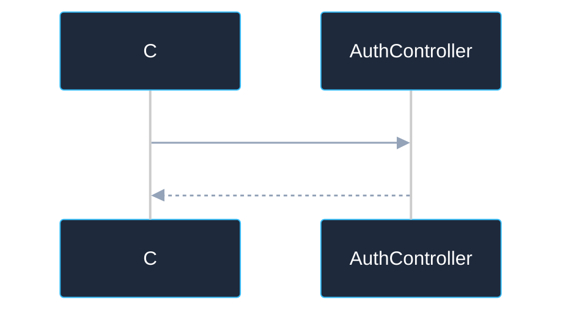

**Rate Limits / Timeouts:** Max 60 requests / minute (`RateLimitAction.PING`).

---

### 5.9 `POST /api/auth/ws-ticket` — Issue Ephemeral WebSocket Handshake Ticket

**Summary:** Issues a short-lived (30s), single-use ticket string that allows the frontend to connect to WebSocket endpoints without passing JWT tokens in query parameters.

**Auth:** Bearer JWT

**Response**
- **Success (`200 OK`)**:
```json
{
    "ticket": "f47ac10b-58cc-4372-a567-0e02b2c3d479"
}
```

**Business Logic / Working Spec**
1. Resolves authenticated username from `SecurityContext`.
2. `WSTicketService.issueTicket(username)` generates a UUIDv4 ticket and stores in cache with 30-second TTL (`TICKET_TTL_MS = 30000`).
3. Returns ticket in response map.

**Data Flow Diagram (Mermaid)**
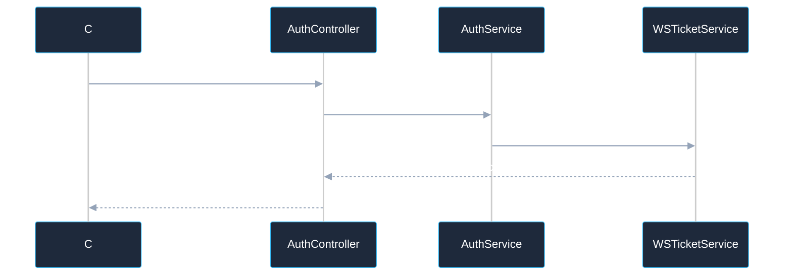

**Related Endpoints:** [14.1 GET /ws/logout](#141-get-wslogout--websocket-session-termination-stream)

---

### 5.10 `POST /api/auth/logout` — Global Session Invalidation

**Summary:** Increments user `session_version` in PostgreSQL, instantly invalidating the caller's JWT and all other tokens issued to this user across all devices.

**Auth:** Bearer JWT

**Response**
- **Success (`200 OK`)**: Empty body (`Void`).

**Data Flow Diagram (Mermaid)**
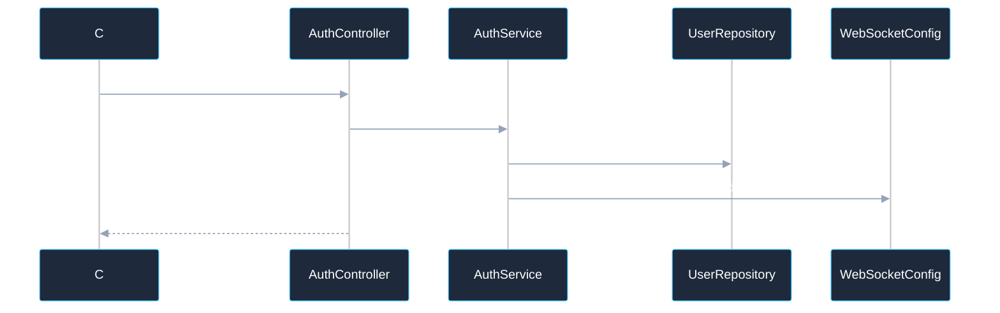

**Related Endpoints:** [5.2 POST /api/auth/login](#52-post-apiauthlogin--user-authentication--session-issuance)

---

### 5.11 `GET /api/auth/check-username` — Check Username Availability
**Summary:** Checks whether a username handle is already registered.  
**Auth:** Public (`permitAll`) | **Query:** `username` (String, required)  
**Response (`200 OK`)**: `true` (taken) or `false` (available).

### 5.12 `GET /api/auth/check-email` — Check Email Registration Status
**Summary:** Checks whether an email address is already bound to an account.  
**Auth:** Public (`permitAll`) | **Query:** `email` (String, required)  
**Response (`200 OK`)**: `true` (registered) or `false` (available).

### 5.13 `GET /api/auth/check-phone` — Check Phone Number Registration Status
**Summary:** Checks whether an E.164 phone number is already registered.  
**Auth:** Public (`permitAll`) | **Query:** `phone` (String, required)  
**Response (`200 OK`)**: `true` (registered) or `false` (available).

---

## 6. User Profile Management Domain

The User Profile domain controls identity settings, password updates, and two-step email address changes. Sensitive modifications (such as updating email or password) require current password verification and email-based OTP authorization.

### 6.1 `GET /api/v1/users/me` — Get Detailed User Profile
**Summary:** Returns identity, plan tier, and account settings for the authenticated user.  
**Auth:** Bearer JWT  
**Response (`200 OK`)**:
```json
{
    "token": null,
    "username": "johndoe",
    "email": "john.doe@example.com",
    "phoneNumber": "+14155552671",
    "role": "ROLE_USER",
    "planType": "PRO",
    "sessionVersion": 2,
    "sessionDurationMs": 7200000,
    "idleTimeoutMs": 60000,
    "emailVerified": true
}
```
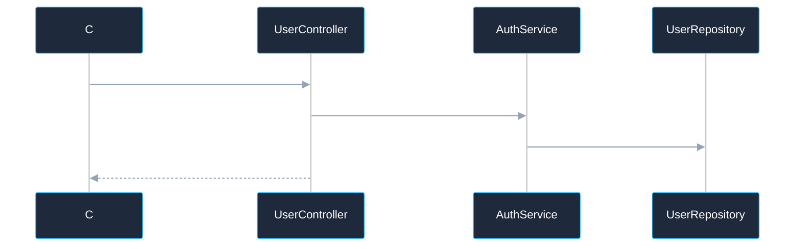

---

### 6.2 `POST /api/v1/users/profile/request-update` — Initiate Profile Modification OTP
**Summary:** Dispatches an email OTP to the user before sensitive profile modifications can proceed.  
**Auth:** Bearer JWT | **Body:** None (`Void`)  
**Response (`200 OK`)**: Empty body (`Void`).  
**Business Logic:** Finds user, generates 6-digit OTP, stores hash in `OtpVerification`, and sends email.
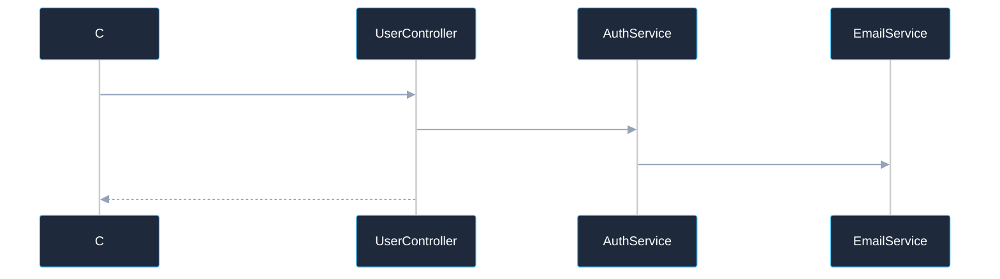

---

### 6.3 `PUT /api/v1/users/profile` — Update Profile Information
**Summary:** Updates username, phone number, and initiates email address change with OTP verification and current password validation.  
**Auth:** Bearer JWT  
**Request**
| Location | Field | Type | Required | Constraints | Description |
|---|---|---|---|---|---|
| `body` | `username` | String | No | Alphanumeric | New username handle |
| `body` | `email` | String | No | Valid email | New email (triggers pending email status) |
| `body` | `phoneNumber` | String | No | E.164 format | New phone number |
| `body` | `currentPassword` | String | Yes | Non-blank | Password verification |
| `body` | `newPassword` | String | No | Min 8 chars | Optional new password |
| `body` | `otp` | String | Conditional | 6 digits | Required if profile OTP was initiated |

```json
{
    "username": "johndoe_updated",
    "email": "new.email@example.com",
    "phoneNumber": "+14155559999",
    "currentPassword": "SecurePass123!",
    "otp": "654321"
}
```
**Response (`200 OK`)**: Updated `AuthResponse`.
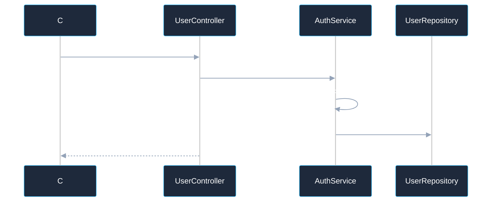

---

### 6.4 `POST /api/v1/users/me/verify-email-change` — Confirm Email Modification OTP
**Summary:** Finalizes an email address change by verifying the code dispatched to the newly requested email.  
**Auth:** Bearer JWT  
**Request Body:** `{"otp": "123456"}`  
**Response (`200 OK`)**: Fresh `AuthResponse` containing the confirmed new email.
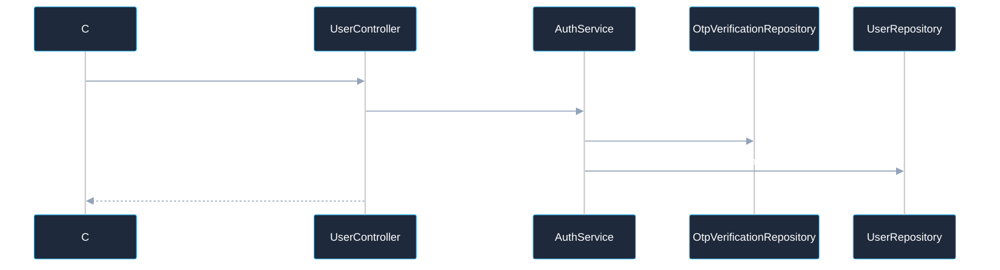

---

### 6.5 `POST /api/v1/users/me/resend-profile-otp` — Resend Profile Modification OTP
**Summary:** Re-issues a pending profile verification or email change OTP.  
**Auth:** Bearer JWT | **Response (`200 OK`)**: Empty body.

---

### 6.6 `POST /api/v1/users/password` — Change Password for Logged-In User
**Summary:** Changes the user's password, resets `session_version`, and emits WebSocket session termination.  
**Auth:** Bearer JWT  
**Request Body:**
```json
{
    "currentPassword": "OldSecurePass123!",
    "newPassword": "NewUltraSecurePass456!"
}
```
**Response (`200 OK`)**: Empty body (`Void`).
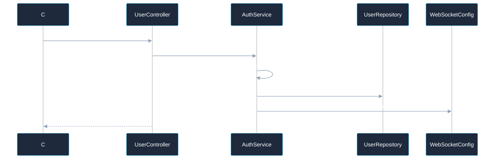

---

### 6.7 `POST /api/v1/users/me/cancel-profile-changes` — Cancel Pending Profile Modifications
**Summary:** Aborts any pending unverified email updates and flushes active profile OTPs.  
**Auth:** Bearer JWT | **Response (`200 OK`)**: `AuthResponse` reverting to active email.

---

## 7. Text-to-Speech (TTS) Synthesis Domain

The TTS domain is the core audio synthesis engine of SpeakIT. It features dynamic routing across AWS Polly (Standard & Neural engines), ElevenLabs, and Sarvam AI, enforcing character limits, daily synthesis limits, and voice entitlements based on user subscription tiers.

### 7.1 `GET /api/tts/voices` — Retrieve Plan-Entitled Synthesis Voices
**Summary:** Returns the list of available speech voices filtered by the caller's active subscription tier (FREE, PRO, PRO_PLUS, ENTERPRISE).  
**Auth:** Bearer JWT  
**Response (`200 OK`)**:
```json
[
    {
        "id": "Joanna",
        "name": "Joanna",
        "language": "en-US",
        "gender": "Female",
        "engine": "neural",
        "provider": "AWS_POLLY"
    },
    {
        "id": "21m00Tcm4TlvDq8ikWAM",
        "name": "Rachel (Natural)",
        "language": "en-US",
        "gender": "Female",
        "engine": "generative",
        "provider": "ELEVEN_LABS"
    }
]
```
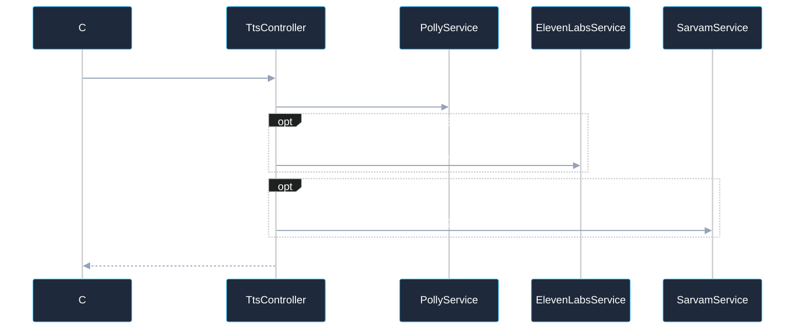

---

### 7.2 `GET /api/tts/usage` — Retrieve Daily Synthesis Quota & Usage
**Summary:** Returns the caller's current daily synthesis count, daily quota limit, and plan identifier.  
**Auth:** Bearer JWT  
**Response (`200 OK`)**:
```json
{
    "plan": "PRO",
    "dailyCount": 12,
    "dailyLimit": 100
}
```
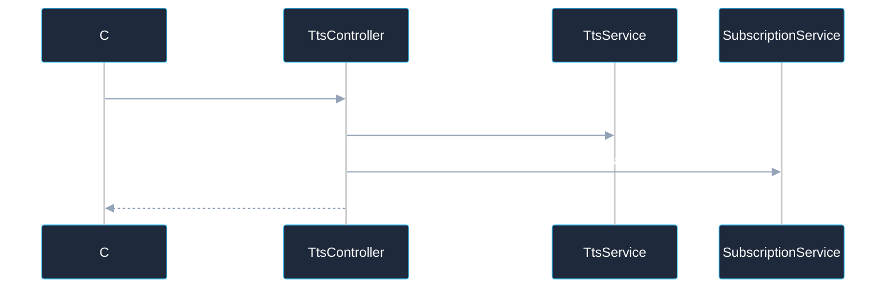

---

### 7.3 `POST /api/tts/synthesize` — Generate Buffered Audio Synthesis
**Summary:** Synthesizes input text into a complete downloadable audio file (MP3, OGG, or PCM), enforcing character and tier quotas, and records synthesis history.  
**Auth:** Bearer JWT  
**Request**
| Location | Field | Type | Required | Constraints | Description |
|---|---|---|---|---|---|
| `body` | `text` | String | Yes | Max 10,000 chars (further capped by plan) | Text to synthesize |
| `body` | `voiceId` | String | Yes | Non-blank | Voice identifier (e.g. `Joanna`, `Matthew`) |
| `body` | `voiceName` | String | No | Max 100 chars | Display name of the voice |
| `body` | `voiceType` | String | No | `STANDARD`, `NEURAL`, `NATURAL`, `INDIAN` | Voice technology engine |
| `body` | `outputFormat` | String | No | `mp3`, `ogg_vorbis`, `pcm` (Default: `mp3`) | Target audio container format |
| `body` | `isElevenLabs` | Boolean | No | Default: `false` | Routes synthesis to ElevenLabs |
| `body` | `isSarvam` | Boolean | No | Default: `false` | Routes synthesis to Sarvam AI |
| `body` | `languageCode` | String | No | Standard format (e.g., `en-US`, `hi-IN`) | Language code for regional engines |
| `body` | `pace` | Double | No | Default: `1.0` (0.5 to 2.0) | Speech tempo multiplier |
| `body` | `samplingRate` | Integer | No | Hz (e.g. 22050, 44100) | Audio sampling frequency |

```json
{
    "text": "Welcome to SpeakIT text-to-speech platform.",
    "voiceId": "Joanna",
    "voiceName": "Joanna",
    "voiceType": "NEURAL",
    "outputFormat": "mp3",
    "isElevenLabs": false,
    "isSarvam": false,
    "languageCode": "en-US",
    "pace": 1.0,
    "samplingRate": 22050
}
```
**Response**
- **Success (`200 OK`)**: Raw audio bytes with `Content-Type: audio/mpeg` (or `audio/ogg`, `audio/wave`) and header `Content-Disposition: attachment; filename="speech.mp3"`.
- **Errors**:
| Status | Error Code | Condition |
|---|---|---|
| `400 Bad Request` | `VALIDATION_ERROR` | Empty text or invalid voice format |
| `403 Forbidden` | `PLAN_RESTRICTION` | Character limit exceeded for plan or unauthorized engine (e.g., FREE user requesting Neural voice) |
| `500 Internal Server Error` | `TTS_ERROR` | Synthesis failure at cloud provider |

**Working Spec & Engine Routing**
1. Extracts pre-cached plan details (`planType`, `subscriptionStatus`, `planExpiry`, `userId`) from request attributes.
2. Enforces plan access via `TtsService.validatePlanAccess()`.
3. Checks text length against `SubscriptionService.getMaxCharacters(planType)`.
4. If `isElevenLabs == true`: verifies ElevenLabs plan permission, executes `ElevenLabsService.synthesizeSpeech()`.
5. Else if `isSarvam == true`: verifies Sarvam plan permission, executes `SarvamService.synthesizeSpeech()`.
6. Else (AWS Polly): dynamically negotiates highest permitted engine (NEURAL vs STANDARD) via `PollyService.getBestEngineForVoice(voiceId, planType)`.
7. Persists synthesis history entry to `TtsHistory` asynchronously.
8. Returns raw audio stream with appropriate media headers.

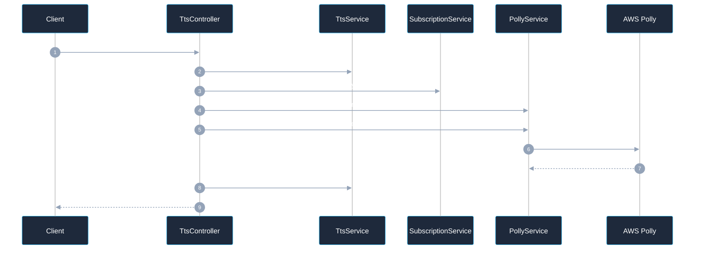

```mermaid
%%{init: {'theme': 'dark', 'themeVariables': {'textColor': '#ffffff', 'primaryTextColor': '#ffffff', 'secondaryTextColor': '#ffffff', 'mainBkg': '#1e293b', 'nodeBorder': '#38bdf8', 'lineColor': '#94a3b8'}}}%%
flowchart TD
    Req["TtsRequest"] --> Router{"Engine Router"}
    Router -->|isElevenLabs| E11["ElevenLabs Service"] --> E11Cloud["ElevenLabs API"]
    Router -->|isSarvam| Sarv["Sarvam AI Service"] --> SarvCloud["Sarvam Regional API"]
    Router -->|Default| Polly["AWS Polly Service"] --> PollyCloud["AWS Polly Cloud"]
    PollyCloud --> AuditHistory["Record History (Postgres)"]
    E11Cloud --> AuditHistory
    SarvCloud --> AuditHistory
```

**Rate Limits / Timeouts:** Max characters per synthesis: FREE=500, PRO=2,500, PRO_PLUS=5,000, ENTERPRISE=10,000.

---

### 7.4 `POST /api/tts/synthesize-stream` — Stream Low-Latency Audio Synthesis
**Summary:** Synthesizes speech and pipes the response as an `InputStreamResource` for zero-buffering, low-latency browser audio streaming.  
**Auth:** Bearer JWT  
**Response (`200 OK`)**: Chunked HTTP audio stream (`audio/mpeg`).
```mermaid
%%{init: {'theme': 'dark', 'themeVariables': {'textColor': '#ffffff', 'primaryTextColor': '#ffffff', 'actorTextColor': '#ffffff', 'actorBkg': '#1e293b', 'actorBorder': '#38bdf8', 'signalColor': '#94a3b8', 'signalTextColor': '#ffffff', 'labelTextColor': '#ffffff', 'loopTextColor': '#ffffff', 'noteTextColor': '#ffffff', 'noteBkgColor': '#0f172a', 'noteBorderColor': '#475569', 'activationBorderColor': '#38bdf8', 'activationBkgColor': '#334155', 'sequenceNumberColor': '#ffffff'}}}%%
sequenceDiagram
    C->>TtsController: POST /api/tts/synthesize-stream [Bearer]
    TtsController->>PollyService: synthesizeSpeech(text, voiceId, engine)
    PollyService->>AWS Polly: Stream Audio
    TtsController-->>C: 200 OK (Chunked Audio Stream)
```

---

## 8. Speech-to-Text (STT) & Translation Domain

The STT domain powers automated audio transcription and neural multi-language translation. Uploaded audio files undergo strict MIME-type and magic-byte inspection via `AudioFileValidator` to prevent arbitrary file upload vulnerabilities.

### 8.1 `POST /api/stt/transcribe` — Transcribe Audio File (PRO+)
**Summary:** Uploads an audio file and converts speech to text. Restricted to PRO, PRO_PLUS, and ENTERPRISE tiers.  
**Auth:** Bearer JWT (Requires active subscription)  
**Request (`multipart/form-data`)**
| Field | Type | Required | Constraints | Description |
|---|---|---|---|---|
| `file` | Binary File | Yes | WAV, MP3, M4A, OGG, WebM; Plan-based size limit | Audio file to transcribe |
| `language` | Text | No | Regex: `^[a-zA-Z0-9\\-]+$` | Source audio language (e.g. `en`, `hi`) |
| `provider` | Text | No | `SARVAM` or `ELEVEN_LABS` | Preferred transcription engine |

**Response (`200 OK`)**:
```json
{
    "text": "Welcome to the SpeakIT automated speech transcription service.",
    "language": "en",
    "durationSeconds": 4.52,
    "confidence": 0.985,
    "provider": "SARVAM"
}
```
- **Errors**:
| Status | Error Code | Condition |
|---|---|---|
| `400 Bad Request` | `INVALID_INPUT` | Invalid language code, malformed provider, or invalid audio format |
| `403 Forbidden` | `PLAN_RESTRICTION` | Caller does not have an active PRO, PRO_PLUS, or ENTERPRISE subscription |
| `503 Service Unavailable` | `SERVICE_DISABLED` | Global `STT_ENABLED` system parameter is set to `false` |

**Business Logic / Working Spec**
1. Validates `language` and `provider` parameters against strict regex.
2. Checks dynamic feature flag `STT_ENABLED` from `SystemParameterService`.
3. Validates caller plan via `SubscriptionService.hasSpeechToText(planType)`.
4. Inspects audio file magic bytes and MIME type via `AudioFileValidator.validate()`.
5. Validates file size against tier limit via `SubscriptionService.getSttUploadLimitBytes(planType)`.
6. Enforces engine entitlement: if caller is PRO and requests `ELEVEN_LABS`, forces `SARVAM` (ElevenLabs STT reserved for PRO_PLUS/ENTERPRISE).
7. Executes transcription and returns `SpeechToTextResult`.

```mermaid
%%{init: {'theme': 'dark', 'themeVariables': {'textColor': '#ffffff', 'primaryTextColor': '#ffffff', 'actorTextColor': '#ffffff', 'actorBkg': '#1e293b', 'actorBorder': '#38bdf8', 'signalColor': '#94a3b8', 'signalTextColor': '#ffffff', 'labelTextColor': '#ffffff', 'loopTextColor': '#ffffff', 'noteTextColor': '#ffffff', 'noteBkgColor': '#0f172a', 'noteBorderColor': '#475569', 'activationBorderColor': '#38bdf8', 'activationBkgColor': '#334155', 'sequenceNumberColor': '#ffffff'}}}%%
sequenceDiagram
    autonumber
    participant C as Client
    participant SC as SttController
    participant Param as SystemParameterService
    participant Sub as SubscriptionService
    participant Val as AudioFileValidator
    participant Svc as SttService

    C->>SC: POST /api/stt/transcribe [multipart/form-data]
    SC->>Param: getLiveParameter("STT_ENABLED")
    SC->>Sub: hasSpeechToText(planType)
    SC->>Val: validate(file)
    SC->>Sub: getSttUploadLimitBytes(planType)
    SC->>Svc: transcribe(file, language, provider)
    Svc-->>SC: SpeechToTextResult
    SC-->>C: 200 OK (SpeechToTextResult)
```

---

### 8.2 `POST /api/stt/transcribe-live` — Transcribe Live Microphone Recording (PRO_PLUS+)
**Summary:** High-priority transcription endpoint optimized for live browser microphone recordings (strictly capped at 10MB).  
**Auth:** Bearer JWT (PRO_PLUS and ENTERPRISE tiers only)  
**Request (`multipart/form-data`):** Same schema as 8.1, maximum file size 10MB.  
**Response (`200 OK`)**: `SpeechToTextResult`
```mermaid
%%{init: {'theme': 'dark', 'themeVariables': {'textColor': '#ffffff', 'primaryTextColor': '#ffffff', 'actorTextColor': '#ffffff', 'actorBkg': '#1e293b', 'actorBorder': '#38bdf8', 'signalColor': '#94a3b8', 'signalTextColor': '#ffffff', 'labelTextColor': '#ffffff', 'loopTextColor': '#ffffff', 'noteTextColor': '#ffffff', 'noteBkgColor': '#0f172a', 'noteBorderColor': '#475569', 'activationBorderColor': '#38bdf8', 'activationBkgColor': '#334155', 'sequenceNumberColor': '#ffffff'}}}%%
sequenceDiagram
    C->>SttController: POST /api/stt/transcribe-live [multipart]
    SttController->>SystemParameterService: Check STT_ENABLED & LIVE_RECORDING_ENABLED
    SttController->>SubscriptionService: hasLiveRecording(planType)
    SttController->>AudioFileValidator: validate(file, max=10MB)
    SttController->>SttService: transcribe(file, language, provider)
    SttController-->>C: 200 OK (SpeechToTextResult)
```

---

### 8.3 `POST /api/stt/translate` — Translate Transcribed Text
**Summary:** Translates transcribed speech or raw text between supported languages.  
**Auth:** Bearer JWT (Requires STT plan entitlement)  
**Request**
| Location | Field | Type | Required | Constraints | Description |
|---|---|---|---|---|---|
| `body` | `text` | String | Yes | Max 10,000 chars | Text to translate |
| `body` | `sourceLanguage` | String | Yes | Regex: `^[a-zA-Z0-9\\-]+$` | Source language code |
| `body` | `targetLanguage` | String | Yes | Regex: `^[a-zA-Z0-9\\-]+$` | Target language code |

```json
{
    "text": "Hello, welcome to SpeakIT translation service.",
    "sourceLanguage": "en",
    "targetLanguage": "hi"
}
```
**Response (`200 OK`)**:
```json
{
    "translatedText": "नमस्ते, स्पीक-इट अनुवाद सेवा में आपका स्वागत है।",
    "sourceLanguage": "en",
    "targetLanguage": "hi"
}
```
```mermaid
%%{init: {'theme': 'dark', 'themeVariables': {'textColor': '#ffffff', 'primaryTextColor': '#ffffff', 'actorTextColor': '#ffffff', 'actorBkg': '#1e293b', 'actorBorder': '#38bdf8', 'signalColor': '#94a3b8', 'signalTextColor': '#ffffff', 'labelTextColor': '#ffffff', 'loopTextColor': '#ffffff', 'noteTextColor': '#ffffff', 'noteBkgColor': '#0f172a', 'noteBorderColor': '#475569', 'activationBorderColor': '#38bdf8', 'activationBkgColor': '#334155', 'sequenceNumberColor': '#ffffff'}}}%%
sequenceDiagram
    C->>SttController: POST /api/stt/translate [Bearer]
    SttController->>TranslationService: translate(TranslationRequest)
    TranslationService-->>SttController: TranslationResponse
    SttController-->>C: 200 OK
```

---

## 9. Analytics & Synthesis History Domain

Tracks user TTS conversion events, character consumption, voice choices, and audio outputs. Read queries leverage Spring Data JPA projections to eliminate overfetching.

### 9.1 `GET /api/history` — Retrieve Paginated Synthesis History
**Summary:** Returns paginated conversion records for the authenticated user, ordered chronologically descending.  
**Auth:** Bearer JWT  
**Query Parameters:** `page` (Integer, default 0), `size` (Integer, default 20).  
**Response (`200 OK`)**:
```json
{
    "content": [
        {
            "id": 101,
            "voiceId": "Joanna",
            "voiceName": "Joanna",
            "voiceType": "NEURAL",
            "outputFormat": "mp3",
            "characterCount": 45,
            "textSnippet": "Welcome to SpeakIT text-to-speech platform.",
            "createdAt": "2026-09-22T12:00:00"
        }
    ],
    "page": {
        "size": 20,
        "number": 0,
        "totalElements": 1,
        "totalPages": 1
    }
}
```
```mermaid
%%{init: {'theme': 'dark', 'themeVariables': {'textColor': '#ffffff', 'primaryTextColor': '#ffffff', 'actorTextColor': '#ffffff', 'actorBkg': '#1e293b', 'actorBorder': '#38bdf8', 'signalColor': '#94a3b8', 'signalTextColor': '#ffffff', 'labelTextColor': '#ffffff', 'loopTextColor': '#ffffff', 'noteTextColor': '#ffffff', 'noteBkgColor': '#0f172a', 'noteBorderColor': '#475569', 'activationBorderColor': '#38bdf8', 'activationBkgColor': '#334155', 'sequenceNumberColor': '#ffffff'}}}%%
sequenceDiagram
    C->>HistoryController: GET /api/history?page=0&size=20 [Bearer]
    HistoryController->>TtsHistoryRepository: findRecentHistoryByUserId(userId, PageRequest)
    TtsHistoryRepository-->>HistoryController: Page<TtsHistory>
    HistoryController-->>C: 200 OK (PagedModel<TtsHistoryDto>)
```

---

### 9.2 `DELETE /api/history/delete` — Batch Delete Specific History Records
**Summary:** Deletes a list of up to 100 history IDs belonging to the authenticated caller.  
**Auth:** Bearer JWT  
**Request Body:** `[101, 102, 103]` (List of Long IDs)  
**Response (`204 No Content`)**: Empty body.
```mermaid
%%{init: {'theme': 'dark', 'themeVariables': {'textColor': '#ffffff', 'primaryTextColor': '#ffffff', 'actorTextColor': '#ffffff', 'actorBkg': '#1e293b', 'actorBorder': '#38bdf8', 'signalColor': '#94a3b8', 'signalTextColor': '#ffffff', 'labelTextColor': '#ffffff', 'loopTextColor': '#ffffff', 'noteTextColor': '#ffffff', 'noteBkgColor': '#0f172a', 'noteBorderColor': '#475569', 'activationBorderColor': '#38bdf8', 'activationBkgColor': '#334155', 'sequenceNumberColor': '#ffffff'}}}%%
sequenceDiagram
    C->>HistoryController: DELETE /api/history/delete [101, 102] [Bearer]
    HistoryController->>TtsHistoryRepository: deleteAllByIdInAndUserId(ids, userId)
    HistoryController-->>C: 204 No Content
```

---

### 9.3 `DELETE /api/history/clear-all` — Purge All Synthesis History
**Summary:** Permanently purges all conversion history records for the authenticated user.  
**Auth:** Bearer JWT | **Response (`204 No Content`)**: Empty body.
```mermaid
%%{init: {'theme': 'dark', 'themeVariables': {'textColor': '#ffffff', 'primaryTextColor': '#ffffff', 'actorTextColor': '#ffffff', 'actorBkg': '#1e293b', 'actorBorder': '#38bdf8', 'signalColor': '#94a3b8', 'signalTextColor': '#ffffff', 'labelTextColor': '#ffffff', 'loopTextColor': '#ffffff', 'noteTextColor': '#ffffff', 'noteBkgColor': '#0f172a', 'noteBorderColor': '#475569', 'activationBorderColor': '#38bdf8', 'activationBkgColor': '#334155', 'sequenceNumberColor': '#ffffff'}}}%%
sequenceDiagram
    C->>HistoryController: DELETE /api/history/clear-all [Bearer]
    HistoryController->>TtsHistoryRepository: deleteAllByUserId(userId)
    HistoryController-->>C: 204 No Content
```

---

## 10. Billing & Subscriptions Domain

Manages commercial plan tiers (`FREE`, `PRO`, `PRO_PLUS`, `ENTERPRISE`), integrates with Razorpay order creation, verifies cryptographic HMAC SHA-256 signatures, and tracks invoice payment history.

### 10.1 `POST /api/v1/payments/create-order` — Create Razorpay Payment Order
**Summary:** Provisions an official Razorpay payment order and records a pending payment record in PostgreSQL.  
**Auth:** Bearer JWT  
**Request**
| Location | Field | Type | Required | Constraints | Description |
|---|---|---|---|---|---|
| `body` | `planType` | String | Yes | `PRO`, `PRO_PLUS`, `ENTERPRISE` | Target upgrade subscription plan |
| `body` | `amount` | BigDecimal | Yes | Positive numeric | Price in currency units |
| `body` | `currency` | String | Yes | `INR` | Three-letter currency code |

```json
{
    "planType": "PRO",
    "amount": 499,
    "currency": "INR"
}
```
**Response (`200 OK`)**:
```json
{
    "orderId": "order_HpH789xYz",
    "amount": 49900,
    "currency": "INR",
    "key": "rzp_test_placeholder",
    "planType": "PRO"
}
```
```mermaid
%%{init: {'theme': 'dark', 'themeVariables': {'textColor': '#ffffff', 'primaryTextColor': '#ffffff', 'actorTextColor': '#ffffff', 'actorBkg': '#1e293b', 'actorBorder': '#38bdf8', 'signalColor': '#94a3b8', 'signalTextColor': '#ffffff', 'labelTextColor': '#ffffff', 'loopTextColor': '#ffffff', 'noteTextColor': '#ffffff', 'noteBkgColor': '#0f172a', 'noteBorderColor': '#475569', 'activationBorderColor': '#38bdf8', 'activationBkgColor': '#334155', 'sequenceNumberColor': '#ffffff'}}}%%
sequenceDiagram
    autonumber
    participant C as Client
    participant PC as PaymentController
    participant RS as RazorpayService
    participant RZ as Razorpay Client SDK
    participant PR as PaymentRepository

    C->>PC: POST /api/v1/payments/create-order [Bearer]
    PC->>RS: createOrder(request, user)
    RS->>RZ: Orders.create(amountInPaise, currency, receipt)
    RZ-->>RS: Razorpay Order Object
    RS->>PR: save(Payment: status=CREATED, orderId=...)
    RS-->>PC: PaymentOrderResponse
    PC-->>C: 200 OK (PaymentOrderResponse)
```

---

### 10.2 `POST /api/v1/payments/verify` — Verify Razorpay Payment Signature & Upgrade
**Summary:** Validates HMAC-SHA256 signature from Razorpay frontend checkout. Upon successful verification, transitions subscription to active status and enables upgraded plan limits.  
**Auth:** Bearer JWT  
**Request**
| Location | Field | Type | Required | Constraints | Description |
|---|---|---|---|---|---|
| `body` | `razorpayOrderId` | String | No | Alphanumeric | Razorpay Order ID (or Subscription ID) |
| `body` | `razorpaySubscriptionId` | String | Yes | Non-blank (`sub_...`) | Razorpay Subscription ID (required for recurring plan upgrades) |
| `body` | `razorpayPaymentId` | String | Yes | Non-blank (`pay_...`) | Razorpay Payment ID |
| `body` | `razorpaySignature` | String | Yes | Hex string | Cryptographic HMAC-SHA256 signature (`paymentId + '\|' + subscriptionId`) |

```json
{
    "razorpayOrderId": "sub_HpK456def",
    "razorpaySubscriptionId": "sub_HpK456def",
    "razorpayPaymentId": "pay_HpJ123abc",
    "razorpaySignature": "abcdef0123456789abcdef0123456789abcdef0123456789"
}
```
**Response (`200 OK`)**: `"Payment verified and subscription activated"`.  
- **Error (`400 Bad Request`)**: `"Invalid payment signature"`.
```mermaid
%%{init: {'theme': 'dark', 'themeVariables': {'textColor': '#ffffff', 'primaryTextColor': '#ffffff', 'actorTextColor': '#ffffff', 'actorBkg': '#1e293b', 'actorBorder': '#38bdf8', 'signalColor': '#94a3b8', 'signalTextColor': '#ffffff', 'labelTextColor': '#ffffff', 'loopTextColor': '#ffffff', 'noteTextColor': '#ffffff', 'noteBkgColor': '#0f172a', 'noteBorderColor': '#475569', 'activationBorderColor': '#38bdf8', 'activationBkgColor': '#334155', 'sequenceNumberColor': '#ffffff'}}}%%
sequenceDiagram
    autonumber
    participant C as Client
    participant PC as PaymentController
    participant RS as RazorpayService
    participant PR as PaymentRepository
    participant SR as SubscriptionRepository

    C->>PC: POST /api/v1/payments/verify [Bearer]
    PC->>RS: verifyPayment(request, user)
    RS->>RS: Compute HMAC-SHA256(paymentId + '|' + subscriptionId, secret)
    alt Signature Matches
        RS->>PR: updatePaymentStatus(SUCCESS, paymentId)
        RS->>SR: activateSubscription(userId, planType, expiry=+30days)
        RS-->>PC: true
        PC-->>C: 200 OK ("Payment verified and subscription activated")
    else Signature Mismatch
        RS-->>PC: false
        PC-->>C: 400 Bad Request ("Invalid payment signature")
    end
```

---

### 10.3 `GET /api/v1/payments/history` — Get Paginated Payment & Invoice History
**Summary:** Retrieves the caller's transaction history, subscription charges, currencies, and payment statuses.  
**Auth:** Bearer JWT  
**Query Parameters:** `page` (Integer, default 0), `size` (Integer, default 20).  
**Response (`200 OK`)**:
```json
{
    "content": [
        {
            "id": 51,
            "planName": "PRO",
            "amount": 499.00,
            "currency": "INR",
            "status": "SUCCESS",
            "razorpayOrderId": "order_HpH789xYz",
            "createdAt": "2026-09-22T11:45:00"
        }
    ],
    "page": {
        "size": 20,
        "number": 0,
        "totalElements": 1,
        "totalPages": 1
    }
}
```
```mermaid
%%{init: {'theme': 'dark', 'themeVariables': {'textColor': '#ffffff', 'primaryTextColor': '#ffffff', 'actorTextColor': '#ffffff', 'actorBkg': '#1e293b', 'actorBorder': '#38bdf8', 'signalColor': '#94a3b8', 'signalTextColor': '#ffffff', 'labelTextColor': '#ffffff', 'loopTextColor': '#ffffff', 'noteTextColor': '#ffffff', 'noteBkgColor': '#0f172a', 'noteBorderColor': '#475569', 'activationBorderColor': '#38bdf8', 'activationBkgColor': '#334155', 'sequenceNumberColor': '#ffffff'}}}%%
sequenceDiagram
    C->>PaymentController: GET /api/v1/payments/history?page=0&size=20 [Bearer]
    PaymentController->>PaymentRepository: findByUserIdOrderByCreatedAtDesc(userId, PageRequest)
    PaymentController-->>C: 200 OK (PagedModel<PaymentHistoryDto>)
```

---

## 11. Webhook Integrations Domain

Handles asynchronous lifecycle events from third-party payment gateways. Webhook endpoints are unauthenticated via JWT, but are cryptographically authenticated via signature headers.

### 11.1 `POST /api/v1/webhooks/razorpay` — Inbound Razorpay Webhook Event Processor
**Summary:** Ingests and processes asynchronous Razorpay payment events (`payment.captured`, `order.paid`) with HMAC-SHA256 signature verification.  
**Auth:** Public / Signature-Protected (`X-Razorpay-Signature: <hmac_hex>`)  
**Request**
| Location | Header/Field | Type | Required | Description |
|---|---|---|---|---|
| `header` | `X-Razorpay-Signature` | String | Yes | HMAC-SHA256 digest computed using `razorpay.webhook.secret` |
| `body` | Raw JSON payload | String | Yes | Razorpay webhook event payload |

```json
{
    "entity": "event",
    "account_id": "acc_BFQ7uISujFjQIK",
    "event": "payment.captured",
    "contains": ["payment"],
    "payload": {
        "payment": {
            "entity": {
                "id": "pay_DESLFZ4ox4asD5",
                "amount": 49900,
                "currency": "INR",
                "status": "captured",
                "order_id": "order_DESLeaves456",
                "email": "john.doe@example.com"
            }
        }
    }
}
```
**Response**
- **Success (`200 OK`)**: `{"status": "ok"}`.
- **Errors (`400 Bad Request`)**: `{"error": "Webhook processing failed. Check internal logs."}`.

**Business Logic / Working Spec**
1. Reads raw HTTP body string and `X-Razorpay-Signature` header.
2. Computes expected HMAC-SHA256 digest using configured `razorpay.webhook.secret`.
3. If signature matches: deserializes JSON event and resolves event type.
4. On `payment.captured`: updates corresponding `Payment` record and activates user's subscription.
5. Idempotent processing ensures duplicate webhook deliveries do not re-credit accounts.

```mermaid
%%{init: {'theme': 'dark', 'themeVariables': {'textColor': '#ffffff', 'primaryTextColor': '#ffffff', 'actorTextColor': '#ffffff', 'actorBkg': '#1e293b', 'actorBorder': '#38bdf8', 'signalColor': '#94a3b8', 'signalTextColor': '#ffffff', 'labelTextColor': '#ffffff', 'loopTextColor': '#ffffff', 'noteTextColor': '#ffffff', 'noteBkgColor': '#0f172a', 'noteBorderColor': '#475569', 'activationBorderColor': '#38bdf8', 'activationBkgColor': '#334155', 'sequenceNumberColor': '#ffffff'}}}%%
sequenceDiagram
    autonumber
    participant RZ as Razorpay Webhook Dispatcher
    participant WC as WebhookController
    participant WS as WebhookService
    participant DB as PostgreSQL

    RZ->>WC: POST /api/v1/webhooks/razorpay [X-Razorpay-Signature]
    WC->>WS: processWebhook(payload, signature)
    WS->>WS: Verify HMAC-SHA256(payload, webhookSecret)
    alt Valid Signature
        WS->>DB: updatePaymentStatus(orderId, 'SUCCESS')
        WS->>DB: activateSubscription(userId, planType)
        WS-->>WC: void
        WC-->>RZ: 200 OK {"status":"ok"}
    else Invalid Signature
        WS-->>WC: throw SecurityException
        WC-->>RZ: 400 Bad Request {"error":"Webhook processing failed."}
    end
```

---

## 12. Contact & Inquiries Domain

The Contact domain accepts public feedback, technical support requests, and enterprise partnership inquiries. It is engineered with multi-layered defense-in-depth security: an invisible honeypot field for bot deterrence, an atomic sliding-window cache for replay protection, SHA-256 message fingerprinting for spam deduplication, privacy-compliant IP hashing, and direct asynchronous integration with the **Telegram Bot API** for instantaneous administrative alerting.

### 12.1 `POST /api/contact` — Public Contact Form Submission & Telegram Integration

**Summary:** Handles public contact form submissions (`submitContact`), validates human interaction via honeypot, saves sanitized inquiry details to PostgreSQL (`contact_submissions`), and asynchronously dispatches formatted, injection-shielded alerts to Telegram.  

**Auth:** Public (`permitAll`)  

**Request Headers**
| Header | Type | Required | Description |
|---|---|---|---|
| `Content-Type` | String | Yes | Must be `application/json` |
| `X-Request-ID` | String | No | Client-supplied UUID idempotency key for replay prevention. If omitted, the server generates a random UUID. |

**Request Body**
| Field | Type | Required | Constraints | Description |
|---|---|---|---|---|
| `firstName` | String | Yes | Max 50 chars, non-blank | Sender's given name |
| `lastName` | String | Yes | Max 50 chars, non-blank | Sender's family name |
| `email` | String | Yes | Valid RFC 5322 email, max 255 chars | Sender's email address for follow-up |
| `topic` | String | Yes | Max 100 chars, non-blank | Category: `support`, `billing`, `feature`, `general`, `enterprise`, `feedback` |
| `message` | String | Yes | Min 10, max 5,000 chars | In-depth description of the inquiry or feedback |
| `website` | String | No | Must be empty / omitted | **Honeypot Trap:** Hidden from legitimate UI users. Automated bots filling this field are silently dropped. |

```json
{
    "firstName": "Mohitur",
    "lastName": "Rahman",
    "email": "mohitur@example.com",
    "topic": "enterprise",
    "message": "We require high-volume API access for our production voice generation pipeline.",
    "website": ""
}
```

**Response**
- **Success (`200 OK`)**:
```json
{
    "message": "Your message has been received."
}
```
- **Errors**:
| Status | Error Code | Condition |
|---|---|---|
| `400 Bad Request` | `Validation Error` | Missing required fields, invalid email format, or message shorter than 10 / longer than 5000 chars |
| `429 Too Many Requests` | `RATE_LIMIT_EXCEEDED` | Exceeded 10 submissions per minute per client IP (`RateLimitAction.PUBLIC`) |

**Business Logic & Security Pipeline (Working Spec)**
1. **Replay Protection (Atomic Window):** `ContactController.submitContact()` extracts or generates `requestId`. It checks an in-memory `ConcurrentHashMap<String, Long> requestIds` with a 5-minute sliding window (`REPLAY_WINDOW_MS = 300,000ms`). If a duplicate request ID is presented within 5 minutes, it immediately returns `200 OK {"message": "Your message has been received."}` without re-inserting into the database or triggering duplicate Telegram notifications (Idempotency Shield).
2. **Rate Limiting:** Guarded by `@RateLimited(action = RateLimitAction.PUBLIC)` enforcing a maximum of 10 requests per minute per IP via Bucket4j.
3. **Honeypot Bot Detection:** `ContactService.handleSubmission()` checks `request.getWebsite()`. If populated, a bot submission warning is logged and the request is silently terminated with `200 OK`, preventing automated crawlers from adapting.
4. **Input Sanitization:** Normalizes all inputs via `Sanitizer.sanitize()`; email is trimmed and forced to lowercase.
5. **Anti-Spam Message Fingerprinting:** Computes a SHA-256 Base64 hash of `(cleanEmail:cleanMessage)`. Uses atomic `messageFingerprints.putIfAbsent(fingerprint, now)` with a 60-second deduplication window (`DEDUPLICATION_WINDOW_MS = 60,000ms`). Identical messages from the same sender within 60 seconds are blocked.
6. **Persistence with Privacy IP Hashing:** Converts topic identifier to human-readable label (`support` &rarr; `Technical Support`, `billing` &rarr; `Billing`, `feature` &rarr; `Feature Request`, `general` &rarr; `General Inquiry`, `enterprise` &rarr; `Enterprise / Partnership`, `feedback` &rarr; `Feedback`). Hashes the client IP with unsalted SHA-256 truncated to 16 characters (`hashIp`) to protect user privacy before persisting `ContactSubmission` entity into `contact_submissions`.
7. **Telegram Bot Alert (`TelegramService`):** Invokes `@Async` `telegramService.sendNotification(name, email, topic, message, requestId)`:
   - **Configuration:** Reads `app.telegram.bot-token` (`TELEGRAM_BOT_TOKEN`) and `app.telegram.chat-id` (`TELEGRAM_CHAT_ID`). If missing, logs a warning and gracefully skips alerting without breaking the user request.
   - **MarkdownV2 Injection Shielding:** Escapes all 18 MarkdownV2 reserved characters (`_`, `*`, `[`, `]`, `(`, `)`, `~`, `` ` ``, `>`, `#`, `+`, `-`, `=`, `|`, `{`, `}`, `.`, `!`) to strictly prevent Telegram syntax breaking or malicious command injection.
   - **HTTP Client:** Uses Spring `RestClient` configured with a 5-second socket read timeout (`JdkClientHttpRequestFactory.setReadTimeout(Duration.ofSeconds(5))`) against `https://api.telegram.org/bot<token>/sendMessage`.
   - **Exponential Backoff Retries:** On network failure, attempts up to 3 times total (1 initial execution + up to 2 retries) with exponential backoff delays (1,000ms &rarr; 2,000ms).

**Data Flow Diagram (Mermaid)**
```mermaid
%%{init: {'theme': 'dark', 'themeVariables': {'textColor': '#ffffff', 'primaryTextColor': '#ffffff', 'actorTextColor': '#ffffff', 'actorBkg': '#1e293b', 'actorBorder': '#38bdf8', 'signalColor': '#94a3b8', 'signalTextColor': '#ffffff', 'labelTextColor': '#ffffff', 'loopTextColor': '#ffffff', 'noteTextColor': '#ffffff', 'noteBkgColor': '#0f172a', 'noteBorderColor': '#475569', 'activationBorderColor': '#38bdf8', 'activationBkgColor': '#334155', 'sequenceNumberColor': '#ffffff'}}}%%
sequenceDiagram
    autonumber
    participant C as Client (Web / Postman)
    participant RL as RateLimitAspect (PUBLIC: 10/min)
    participant CC as ContactController (submitContact)
    participant CS as ContactService (handleSubmission)
    participant DB as PostgreSQL (contact_submissions)
    participant TS as TelegramService (@Async)
    participant TG as Telegram Bot API (/sendMessage)

    C->>RL: POST /api/contact [X-Request-ID: uuid]
    RL->>RL: Check Bucket4j IP token bucket
    RL->>CC: Forward request
    CC->>CC: Atomic check requestIds (5m replay window)
    alt Duplicate Request ID (Replay)
        CC-->>C: 200 OK {"message":"Your message has been received."}
    else Fresh Request ID
        CC->>CS: handleSubmission(request, ip, requestId)
        alt Honeypot Filled (website != "")
            CS-->>CC: Silent drop (Bot detected)
            CC-->>C: 200 OK {"message":"Your message has been received."}
        else Clean Human Submission
            CS->>CS: Check SHA-256 fingerprint (60s anti-spam window)
            CS->>DB: save(ContactSubmission: hashed IP + details)
            CS->>TS: sendNotification(name, email, topic, msg, requestId) [Async]
            TS->>TS: Escape MarkdownV2 characters
            TS->>TG: POST /sendMessage [chat_id, MarkdownV2, 5s read timeout, up to 3 attempts]
            TG-->>TS: 200 OK
            CS-->>CC: Processing complete
            CC-->>C: 200 OK {"message":"Your message has been received."}
        end
    end
```

**Architecture Diagram (Mermaid)**
```mermaid
%%{init: {'theme': 'dark', 'themeVariables': {'textColor': '#ffffff', 'primaryTextColor': '#ffffff', 'secondaryTextColor': '#ffffff', 'mainBkg': '#1e293b', 'nodeBorder': '#38bdf8', 'lineColor': '#94a3b8'}}}%%
flowchart TD
    Client["Client Submission"] --> RateLimit["Bucket4j Rate Limiter (PUBLIC: 10/min)"]
    RateLimit --> ReplayCache["Replay Shield (5m ConcurrentHashMap Cache)"]
    ReplayCache --> Honeypot{"Honeypot Trap (website == '')"}
    Honeypot -->|Filled: Bot| Drop["Silent Drop (200 OK)"]
    Honeypot -->|Empty: Human| AntiSpam{"Anti-Spam Fingerprint (60s Window)"}
    AntiSpam -->|Duplicate| DropSpam["Drop Spam (Log Warning)"]
    AntiSpam -->|Unique| DB[("PostgreSQL (contact_submissions - Hashed IP)")]
    AntiSpam -->|Async Dispatch| TelegramService["TelegramService (MarkdownV2 Escaping)"]
    TelegramService --> Retry["Exponential Backoff Retry (Up to 3 Attempts, 5s Read Timeout)"]
    Retry --> TelegramBot["Telegram Bot API (sendMessage to Admin Chat)"]
```

**Edge Cases & Error Handling**
- **Telegram Outage:** If Telegram is unreachable or credentials are invalid, `TelegramService` logs error after all 3 attempts fail. The client submission succeeds without error because the notification runs asynchronously (`@Async`).
- **Bot Crawlers:** Automated bots that populate every input field (including hidden `website`) are silently acknowledged with `200 OK`, conserving database space and preventing spam alerts.
- **Privacy Enforcement:** Client IP addresses are never stored in plaintext; they are transformed via unsalted SHA-256 (truncated to the first 16 characters) before saving to `contact_submissions`.

**Rate Limits / Timeouts:** Max 10 requests / minute per IP (`RateLimitAction.PUBLIC`). Telegram client enforces a 5-second socket read timeout.

**Example Request / Response**
```bash
curl -X POST http://localhost:8080/api/contact \
  -H "Content-Type: application/json" \
  -H "X-Request-ID: $(uuidgen)" \
  -d '{
    "firstName": "Mohitur",
    "lastName": "Rahman",
    "email": "mohitur@example.com",
    "topic": "enterprise",
    "message": "We require high-volume API access for our production voice generation pipeline.",
    "website": ""
  }'
```

---

## 13. System Parameters & Feature Flags Domain

Provides dynamic, live configuration and feature flags without requiring application restarts. To prevent arbitrary configuration exposure, public access is restricted to an immutable `PUBLIC_WHITELIST` of system parameters.

### 13.1 `GET /api/system-parameters/bulk` — Bulk Query Whitelisted Parameters
**Summary:** Queries multiple system configuration parameters in a single batch request, filtering against the public safety whitelist.  
**Auth:** Public (`permitAll`)  
**Query Parameters:** `names` (List of Strings, comma-separated, e.g. `names=SYSTEM_STATUS,FREE_PLAN_FEATURES,PRO_PLAN_PRICE_INR`).  
**Response (`200 OK`)**:
```json
{
    "SYSTEM_STATUS": "OPERATIONAL",
    "FREE_PLAN_FEATURES": "AWS Polly Standard, 500 characters/request",
    "PRO_PLAN_PRICE_INR": "499"
}
```
```mermaid
%%{init: {'theme': 'dark', 'themeVariables': {'textColor': '#ffffff', 'primaryTextColor': '#ffffff', 'actorTextColor': '#ffffff', 'actorBkg': '#1e293b', 'actorBorder': '#38bdf8', 'signalColor': '#94a3b8', 'signalTextColor': '#ffffff', 'labelTextColor': '#ffffff', 'loopTextColor': '#ffffff', 'noteTextColor': '#ffffff', 'noteBkgColor': '#0f172a', 'noteBorderColor': '#475569', 'activationBorderColor': '#38bdf8', 'activationBkgColor': '#334155', 'sequenceNumberColor': '#ffffff'}}}%%
sequenceDiagram
    C->>SystemParameterController: GET /api/system-parameters/bulk?names=... 
    SystemParameterController->>SystemParameterController: Filter names against PUBLIC_WHITELIST
    SystemParameterController->>SystemParameterService: getBulkParameters(filteredNames)
    SystemParameterService-->>SystemParameterController: Map<String, String>
    SystemParameterController-->>C: 200 OK (JSON Map)
```

---

### 13.2 `GET /api/system-parameters/live/{name}` — Query Live Database Parameter
**Summary:** Reads a parameter value directly from PostgreSQL, bypassing in-memory caches (whitelisted names only).  
**Auth:** Public (`permitAll`)  
**Path Variable:** `name` (String, required) | **Query:** `defaultValue` (String, optional)  
**Response (`200 OK`)**: Plain text string value (`text/plain`).  
- **Errors (`403 Forbidden`)**: Name is not present in `PUBLIC_WHITELIST`.

---

### 13.3 `GET /api/system-parameters/cached/{name}` — Query In-Memory Cached Parameter
**Summary:** Reads a parameter value from the high-speed Caffeine in-memory cache (whitelisted names only).  
**Auth:** Public (`permitAll`)  
**Path Variable:** `name` (String, required) | **Query:** `defaultValue` (String, optional)  
**Response (`200 OK`)**: Plain text string value (`text/plain`).  
- **Errors (`403 Forbidden`)**: Name is not present in `PUBLIC_WHITELIST`.

---

## 14. Real-Time WebSockets Domain

Provides bidirectional real-time communication for instant session termination across multi-tab browser sessions.

### 14.1 `GET /ws/logout` — WebSocket Session Termination Stream
**Summary:** Real-time WebSocket connection endpoint. Listens for server-initiated session revocation events (e.g. when user logs out or resets password in another tab or device).  
**Protocol:** WebSocket Upgrade (`ws://` or `wss://`)  
**Auth:** Ticket Query Authentication (`?ticket={{ticket}}`)  
**Request Headers:** `Upgrade: websocket`, `Connection: Upgrade`  
**Working Spec:**
1. Client requests ticket via `POST /api/auth/ws-ticket`.
2. Client initiates WebSocket connection to `/ws/logout?ticket=<ticket>`.
3. `LogoutWebSocketHandler.afterConnectionEstablished()` validates ticket via `WSTicketService.validateAndConsumeTicket()`.
4. If ticket is invalid or expired (>30s), closes connection immediately with status `CloseStatus.POLICY_VIOLATION` (4003).
5. If ticket is valid: registers WebSocket session in `userSessions` concurrent map under the authenticated username.
6. When user logs out or modifies password on any device, `WebSocketConfig.notifySessionInvalidated(username)` iterates all active sessions of that user and sends close frame `CloseStatus.NORMAL` (1000) or text message `FORCE_LOGOUT`.

```mermaid
%%{init: {'theme': 'dark', 'themeVariables': {'textColor': '#ffffff', 'primaryTextColor': '#ffffff', 'actorTextColor': '#ffffff', 'actorBkg': '#1e293b', 'actorBorder': '#38bdf8', 'signalColor': '#94a3b8', 'signalTextColor': '#ffffff', 'labelTextColor': '#ffffff', 'loopTextColor': '#ffffff', 'noteTextColor': '#ffffff', 'noteBkgColor': '#0f172a', 'noteBorderColor': '#475569', 'activationBorderColor': '#38bdf8', 'activationBkgColor': '#334155', 'sequenceNumberColor': '#ffffff'}}}%%
sequenceDiagram
    autonumber
    participant BrowserTab1 as Browser Tab 1
    participant BrowserTab2 as Browser Tab 2
    participant WS as WebSocketConfig
    participant TicketSvc as WSTicketService
    participant Auth as AuthService

    BrowserTab1->>Auth: POST /api/auth/ws-ticket [Bearer Token]
    Auth->>TicketSvc: createTicket(username)
    TicketSvc-->>BrowserTab1: ticket UUID
    BrowserTab1->>WS: GET /ws/logout?ticket=<uuid> [Upgrade: websocket]
    WS->>TicketSvc: validateAndConsumeTicket(ticket)
    TicketSvc-->>WS: username
    WS->>WS: userSessions.get(username).add(session)
    WS-->>BrowserTab1: 101 Switching Protocols

    Note over BrowserTab2,Auth: User clicks Logout in Tab 2
    BrowserTab2->>Auth: POST /api/auth/logout [Bearer Token]
    Auth->>WS: notifySessionInvalidated(username)
    WS->>BrowserTab1: Close WebSocket Session / Send FORCE_LOGOUT
    BrowserTab1->>BrowserTab1: Auto-redirect to Login Screen
```

---

## 15. Appendices & References

### 15.1 Entity Relationship Model (ERD)

The diagram below illustrates the core PostgreSQL database schema, primary keys (Long sequences), foreign key links, and entity relationships.

```mermaid
%%{init: {'theme': 'dark', 'themeVariables': {'textColor': '#ffffff', 'primaryTextColor': '#ffffff', 'attributeTextColor': '#ffffff', 'attributeColorOdd': '#ffffff', 'attributeColorEven': '#ffffff', 'entityBorder': '#38bdf8', 'entityBkg': '#1e293b', 'lineColor': '#94a3b8'}}}%%
erDiagram
    USERS ||--o{ SUBSCRIPTIONS : "has"
    USERS ||--o{ PAYMENTS : "makes"
    USERS ||--o{ TTS_HISTORY : "generates"
    USERS ||--o{ OTP_VERIFICATIONS : "verifies"

    USERS {
        bigint id PK
        varchar username UK
        varchar email UK
        varchar phone_number UK
        varchar password
        varchar role
        varchar plan_type
        bigint session_version
        boolean email_verified
        varchar account_status
        timestamp created_at
        timestamp updated_at
    }

    SUBSCRIPTIONS {
        bigint id PK
        bigint user_id FK
        varchar plan_type
        varchar status
        timestamp start_date
        timestamp expiry_date
        varchar razorpay_subscription_id
    }

    PAYMENTS {
        bigint id PK
        bigint user_id FK
        bigint subscription_id FK
        numeric amount
        varchar currency
        varchar status
        varchar razorpay_order_id
        varchar razorpay_payment_id
        timestamp created_at
    }

    TTS_HISTORY {
        bigint id PK
        bigint user_id FK
        varchar voice_id
        varchar voice_name
        varchar voice_type
        varchar output_format
        int character_count
        text text_snippet
        timestamp created_at
    }

    OTP_VERIFICATIONS {
        bigint id PK
        bigint user_id FK
        varchar email
        varchar otp_hash
        timestamp expires_at
        boolean verified
    }

    SYSTEM_PARAMETERS {
        varchar name PK
        text value
        varchar description
        boolean is_active
    }

    CONTACT_SUBMISSIONS {
        bigint id PK
        varchar first_name
        varchar last_name
        varchar email
        varchar topic
        text message
        varchar ip_address
        timestamp created_at
        timestamp updated_at
    }
```

### 15.2 Domain Terminology Glossary
| Term | Definition |
|---|---|
| **AWS Polly** | Cloud service for standard and neural speech synthesis. Standard voices use concatenative/parametric synthesis; Neural voices use deep learning. |
| **ElevenLabs** | Premium speech generation engine providing natural human inflection and voice cloning capabilities. Restricted to higher subscription tiers. |
| **Sarvam AI** | Specialized speech synthesis and speech-to-text platform optimized for Indian regional languages and accents (Hindi, Tamil, Telugu, etc.). |
| **TelegramService** | High-security asynchronous alerting service that dispatches contact submissions to administrative Telegram channels using Telegram Bot API (`/sendMessage`) with exponential retry shields. |
| **MarkdownV2 Escaping** | Security formatting and escaping mechanism preventing Markdown/command injection when submitting dynamic text to the Telegram Bot API. |
| **Session Version** | Database-backed numeric sequence per user. Included in JWT claims and validated on every request. Incrementing this invalidates all active tokens globally. |
| **WS Ticket** | Single-use UUID string valid for 30 seconds. Exchanged during WebSocket handshake to authenticate without passing JWT in query parameters. |
| **Bucket4j** | Token bucket rate-limiting library implemented via Spring AOP `@RateLimited` to prevent DDoS, credential stuffing, and API resource abuse. |
| **Idempotency** | Property of certain operations (such as webhook processing and contact form submissions) where repeating the request produces the exact same outcome without side-effects. |

### 15.3 Security & Role-Based Access Control (RBAC) Matrix
| Endpoint Group | Public | Free User | Pro User | Pro Plus | Enterprise | Admin |
|---|:---:|:---:|:---:|:---:|:---:|:---:|
| `/api/auth/**` (Public Routes) | Yes | Yes | Yes | Yes | Yes | Yes |
| `/api/auth/me`, `/logout` | No | Yes | Yes | Yes | Yes | Yes |
| `/api/v1/users/**` | No | Yes | Yes | Yes | Yes | Yes |
| `/api/tts/synthesize` (Standard) | No | Yes | Yes | Yes | Yes | Yes |
| `/api/tts/synthesize` (Neural) | No | No | Yes | Yes | Yes | Yes |
| `/api/tts/synthesize` (ElevenLabs / Sarvam) | No | No | No | Yes | Yes | Yes |
| `/api/stt/transcribe` (File) | No | No | Yes | Yes | Yes | Yes |
| `/api/stt/transcribe-live` (Mic) | No | No | No | Yes | Yes | Yes |
| `/api/v1/payments/**` | No | Yes | Yes | Yes | Yes | Yes |
| `/api/v1/webhooks/**` | Signature | Signature | Signature | Signature | Signature | Signature |
| `/api/system-parameters/**` | Whitelist | Whitelist | Whitelist | Whitelist | Whitelist | Whitelist |

---

> **Document End — SpeakIT API Specification v2.0.0**
