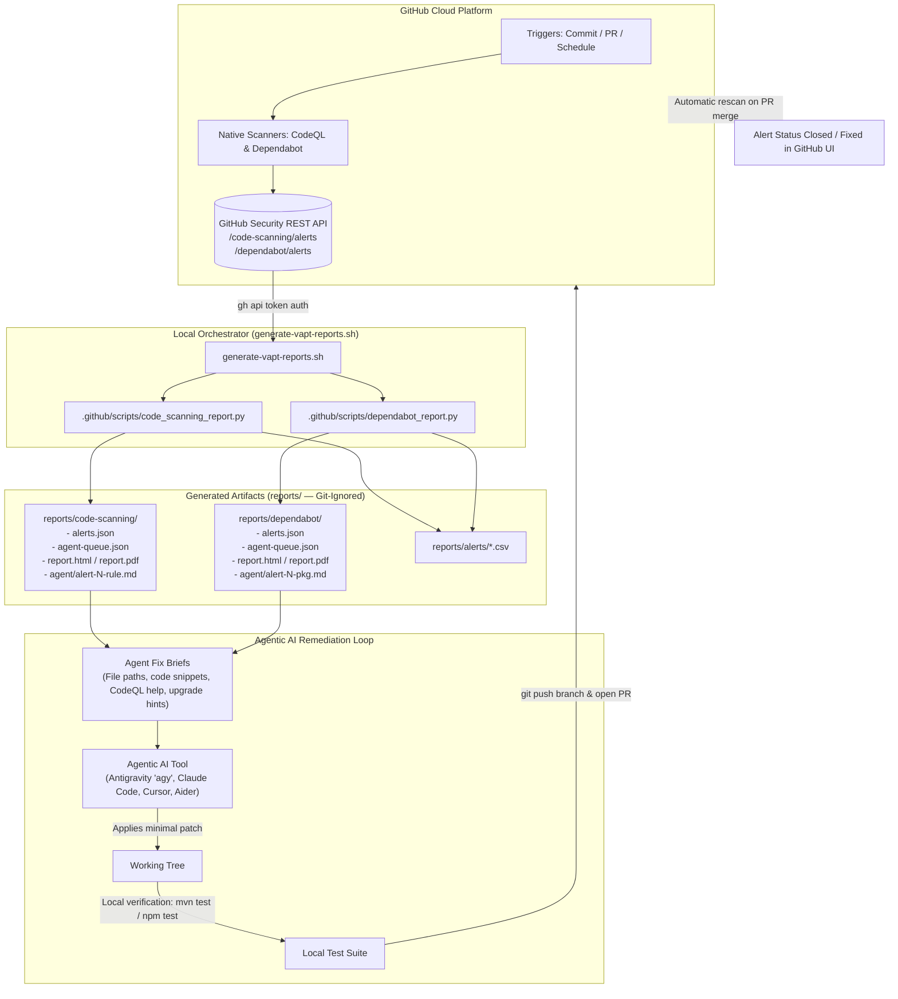
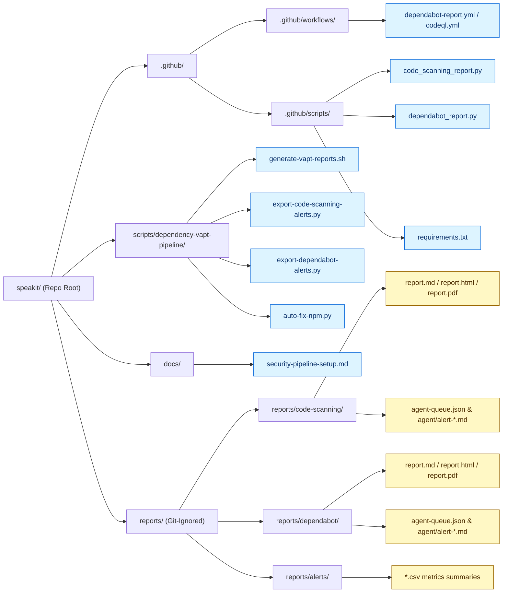
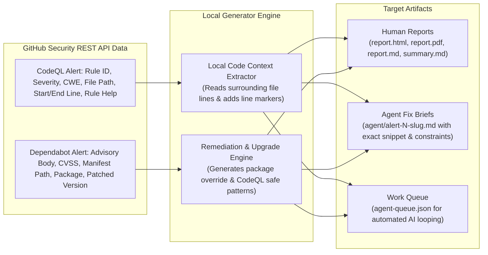
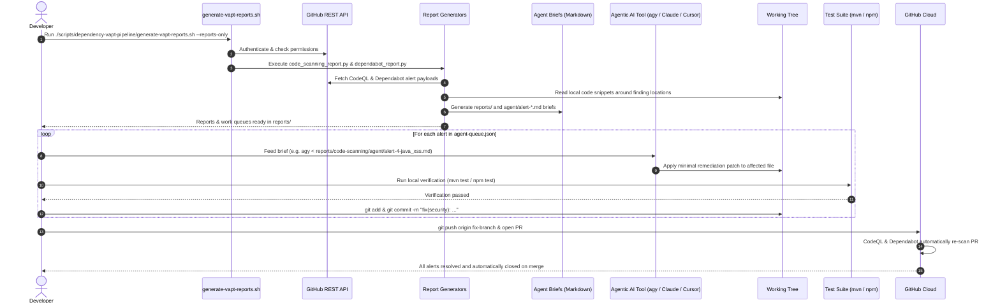

# Unified Security Pipeline Setup: GitHub Code Scanning (CodeQL) & Dependabot → AI Agent Remediation

Destination: `docs/security-pipeline-setup.md`  
*(Unified guide incorporating setup instructions, architecture models, and AI agent remediation workflows for both CodeQL SAST and Dependabot SCA)*

---

## 1. Overview & Architecture

GitHub provides automated native security scanning directly on GitHub Cloud:
1. **GitHub Code Scanning (CodeQL)** — Static Application Security Testing (SAST) detecting code-level security vulnerabilities (XSS, CSRF, insecure clear-text storage, unhandled workflow permissions, SQLi, etc.).
2. **Dependabot Alerts** — Software Composition Analysis (SCA) tracking vulnerable third-party dependencies across Maven, NPM, pip, etc.

Both scanners run automatically on GitHub Cloud (triggered on push, pull request, or scheduled workflows).

**The role of this local pipeline is NOT to execute heavy scanning compilers locally, but to:**
1. Fetch active alerts from GitHub's Security REST API (`/code-scanning/alerts` and `/dependabot/alerts`).
2. Synthesize alerts into unified human-readable reports (Markdown, styled HTML, print-ready PDF, and CSV).
3. Generate **self-contained, structured task briefs** (`agent-queue.json` and `agent/alert-*.md`) containing the exact file path, vulnerable code snippets, CodeQL remediation rules, and upgrade paths.
4. **Feed these briefs into any Agentic AI coding assistant** (e.g., Google Antigravity `agy`, Claude Code, Cursor, Aider, GitHub Copilot) to automatically remediate each vulnerability with minimal human intervention.

---

### 1.1 End-to-End System Architecture



---

### 1.2 Repository Structure: Committed vs Generated



> [!NOTE]
> Everything under `reports/` is dynamically generated on each run and should never be committed. Verify that `reports/` is present in your `.gitignore`.

---

### 1.3 Where Alert Data Comes From Inside One Alert



---

## 2. Step 1 — Prerequisites & GitHub UI Setup

### 2.1 Enable Scanning in GitHub UI
Ensure both scanners are activated on GitHub:
- **CodeQL Code Scanning**:  
  Navigate to **Repository → Settings → Code security and analysis → Code scanning → Set up → Default** (or Advanced setup via `.github/workflows/codeql.yml`).
- **Dependabot Alerts**:  
  Navigate to **Repository → Settings → Code security and analysis → Dependabot alerts → Enable**.

### 2.2 Local System Requirements

| Tool | Verification | How to Install |
| --- | --- | --- |
| **Python 3.10+** | `python3 --version` | `sudo apt install python3 python3-venv` (Ubuntu/Debian) |
| **GitHub CLI (`gh`)** | `gh --version` | [cli.github.com](https://cli.github.com) or `sudo apt install gh` |
| **`jq`** | `jq --version` | `sudo apt install jq` / `brew install jq` |
| **Agent CLI** | `agy --version` or `claude --version` | Any CLI agent capable of reading prompts from stdin or file |

*(Optional)* For local PDF generation with WeasyPrint:
```bash
sudo apt-get install -y libpango-1.0-0 libpangoft2-1.0-0 libharfbuzz0b libffi-dev libjpeg-turbo8
# macOS: brew install pango libffi
```
*Note: If these libraries are absent, the generator cleanly skips PDF generation while preserving Markdown, HTML, and agent briefs.*

---

## 3. Step 2 — Token Permissions & Authentication

The GitHub CLI token or Personal Access Token (PAT) must have permissions to query security alerts.

### 3.1 Authenticate via GitHub CLI
```bash
gh auth login
```
Select GitHub.com, HTTPS, and authenticate via browser or token.

### 3.2 Token Permissions Required

- **Fine-grained Personal Access Token (Recommended)**:
  - Repository Access: Target repository (`speakit`)
  - Permissions:
    - **Code scanning alerts**: `Read-only`
    - **Dependabot alerts**: `Read-only`
- **Classic Personal Access Token**:
  - Scopes: `repo` and `security_events` (read).

### 3.3 Verify API Access
Test both endpoints before generating reports:

```bash
# Verify Dependabot alerts access
gh api /repos/Mohitur669/speakit/dependabot/alerts --jq 'length'

# Verify Code Scanning (CodeQL) alerts access
gh api /repos/Mohitur669/speakit/code-scanning/alerts --jq 'length'
```

If either command returns an integer, your permissions are properly configured. If you receive a `403 Forbidden`, update your token permissions in GitHub Developer Settings.

---

## 4. Step 3 — Repository File Structure

Ensure the pipeline scripts are in place:

```text
speakit/
├── .github/
│   └── scripts/
│       ├── code_scanning_report.py       # CodeQL report & agent brief generator
│       ├── dependabot_report.py          # Dependabot report & agent brief generator
│       └── requirements.txt              # Python dependencies (requests, markdown, weasyprint)
├── scripts/
│   └── dependency-vapt-pipeline/
│       ├── generate-vapt-reports.sh      # Unified orchestrator (creates venv, runs generators)
│       ├── export-code-scanning-alerts.py# Standalone CodeQL CSV exporter
│       ├── export-dependabot-alerts.py   # Standalone Dependabot CSV exporter
│       └── auto-fix-npm.py               # Optional automated NPM package upgrade runner
├── reports/                              # Output folder (automatically added to .gitignore)
│   ├── code-scanning/                   # CodeQL reports, JSON, queue, and agent briefs
│   ├── dependabot/                      # Dependabot reports, JSON, queue, and agent briefs
│   └── alerts/                          # CSV summaries
└── docs/
    └── security-pipeline-setup.md       # This comprehensive guide
```

Ensure scripts are executable:
```bash
chmod +x scripts/dependency-vapt-pipeline/*.sh
chmod +x scripts/dependency-vapt-pipeline/*.py
chmod +x .github/scripts/*.py
```

---

## 5. Step 4 — Quickstart: One-Command Report Orchestration

The orchestrator script handles environment setup, token export, and runs both generators in sequence:

```bash
./scripts/dependency-vapt-pipeline/generate-vapt-reports.sh --reports-only
```

### Supported Orchestrator Flags:

| Flag | Purpose |
| --- | --- |
| `--reports-only` *(or `--skip-autofix`, `--no-autofix`)* | **Recommended**. Generates all CodeQL and Dependabot reports without triggering automated local git commit scripts. |
| *(no flags)* | Generates reports and initiates the automated NPM fast-track upgrade script (`auto-fix-npm.py`). |

---

## 6. Step 5 — Deep Dive: Running Generators with All Flags

You can run each report generator independently using the project virtual environment (`.venv/bin/python`).

### 6.1 Code Scanning Generator (`code_scanning_report.py`)

Generates comprehensive reports and agent briefs for CodeQL SAST alerts.

```bash
GITHUB_TOKEN=$(gh auth token) .venv/bin/python .github/scripts/code_scanning_report.py --repo Mohitur669/speakit [FLAGS]
```

#### All Flags & Options:

| Flag | Type / Choices | Default | Description |
| --- | --- | --- | --- |
| `--repo` | `owner/repo` | `$GITHUB_REPOSITORY` | Target GitHub repository. |
| `--state` | `open`, `closed`, `dismissed`, `fixed`, `all` | `open` | Filter alerts by lifecycle state. Use `all` for complete historical compliance audits. |
| `--min-severity` | `low`, `medium`, `high`, `critical` | `low` | Filter alerts at or above this severity threshold. |
| `--out` | `directory path` | `reports/code-scanning` | Directory where all reports, queues, and briefs are stored. |
| `--no-pdf` | Boolean flag | `False` | Disables PDF generation (skips WeasyPrint). Useful in headless or minimal container environments. |
| `--fail-on` | `low`, `medium`, `high`, `critical` | `None` | Exits with status code `1` if any alerts at or above this threshold exist (ideal for CI gating). |

#### Common Usage Examples:

```bash
# 1. Standard run: open alerts, all severities
.venv/bin/python .github/scripts/code_scanning_report.py --repo Mohitur669/speakit

# 2. Critical & High alerts only (dropping low/medium noise)
.venv/bin/python .github/scripts/code_scanning_report.py --repo Mohitur669/speakit --min-severity high

# 3. Fast mode (skip PDF rendering)
.venv/bin/python .github/scripts/code_scanning_report.py --repo Mohitur669/speakit --no-pdf

# 4. CI build failure check: fail build if any Critical or High vulnerability exists
.venv/bin/python .github/scripts/code_scanning_report.py --repo Mohitur669/speakit --fail-on high --no-pdf
```

---

### 6.2 Dependabot Generator (`dependabot_report.py`)

Generates reports, remediation plans, and agent briefs for third-party dependency vulnerabilities.

```bash
GITHUB_TOKEN=$(gh auth token) .venv/bin/python .github/scripts/dependabot_report.py --repo Mohitur669/speakit [FLAGS]
```

#### All Flags & Options:

| Flag | Type / Choices | Default | Description |
| --- | --- | --- | --- |
| `--repo` | `owner/repo` | `$GITHUB_REPOSITORY` | Target GitHub repository. |
| `--state` | `open`, `fixed`, `dismissed`, `auto_dismissed`, `all` | `open` | Filter alerts by state. |
| `--min-severity` | `low`, `medium`, `high`, `critical` | `low` | Filter alerts at or above this severity. |
| `--out` | `directory path` | `reports/dependabot` | Destination directory. |
| `--no-pdf` | Boolean flag | `False` | Skips WeasyPrint PDF rendering. |
| `--no-images` | Boolean flag | `False` | Skips fetching remote advisory screenshots (accelerates execution). |
| `--fail-on` | `low`, `medium`, `high`, `critical` | `None` | Returns exit code `1` if matching alerts survive filtering. |

---

### 6.3 Standalone CSV Exporters

For quick spreadsheets or reporting to compliance officers:

```bash
# Export CodeQL Code Scanning alerts to reports/alerts/code-scanning-alerts.csv
./scripts/dependency-vapt-pipeline/export-code-scanning-alerts.py

# Export Dependabot alerts to reports/alerts/dependabot-alerts-report.csv
./scripts/dependency-vapt-pipeline/export-dependabot-alerts.py
```

---

## 7. Step 6 — Generated Output Artifacts

Running the pipeline populates the `reports/` folder:

```text
reports/
├── code-scanning/
│   ├── alerts.json                  # Complete, unmodified GitHub API response
│   ├── agent-queue.json             # Work queue ordered by severity for AI agents
│   ├── agent/                       # Self-contained task briefs for each alert
│   │   ├── alert-1-actions_missing-workflow-permissions.md
│   │   ├── alert-2-js_clear-text-storage-of-sensitive-data.md
│   │   ├── alert-3-java_spring-disabled-csrf-protection.md
│   │   ├── alert-4-java_xss.md
│   │   └── alert-5-java_xss.md
│   ├── report.md                    # Human-readable report with code snippets & CWEs
│   ├── report.html                  # GitHub-styled HTML report
│   ├── report.pdf                   # Print-ready executive PDF
│   └── summary.md                   # Concise summary markdown table
├── dependabot/
│   ├── alerts.json
│   ├── agent-queue.json
│   ├── agent/
│   │   └── alert-*.md               # Fix briefs with exact manifest upgrade snippets
│   ├── report.md
│   ├── report.html
│   ├── report.pdf
│   └── summary.md
└── alerts/
    ├── code-scanning-alerts.csv     # CSV table with severity metrics
    └── dependabot-alerts.csv        # CSV table with severity metrics
```

---

## 8. Step 7 — Feeding Reports to Any Agentic AI Tool for Automated Fixes

Every file in `reports/code-scanning/agent/` and `reports/dependabot/agent/` is a **standalone remediation brief** explicitly engineered for an AI coding assistant.

### 8.1 The Local Fix Sequence Diagram



---

### 8.2 Anatomy of an Agent Fix Brief:
- **Target Location**: Precise file path, start line, end line, start column, end column.
- **Vulnerable Code Snippet**: Actual surrounding code lines extracted from the local repository with pointer markers (`>`).
- **CodeQL Remediation Guidance**: Official explanation, secure alternative patterns, and code examples.
- **Guardrails & Constraints**: Directives instructing the agent not to make stylistic refactors, to touch only the necessary files, and to keep existing tests intact.

### 8.3 How to Feed the Brief to Your AI Tool:

#### Option A: Using Google Antigravity CLI (`agy`)
To fix a specific alert:
```bash
agy < reports/code-scanning/agent/alert-4-java_xss.md
```

To run interactively:
```bash
agy
# Then paste the contents of reports/code-scanning/agent/alert-4-java_xss.md
```

#### Option B: Using Claude Code (`claude`)
```bash
claude -p "$(cat reports/code-scanning/agent/alert-4-java_xss.md)"
```

#### Option C: Using Aider (`aider`)
```bash
aider --message-file reports/code-scanning/agent/alert-4-java_xss.md
```

#### Option D: Using Cursor, GitHub Copilot, or ChatGPT / Web UI
1. Open the target file mentioned in the brief (e.g. `backend/src/main/java/com/speakit/parameter/controller/SystemParameterController.java`).
2. Attach or paste the content of `reports/code-scanning/agent/alert-4-java_xss.md` into the AI chat prompt.
3. Prompt: *"Please implement the remediation described in this task brief while adhering to all constraints."*

#### Option E: Automated Queue Loop Pattern
You can iterate through `reports/code-scanning/agent-queue.json` in a script or interactive loop:

```bash
# Read alert queue and process each brief sequentially
jq -c '.[]' reports/code-scanning/agent-queue.json | while read -r item; do
    BRIEF=$(echo "$item" | jq -r '.brief')
    ALERT_NUM=$(echo "$item" | jq -r '.alert_number')
    RULE=$(echo "$item" | jq -r '.rule_id')
    
    echo "=== Processing Alert #$ALERT_NUM ($RULE) via AI Agent ==="
    agy < "reports/code-scanning/$BRIEF"
    
    # Run tests to verify
    # mvn test / npm test
done
```

---

## 9. Step 8 — Verification & Alert Closure

1. **Verify Locally**:
   - For backend changes (Java / Spring Boot):
     ```bash
     ./mvnw -B test
     ```
   - For frontend changes (Angular / TypeScript):
     ```bash
     cd frontend && npm run build && npm test -- --watch=false
     ```
2. **Review Diff & Commit**:
   - Inspect changes: `git diff`
   - Commit with clear attribution:
     ```bash
     git add <modified-files>
     git commit -m "fix(security): remediate CodeQL java/xss in SystemParameterController (#4)"
     ```
3. **Push to GitHub**:
   - Push your branch and open a Pull Request.
   - GitHub Actions automatically re-scans the repository with CodeQL and Dependabot.
   - Once the pull request merges into the default branch (`main` or `master`), GitHub automatically transitions the alert status from **Open** to **Closed (Fixed)** in the GitHub Security tab.

---

## 10. Troubleshooting & FAQ

| Problem | Cause | Resolution |
| --- | --- | --- |
| `403 from Code Scanning alerts API` | The token lacks the security scope. | Ensure your fine-grained PAT has `Code scanning alerts: Read-only` or your classic token has `security_events` scope. |
| `403 from Dependabot alerts API` | Token lacks Dependabot permission. | Add `Dependabot alerts: Read-only` to the token permissions. |
| `404 for repo` | Code scanning or Dependabot is disabled. | In GitHub UI, go to **Settings → Code security and analysis** and verify both scanners are enabled. |
| `PDF rendering skipped: cannot load library 'gobject-2.0'` | Missing Pango/Cairo system libraries on host. | Install system packages listed in Section 2.2 or pass `--no-pdf` to generate Markdown and HTML only. |
| `No alerts found (0 alerts written)` | No open alerts exist or filters excluded them. | Check `--state all` to inspect closed/dismissed alerts. |
| Local snippet shows `_Code snippet unavailable_` | File was moved or script ran outside repo root. | Ensure you execute commands from the project root (`speakit/`). |
