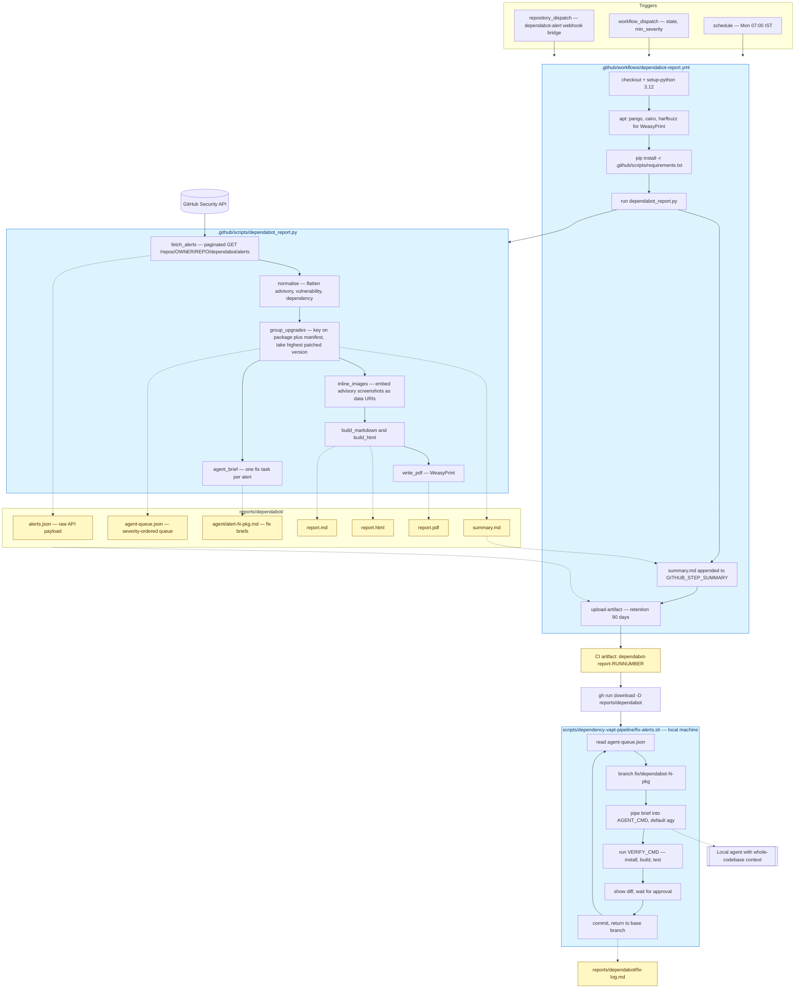
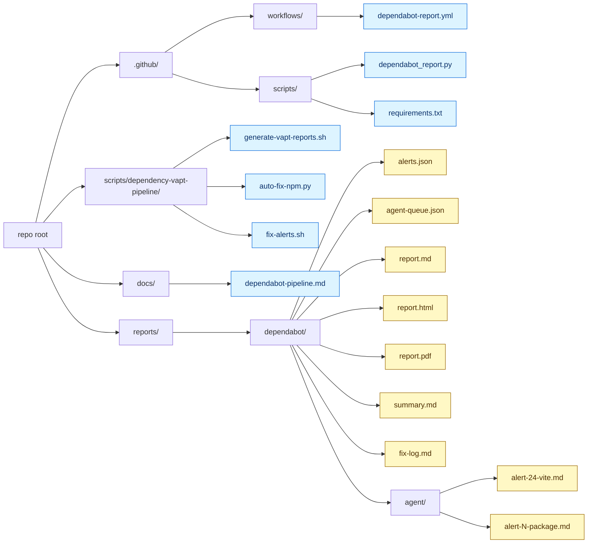
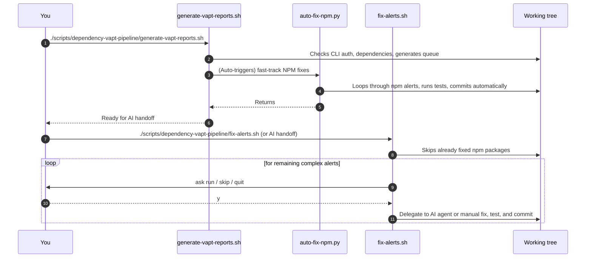
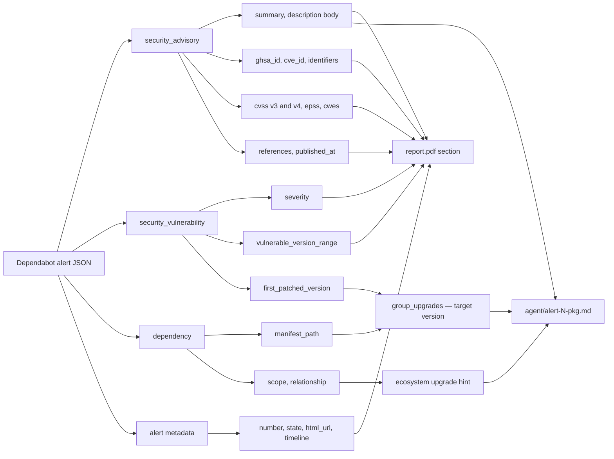

# Dependabot → GitHub Actions → AI agent pipeline

Destination: `docs/dependabot-pipeline.md` (GitHub renders these blocks natively).

Legend: solid arrows = control flow, dotted arrows = a file written or read.

## 1. End-to-end flow, with the artifact each step produces

## 2. Files and folders — committed vs generated

Add `reports/` to `.gitignore` — every file under it is regenerated on each run.

## 3. The local fix workflow

## 4. Where the data comes from inside one alert

