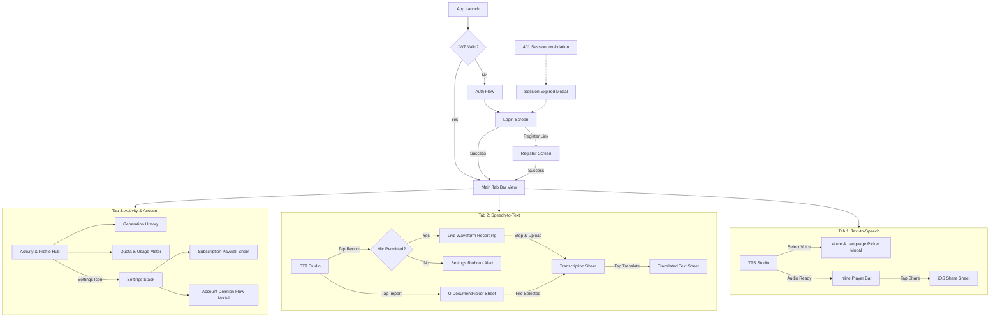
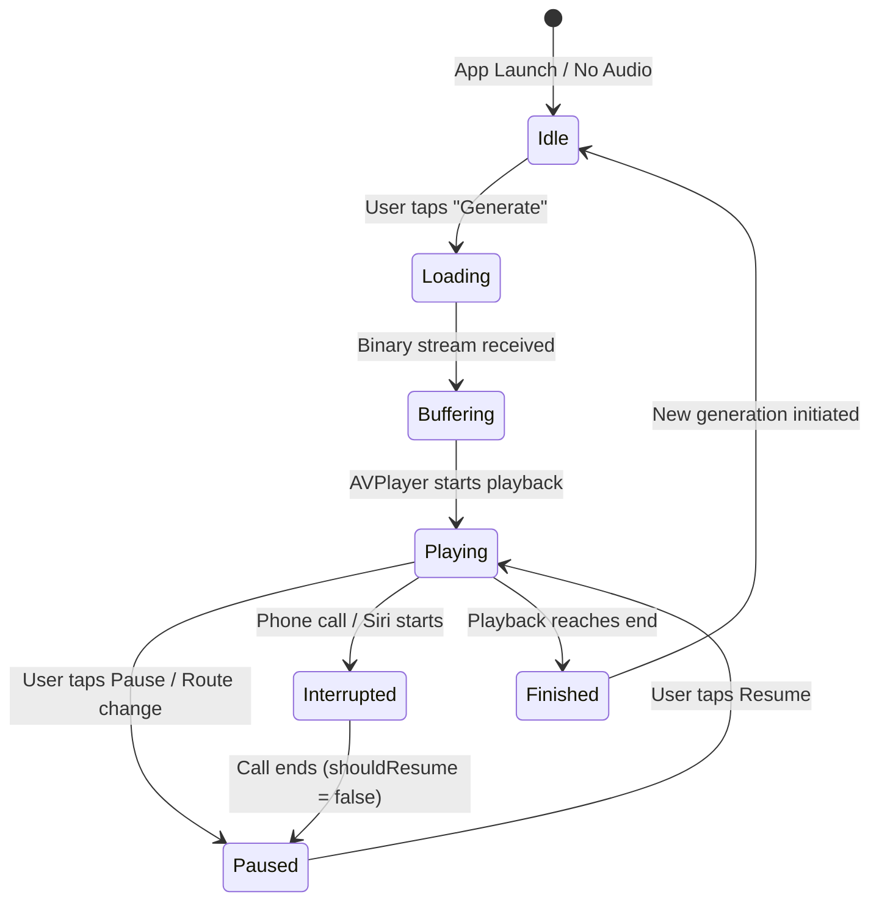
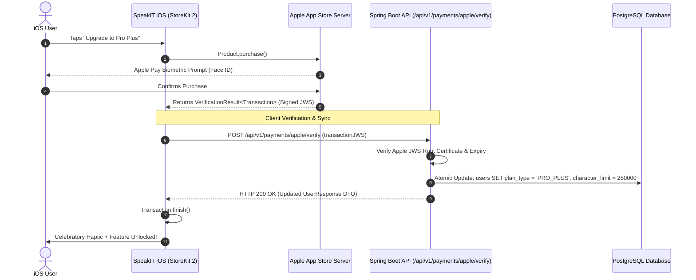
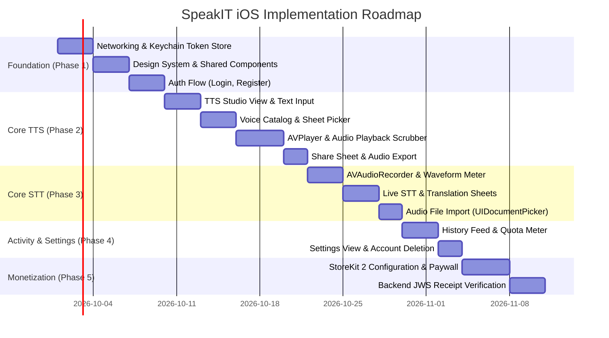

# SpeakIT iOS Product Design & UX Specification (Master Overview)

## Document Master Index

Welcome to the architectural design and UX specification for the native **SpeakIT iOS application**. This suite of documentation defines the complete mobile product strategy, screen architecture, design system, audio engine lifecycle, and StoreKit 2 monetization plan.

All designs are built strictly against the confirmed capabilities of SpeakIT's Java 21 / Spring Boot 3.5.11 backend and adhere to Apple's Human Interface Guidelines (HIG).

---

## 1. Specification Directory & Roadmap

| Document Section | Phase | Purpose |
|---|---|---|
| [**Phase A: Product Discovery Report**](#speakit-ios-product-discovery-report-phase-a) | Phase A | Code-verified audit of backend APIs, session versioning, audio streaming, STT models, and gaps (e.g. account deletion). |
| [**Phase B: Product Strategy & Feature Prioritization**](#speakit-ios-product-strategy--feature-prioritization-phase-b) | Phase B | Target mobile personas, detailed use case evaluations, and P0 (MVP) vs P1 vs Blocked feature matrix. |
| [**Phase C: Information Architecture Specification**](#speakit-ios-information-architecture-specification-phase-c) | Phase C | 3-tab navigation hierarchy (`TTS`, `STT`, `Activity`), screen ownership, and 7 core end-to-end user journeys. |
| [**Phase D: UX Design System Specification**](#speakit-ios-ux-design-system-specification-phase-d) | Phase D | Design tokens, color palette (WCAG AA), typography (Dynamic Type), spacing, component specs, and haptic feedback. |
| [**Phase E: Detailed Screen Specifications**](#speakit-ios-detailed-screen-specifications-phase-e) | Phase E | Exhaustive 14-point UX specifications for all 10 iOS screens, covering interactive states, copy strings, and API mappings. |
| [**Phase F: Audio UX & AVFoundation Architecture**](#speakit-ios-audio-ux--avfoundation-architecture-phase-f) | Phase F | `AVAudioSession` lifecycle, lock-screen `NowPlaying` integration, 16kHz mono AAC recording, waveforms, and interruption protocols. |
| [**Phase G: Subscription, StoreKit 2 & Entitlement Architecture**](#speakit-ios-subscription-storekit-2--entitlement-architecture-phase-g) | Phase G | Apple Guideline 3.1.1 compliance, StoreKit 2 paywall, dual-gateway convergence with web Razorpay, and JWS verification. |
| [**Phase H: Design Review & HIG Compliance Audit**](#speakit-ios-design-review--hig-compliance-audit-phase-h) | Phase H | Apple HIG compliance audit, App Store review risk analysis (5.1.1(v), 3.1.1, 2.1), and architectural tradeoffs. |
| [**Phase I: Implementation Readiness & Technical Checklist**](#speakit-ios-implementation-readiness--technical-checklist-phase-i) | Phase I | Phased 5-milestone engineering roadmap, pre-requisites, and technical pre-coding checklist. |
| [**Appendix: Open Questions & Stakeholder Decisions**](#speakit-ios-open-questions--stakeholder-decisions) | Alignment | Open business, product, and backend engineering questions requiring stakeholder alignment. |

---

## 2. Core Architectural Principles for iOS

1. **Native Apple Standards First:** Pure SwiftUI, `@Observable` architecture, native SF Symbols, and system materials. No non-standard web container paradigms.
2. **Tactile & Responsive Audio:** High-fidelity waveform visualizations, lock-screen scrubbing, and contextual haptic ticks make voice generation feel tangible and immediate.
3. **Strict App Store Compliance:** Zero external payment links on iOS; StoreKit 2 handles all mobile subscriptions; in-app account deletion is mandatory.
4. **Resilient Offline & Interruption Handling:** Immediate pause when AirPods disconnect; graceful session re-authentication upon 401 token invalidation.

---

# SpeakIT iOS Product Discovery Report (Phase A)

## Executive Summary
This document provides a comprehensive, repository-verified discovery audit of SpeakIT's existing backend (Java 21 / Spring Boot 3.5.11), frontend (Angular 21), and operational infrastructure. Its primary objective is to separate **confirmed backend realities** from **documentation assumptions** to ensure the native iOS client is designed strictly against working capabilities while surfacing required platform extensions.

---

## 1. Confirmed Product Capabilities (Code-Verified)

### 1.1 Authentication & Session Architecture
* **Repository Paths:**
  * [`AuthController.java`](file:///Users/mohitur/Desktop/git-projects/speakit/backend/src/main/java/com/speakit/tts/controller/AuthController.java)
  * [`AuthService.java`](file:///Users/mohitur/Desktop/git-projects/speakit/backend/src/main/java/com/speakit/tts/service/AuthService.java)
  * [`JwtAuthenticationFilter.java`](file:///Users/mohitur/Desktop/git-projects/speakit/backend/src/main/java/com/speakit/tts/security/JwtAuthenticationFilter.java)
  * [`WebSocketConfig.java`](file:///Users/mohitur/Desktop/git-projects/speakit/backend/src/main/java/com/speakit/tts/config/WebSocketConfig.java)
* **Confirmed Features:**
  * User Registration: `POST /api/auth/register` (Fields: `username`, `email`, `password`, `fullName`). Normalizes email and username to lowercase.
  * User Login: `POST /api/auth/login` (Fields: `usernameOrEmail`, `password`). Returns JWT `token`, `expiresIn`, `user` DTO.
  * Session Invalidation: Driven by atomic `session_version` counter in PostgreSQL `users` table. Validated on every authenticated request inside `JwtAuthenticationFilter`.
  * Concurrent Session Eviction: When a new login occurs, `session_version` increments, invalidating earlier JWTs on the next API call.
  * WebSocket Logout Notification: Endpoint `GET /api/auth/ws-ticket` generates a single-use 30-second ticket used to connect to `/ws/logout` STOMP broker. Backend broadcasts eviction events to active clients.
  * User Profile retrieval: `GET /api/v1/users/me` returning `UserResponse` with `id`, `username`, `email`, `fullName`, `role`, `planType`, `status`, `characterLimit`, `charactersUsed`.

### 1.2 Text-to-Speech (TTS) Engine & Voice Catalog
* **Repository Paths:**
  * [`TtsController.java`](file:///Users/mohitur/Desktop/git-projects/speakit/backend/src/main/java/com/speakit/tts/controller/TtsController.java)
  * [`TtsService.java`](file:///Users/mohitur/Desktop/git-projects/speakit/backend/src/main/java/com/speakit/tts/service/TtsService.java)
  * [`TtsEngine.java`](file:///Users/mohitur/Desktop/git-projects/speakit/backend/src/main/java/com/speakit/tts/entity/TtsEngine.java)
* **Confirmed Features:**
  * Voice Catalog Endpoint: `GET /api/tts/voices` returns array of available voices per provider/tier.
  * Speech Synthesis Endpoint: `POST /api/tts/synthesize` produces binary `audio/mpeg` streaming response directly in the HTTP body.
  * Multi-Provider Routing:
    1. **AWS Polly (Standard & Neural):** Low-latency default. Standard available on `FREE`; Neural requires `PRO`. Text limit capped at 500 (`FREE`) or 2,500 (`PRO`).
    2. **ElevenLabs:** Hyper-realistic voices. Gated to `PRO_PLUS` and `ENTERPRISE`. Text limit up to 10,000 characters.
    3. **Sarvam AI:** Indian regional dialects and languages (`bulbul:v3`). Gated to `PRO_PLUS` and `ENTERPRISE`.
  * Dynamic Rate Limiting: Enforced via Bucket4j filter ([`RateLimitingFilter.java`](file:///Users/mohitur/Desktop/git-projects/speakit/backend/src/main/java/com/speakit/tts/security/RateLimitingFilter.java)).

### 1.3 Speech-to-Text (STT) & Translation
* **Repository Paths:**
  * [`SttController.java`](file:///Users/mohitur/Desktop/git-projects/speakit/backend/src/main/java/com/speakit/stt/controller/SttController.java)
  * [`SttService.java`](file:///Users/mohitur/Desktop/git-projects/speakit/backend/src/main/java/com/speakit/stt/service/SttService.java)
  * [`AudioFileValidator.java`](file:///Users/mohitur/Desktop/git-projects/speakit/backend/src/main/java/com/speakit/stt/validator/AudioFileValidator.java)
* **Confirmed Features:**
  * File Audio Transcription: `POST /api/stt/transcribe` (Multipart `file`, optional `language`, optional `model`). Supported formats: `audio/wav`, `audio/mpeg`, `audio/mp4`, `audio/m4a`, `audio/webm`. Limit: 25MB.
  * Live Audio Transcription: `POST /api/stt/transcribe-live` (Multipart `audio`, optional `language`, optional `model`). Max 10MB chunk.
  * Audio Translation: `POST /api/stt/translate` (Multipart `file`, optional `targetLanguage`).
  * Supported Languages List: `GET /api/stt/languages`.
  * STT Engine: Powered by Groq Whisper-large-v3 cloud API with sub-second turnaround.

### 1.4 History & Activity Log
* **Repository Paths:**
  * [`HistoryController.java`](file:///Users/mohitur/Desktop/git-projects/speakit/backend/src/main/java/com/speakit/tts/controller/HistoryController.java)
  * [`TtsHistory.java`](file:///Users/mohitur/Desktop/git-projects/speakit/backend/src/main/java/com/speakit/tts/entity/TtsHistory.java)
* **Confirmed Features:**
  * Paginated History: `GET /api/history` with page and size parameters.
  * Metadata Fields: `id`, `textSnippet` (truncated to max 100 characters), `characterCount`, `voiceId`, `voiceName`, `createdAt`.
  * Soft/Hard Deletion: `DELETE /api/history/{id}` allows user to remove individual entries.

---

## 2. Existing User Journeys (Web Frontend Baseline)

* **Repository Paths:**
  * [`app.routes.ts`](file:///Users/mohitur/Desktop/git-projects/speakit/frontend/src/app/app.routes.ts)
  * [`tts.component.ts`](file:///Users/mohitur/Desktop/git-projects/speakit/frontend/src/app/features/tts/tts.component.ts)
  * [`profile-settings.component.ts`](file:///Users/mohitur/Desktop/git-projects/speakit/frontend/src/app/features/profile/profile-settings.component.ts)
* **Web Journey Flow:**
  1. **Landing/Auth:** Guest visits `/`, redirects to `/auth/login` or `/auth/signup`.
  2. **Dashboard / TTS Studio:** Navigates to `/tts`. Contains a unified multi-column workspace: text area, voice/engine dropdown selector, speed/pitch sliders, action button ("Generate Audio"), inline audio playback widget, and bottom table of recent history.
  3. **STT Workspace:** (Planned or linked via shared audio components).
  4. **Account & Quotas:** Navigates to `/profile` to view plan usage badges, character counter, update password, and trigger Razorpay checkout modal.

---

## 3. Discrepancies: Documentation vs. Actual Code

| Feature | Mentioned in Docs | Actual Backend Reality | Impact on iOS Design |
|---|---|---|---|
| **Account Deletion** | Implied in general privacy guidelines | **NOT implemented**. `UserController.java` has no `DELETE /api/v1/users/me` endpoint. | **CRITICAL BLOCKER** for Apple App Store (Guideline 5.1.1(v) requires in-app account deletion). Must be prioritized as backend requirement. |
| **History Audio Storage** | "Listen to past generations" | `TtsHistory.java` stores **only textSnippet (100 chars)** and metadata. Does not store audio files or S3 URLs. | History on iOS cannot play past audio from server unless locally cached or re-synthesized. |
| **STT Plan Gating** | General STT documentation | Strictly enforced zero-trust in `SttService.java`: File STT requires `PRO+`, Live STT requires `PRO_PLUS+`. | Free users cannot use STT; UI must show graceful paywall/upgrade prompts rather than crashing on HTTP 403. |
| **In-App Payments** | Web documentation covers Razorpay | `PaymentController.java` only implements Razorpay (`/api/v1/payments/razorpay/*`). | Apple App Store Guideline 3.1.1 strictly forbids external web checkouts for digital features. StoreKit 2 is mandatory on iOS. |
| **Speech-to-Speech** | Mentioned in future roadmaps | No endpoints exist in backend. | Exclude from iOS MVP. |
| **Voice Cloning** | Mentioned as ElevenLabs capability | No voice training or custom voice upload endpoints exist in Spring Boot. | Exclude from iOS MVP; rely only on static/predefined ElevenLabs voice IDs. |

---

## 4. Architectural Constraints for iOS

1. **Audio Streaming Protocol:**
   `POST /api/tts/synthesize` returns raw binary `audio/mpeg` in the HTTP response body without an intermediate S3 URL.
   * *iOS Architecture Decision:* iOS `URLSession` must buffer or stream data directly to an in-memory/temporary file on disk for `AVAudioPlayer` playback.
2. **Audio Recording Format for STT:**
   `AudioFileValidator.java` supports `audio/wav`, `audio/mpeg`, `audio/mp4`, `audio/m4a`, `audio/webm`.
   * *iOS Architecture Decision:* Native iOS `AVAudioRecorder` should record directly to `.m4a` with AAC encoding (`kAudioFormatMPEG4AAC`, 16kHz, mono). This format is natively supported by backend, lightweight, and bandwidth-efficient.
3. **Session Revocation via WebSocket:**
   Backend enforces single-session versioning with STOMP WebSockets over `/ws/logout`.
   * *iOS Architecture Decision:* Mobile background network drops make persistent WebSockets battery-intensive. The iOS app should connect to `/ws/logout` only when in the foreground, and rely on `401 Unauthorized` interception for guaranteed background-to-foreground session eviction.
4. **App Store Review Guidelines Compliance:**
   * **Guideline 5.1.1(v) (Account Deletion):** Mandatory in-app deletion flow.
   * **Guideline 3.1.1 (In-App Purchases):** StoreKit 2 is required for all subscription purchases. Razorpay cannot be presented to iOS users.

---

## 5. Risk Assessment & Dependencies

* **Risk 1: Missing Account Deletion Endpoint:** Apple App Store review will reject any app offering user account creation without an in-app deletion feature. Backend must provide `DELETE /api/v1/users/me`.
* **Risk 2: Backend Payment Gap:** Spring Boot currently lacks Apple App Store receipt validation or StoreKit 2 transaction verification (`POST /api/v1/payments/apple/verify`).
* **Risk 3: Audio History Expectation Mismatch:** Users expect "History" to let them re-listen to generated audio. Because the backend doesn't store audio files, iOS must maintain a secure local cache (`FileManager` in app sandbox) of generated MP3s linked to generation IDs.

---

# SpeakIT iOS Product Strategy & Feature Prioritization (Phase B)

## Executive Summary
This document establishes the product strategy, target mobile user segments, use-case breakdown, and feature prioritization matrix for the SpeakIT native iOS application. The prioritization is strictly grounded in verified backend capabilities from Phase A, Apple Human Interface Guidelines (HIG), and App Store compliance constraints.

---

## 1. Target Mobile User Segments

Based on confirmed capabilities (AWS Polly, ElevenLabs, Sarvam Indian dialects, Groq Whisper transcription and translation):

1. **Mobile Content Creators & Podcasters:**
   * *Needs:* Rapid generation of realistic AI voiceovers on the go, auditioning multiple voices, quick sharing/exporting of audio to iOS Files, CapCut, or Instagram Reels.
   * *Key Features:* High-quality TTS (ElevenLabs, Polly Neural), instant audio scrubber, native iOS Share Sheet.
2. **Professionals & Students (Dictation & Transcription):**
   * *Needs:* Transcribing lectures, meetings, voice memos; translating regional speech into English.
   * *Key Features:* One-tap live mic transcription (Groq Whisper), file audio import (`.m4a`, `.mp3`), copy text to clipboard.
3. **Multilingual Users (Indian Regional Dialects):**
   * *Needs:* Natural voice generation and translation in Hindi, Tamil, Telugu, Bengali, Marathi, etc.
   * *Key Features:* Sarvam AI voice integration (`bulbul:v3`), language filtering.
4. **Productivity & Commuter Listeners:**
   * *Needs:* Listening to articles, notes, or drafts while driving or commuting.
   * *Key Features:* Lock-screen playback (`MPNowPlayingInfoCenter`), background audio, speed controls (0.75x to 2.0x).

---

## 2. Comprehensive Use Case Evaluation

| Use Case | User Intent | Frequency | Speed Expectation | Required Inputs | Expected Output | Friction Points | Backend Dependencies | MVP Priority | Key Risks |
|---|---|---|---|---|---|---|---|---|---|
| **1. Text-to-Speech Generation** | Convert typed or pasted text into lifelike speech | Daily / High | < 2 seconds | Text string, Voice ID, Speed/Pitch | Binary MP3 audio stream | Network latency on long texts | `POST /api/tts/synthesize` | **P0** | Quota exhaustion, provider timeout |
| **2. Voice & Language Selection** | Find suitable voice by accent, gender, engine | Per-session | Instant (< 200ms) | Filter criteria (Language, Engine) | Filtered voice list | Overwhelming voice list without search/filter | `GET /api/tts/voices` | **P0** | Cached list stale if voices change on server |
| **3. Audio Playback & Scrubbing** | Listen, review, seek through generated audio | Immediate after TTS | Real-time | Play/pause, seek position | Continuous audio playback | Lock-screen audio interruptions | Local AVPlayer | **P0** | Audio session category conflicts with other apps |
| **4. Export & Share Audio** | Save generated MP3 to Files or send via AirDrop/Apps | Frequent | Instant | User tap on Share | iOS Share Sheet (`UIActivityViewController`) | Temporary file permission cleanup | Local sandbox cache | **P0** | Disk leak if temp files not cleaned |
| **5. Live Mic Transcription** | Dictate notes or spoken meetings directly | Frequent | < 3 seconds after stop | Audio stream from microphone | Clean transcribed text | Background noise, microphone permissions denied | `POST /api/stt/transcribe-live` | **P0** | Gated to `PRO_PLUS`+; Free users hit 403 unless paywalled gracefully |
| **6. Audio File Import Transcription** | Transcribe pre-recorded voice memos or audio files | Moderate | Depends on file size | Audio file from Files picker | Transcribed text | Unsupported codecs, files > 25MB | `POST /api/stt/transcribe` | **P1** | File size validation before upload to avoid slow failed uploads |
| **7. Audio Translation** | Transcribe and translate foreign audio to English | Moderate | 2–5 seconds | Audio file or live speech | Translated English text | Multi-language detection accuracy | `POST /api/stt/translate` | **P1** | Limited to models supported by backend Whisper |
| **8. Review History & Snippets** | Review recent generations and timestamps | Moderate | Sub-second | Page scroll | List of previous generations | Backend does NOT store audio files (metadata only) | `GET /api/history` | **P0** | User expects to play old audio, but backend only returns 100-char text |
| **9. Account Quotas & Usage Tracking** | Check remaining character count and subscription status | Per-session | Sub-second | Auth token | Progress bar of used vs total characters | Stale quota counts after generation | `GET /api/v1/users/me` | **P0** | Needs real-time decrement or profile refresh post-TTS |
| **10. In-App Subscription (StoreKit 2)** | Upgrade plan to unlock Neural, ElevenLabs, or STT | Low (monthly/yearly) | Immediate Apple Pay | StoreKit product selection | Active entitlement | Apple StoreKit verification backend endpoint missing | StoreKit 2 + Backend Verify | **Blocked** | Must implement backend Apple receipt verify endpoint before launch |
| **11. In-App Account Deletion** | Permanently delete account and all personal data | Rare (one-off) | < 2 seconds | Confirm password / Re-auth | Account deleted, token revoked | Backend endpoint does NOT exist | Backend `DELETE /api/v1/users/me` | **Blocked** | App Store rejection under Guideline 5.1.1(v) until backend is updated |

---

## 3. Feature Prioritization Matrix

```
       HIGH VALUE
           ▲
           │   [P0: Core TTS Engine]        [P0: Voice Selection & Audio Playback]
           │   [P0: Native Share Sheet]     [P0: Quota & Profile State]
           │   [P0: Auth & Session Evict]   [Blocked: StoreKit 2 Paywall]
           │   [P0: Live Mic STT]           [Blocked: In-App Account Deletion]
           │
           │   [P1: File Import STT]        [P1: Audio Translation]
           │   [P1: Local History Cache]    [P1: Lockscreen Playback Controls]
           │
           │   [P2: Advanced Audio EQ]      [P2: Custom Pronunciation Lexicon]
           │   [P2: Haptic Waveform Viz]    [P2: Siri Shortcuts Integration]
           │
           └────────────────────────────────────────────────────────► HIGH COMPLEXITY /
                                                                      BACKEND DEPENDENCY
```

### 3.1 P0 — Required for Core Usable MVP
* **Authentication Flow:** Native registration, login, JWT keychain persistence, session eviction alert on 401.
* **TTS Studio:** Multi-line text input with live character counter, dynamic engine badge (Standard / Neural / ElevenLabs / Sarvam).
* **Voice Catalog Picker:** Filterable by Language, Accent, Gender, and Provider. Voice preview button.
* **Native Audio Player:** Custom SwiftUI waveform/scrubber bar, play/pause, restart, elapsed/remaining time.
* **Audio Sharing:** Native iOS Share Sheet (`UIActivityViewController`) allowing direct export to Files, AirDrop, Messages.
* **Live Speech-to-Text (STT):** Microphone recording with visual audio level indicator, auto-transcription via Groq Whisper (`POST /api/stt/transcribe-live`).
* **Profile & Quota Meter:** Live gauge showing characters used vs. plan limit, active tier badge.
* **History Metadata List:** Paginated feed of past generations with text snippet, voice name, and date.

### 3.2 P1 — Important Post-MVP Features
* **Audio File Import STT:** Document picker (`.m4a`, `.mp3`, `.wav`) for uploading audio up to 25MB for transcription.
* **Speech Translation Mode:** One-tap switch to translate spoken audio to English.
* **Local Audio Persistence in History:** Device sandbox caching of generated MP3s so users can replay recent generations offline.
* **Lock-Screen NowPlaying Controls:** Background audio session integration with `MPNowPlayingInfoCenter` and `MPRemoteCommandCenter`.
* **Haptic Feedback:** Dynamic haptic clicks during recording start/stop and voice selection.

### 3.3 P2 — Optional / Advanced Backlog
* **Siri Shortcuts Integration:** "Hey Siri, read my clipboard with SpeakIT".
* **Custom SSML Editor:** Advanced speech synthesis markup tags for pauses, pitch shifts, and whispering (AWS Polly only).
* **Home Screen Quick Widgets:** WidgetKit glanceable remaining quota and quick voice memo trigger.

### 3.4 Blocked — Dependent on Backend Capability
1. **In-App Account Deletion (Apple Guideline 5.1.1(v)):**
   * *Status:* Blocked until `DELETE /api/v1/users/me` is implemented in backend Spring Boot `UserController.java`.
   * *Mitigation:* Document API specification immediately for backend team.
2. **In-App Subscription Purchasing (Apple Guideline 3.1.1):**
   * *Status:* Blocked until `POST /api/v1/payments/apple/verify` is added to backend `PaymentController.java` to validate StoreKit 2 JWS signed transaction tokens.
   * *Mitigation:* Web Razorpay is forbidden on iOS. In initial TestFlight MVP, app can display active plan status read-only while StoreKit endpoint is developed.

---

# SpeakIT iOS Information Architecture Specification (Phase C)

## Executive Summary
This document establishes the Information Architecture (IA) for the native SpeakIT iOS application. It specifies navigation paradigms, screen hierarchies, modal vs. push presentation rules, authentication boundaries, and end-to-end user journeys conforming to Apple Human Interface Guidelines (HIG).

---

## 1. Primary Navigation Architecture

SpeakIT utilizes a standard native **Bottom Tab Bar (`TabView`)** as its primary structural anchor for authenticated users, paired with contextual **`NavigationStack`** transitions for hierarchy and **Modal Sheets (`.sheet`)** for self-contained, interruptible tasks.

### 1.1 Top-Level Tab Structure (3 Tabs)
1. **TTS (Text-to-Speech):** The primary generation studio for text input, voice selection, synthesis, and audio playback.
2. **STT (Speech-to-Text):** The transcription and translation studio supporting live microphone dictation and audio file import.
3. **Activity (History & Profile):** Combined hub for past generation history, quota meter, account settings, and subscription management.

*Design Rationale:* A focused 3-tab layout prevents cognitive overload, keeps touch targets large (> 48pt), and ensures instant access to core audio creation workflows without deep nesting.

---

## 2. Navigation Diagram



---

## 3. Screen Inventory & Presentation Rules

| Screen Identifier | Title / Name | Navigation Container | Presentation Style | Dismissal / Exit Trigger |
|---|---|---|---|---|
| `SCR-AUTH-01` | Login Screen | Root Container | Full Screen Replacement | Successful auth -> MainTabs |
| `SCR-AUTH-02` | Sign Up Screen | Root Container | Full Screen Replacement | Back button -> Login; Success -> MainTabs |
| `SCR-TTS-01` | TTS Studio | Tab 1 (`NavigationStack`) | Root of Tab | Persistent tab |
| `SCR-TTS-02` | Voice & Dialect Catalog | Tab 1 Modal | Form Sheet (`.sheet`) | "Done" button or Voice selection tap |
| `SCR-TTS-03` | Audio Share Dialog | Tab 1 System Modal | System Share Sheet | Swipe down or share action completed |
| `SCR-STT-01` | STT Studio | Tab 2 (`NavigationStack`) | Root of Tab | Persistent tab |
| `SCR-STT-02` | Live Transcription Result | Tab 2 Modal | Detent Sheet (`.medium`, `.large`) | "Copy Text" or close button |
| `SCR-ACT-01` | Activity & Profile Hub | Tab 3 (`NavigationStack`) | Root of Tab | Persistent tab |
| `SCR-SET-01` | Account Settings | Tab 3 Navigation | Navigation Push (`NavigationLink`) | Back chevron button |
| `SCR-PAY-01` | Subscription Paywall | Global / Contextual Modal | Form Sheet (`.sheet`) | Close "X" button or Purchase complete |
| `SCR-SEC-01` | Session Evicted Notice | Global Window Overlay | Non-dismissible Alert/Modal | "Sign In Again" button -> redirects to Login |

---

## 4. Detailed Core User Journeys

### Journey 1: New User Onboarding & First Synthesis
1. User installs and launches app. App detects no JWT in iOS Keychain.
2. User lands on `SCR-AUTH-01` (Login). Tap "Create an account" -> navigates to `SCR-AUTH-02` (Sign Up).
3. User enters Full Name, Username, Email, Password. Normalization converts email/username to lowercase.
4. User taps "Sign Up". App calls `POST /api/auth/register`. On HTTP 200, JWT and user profile are saved to Keychain.
5. User lands directly on Tab 1 `SCR-TTS-01` (TTS Studio).
6. First-use empty state displays a sample text template ("Welcome to SpeakIT native voice engine!").
7. User selects a voice (defaults to standard AWS Polly "Joanna"), taps "Generate Speech".
8. Dynamic audio progress pulses; within 1.2s audio begins playing automatically via inline player bar.

### Journey 2: Text-to-Speech Generation & Export
1. User opens Tab 1 `SCR-TTS-01`.
2. Pastes 350-character script. Character counter updates: `350 / 500 characters`.
3. Taps "Voice" badge. `SCR-TTS-02` opens as a medium-detent sheet with categories (Polly, ElevenLabs, Sarvam).
4. Selects "Aditi - Indian English (Sarvam)". If user is on Free tier, a subtle padlock badge explains tier requirement.
5. Taps "Generate Speech". App issues `POST /api/tts/synthesize`.
6. Progress spinner changes to play button. User listens, scrubs waveform, and taps Share icon.
7. Native iOS Share Sheet (`UIActivityViewController`) displays options: Save to Files, AirDrop, Messages.

### Journey 3: Live Speech-to-Text Dictation
1. User switches to Tab 2 `SCR-STT-01`.
2. Taps prominent circular Microphone button.
3. If first time: iOS displays system permission dialog: *"SpeakIT needs access to your microphone to transcribe live speech."*
4. Permission granted: Haptic pulse triggers, timer starts (`00:01`), and real-time audio waveform pulses.
5. User speaks for 20 seconds, taps "Stop & Transcribe".
6. App calls `POST /api/stt/transcribe-live` sending `.m4a` audio file.
7. Transcribed text sheet pops up (`SCR-STT-02`). User taps "Copy to Clipboard" or "Translate to English".

### Journey 4: Audio File Import Transcription
1. User in Tab 2 taps "Import Audio File" card.
2. Native `UIDocumentPickerViewController` opens, filtered to `.mp3`, `.m4a`, `.wav`.
3. User picks a 14MB recording from iCloud Drive.
4. App validates file size (< 25MB). Upload progress bar displays.
5. App posts to `POST /api/stt/transcribe`.
6. Transcribed text rendered in formatted text viewer with paragraph spacing and copy controls.

### Journey 5: Subscription Upgrade Flow (Paywall)
1. User attempts to synthesize using ElevenLabs voice "Rachel" while on `FREE` plan.
2. App intercepts action and presents `SCR-PAY-01` as a sheet.
3. Sheet highlights benefits of `PRO` and `PRO_PLUS` (Neural voices, 10,000 chars, STT live dictation).
4. User selects "Pro Plan - Monthly ($9.99/mo)" and confirms Apple Pay StoreKit prompt.
5. StoreKit 2 transaction completes. JWS signature sent to backend for entitlement activation.
6. Local user state updates immediately; voice unlocks with celebratory haptic feedback.

### Journey 6: Session Invalidation & Eviction (Security)
1. User is active on iOS app.
2. User signs into SpeakIT Web on Desktop browser. Backend increments `session_version` in DB.
3. User performs an action on iOS (e.g., tap "Generate").
4. Backend responds with `HTTP 401 Unauthorized` (`Invalid session version`).
5. App's networking interceptor catches 401, clears Keychain tokens, and displays `SCR-SEC-01`:
   *"Your session has expired because your account was logged in from another device."*
6. User taps "Sign In Again" and is returned to `SCR-AUTH-01`.

### Journey 7: Account Settings & In-App Deletion
1. User navigates to Tab 3 `SCR-ACT-01`, taps gear icon in top navigation bar (`SCR-SET-01`).
2. Scrolls down to Privacy & Danger Zone; taps "Delete Account".
3. Red warning dialog appears explaining irreversible deletion of usage history and credentials.
4. User enters account password to confirm intent.
5. App calls backend `DELETE /api/v1/users/me`.
6. On success: Local Keychain, cached audio, and UserDefaults are purged. User returned to onboarding screen with toast: *"Your account has been permanently removed."*

---

## 5. Authentication Boundaries & Navigation Guards

* **Public Boundary:** Login (`SCR-AUTH-01`), Sign Up (`SCR-AUTH-02`), Reset Password.
* **Protected Boundary:** All 3 Tabs (`TTS`, `STT`, `Activity`) require a verified JWT.
* **Network Interceptor:** A centralized `AuthenticatedHTTPClient` attaches `Authorization: Bearer <token>` to all protected calls. Any `401` status triggers global state reset to Unauthenticated without crashing the UI.

---

# SpeakIT iOS UX Design System Specification (Phase D)

## Executive Summary
This design system defines the visual language, typography, layout grid, component specifications, and accessibility standards for SpeakIT iOS. Built strictly according to Apple's Human Interface Guidelines (HIG), it emphasizes typography legibility, audio-centric tactile feedback, and seamless support for Light/Dark mode and Dynamic Type.

---

## 1. Brand Identity & Design Principles

### 1.1 Brand Personality
* **Fluid & Articulate:** Audio generation should feel instant and expressive.
* **Focused & Uncluttered:** Minimize cognitive noise during creative writing and dictation.
* **Native & Honest:** Avoid non-standard web abstractions; embrace native iOS controls, system materials, and SF Symbols.

### 1.2 Design Principles
1. **Audio as the Hero:** Playback controls, waveforms, and recording indicators must have prominent placement and immediate tactile response.
2. **Accessible by Default:** All text supports Dynamic Type up to Accessibility XXXL without clipping; minimum touch targets are 44×44pt.
3. **Subtle Materials over Heavy Blurs:** Use Apple system materials (`.ultraThinMaterial`, `.regularMaterial`) sparingly on navigation bars and floating player bars only.

---

## 2. Color Palette & Adaptive Theming

SpeakIT uses semantic system colors to ensure automatic adaptation between Light and Dark mode with guaranteed WCAG AA (4.5:1) contrast.

| Semantic Token | Light Mode Color | Dark Mode Color | Purpose |
|---|---|---|---|
| `BrandPrimary` | Deep Violet (`#6366F1`) | Vibrant Violet (`#818CF8`) | Primary buttons, active tab icons, key CTA highlights |
| `BrandSecondary` | Sky Blue (`#0EA5E9`) | Sky Blue (`#38BDF8`) | Secondary accents, transcription tags, engine indicators |
| `SurfaceBackground` | System Background (`#FFFFFF`) | System Background (`#000000`) | Main window background |
| `SurfaceCard` | Secondary System Background (`#F2F2F7`) | Secondary System Background (`#1C1C1E`) | Card containers, input background, voice list rows |
| `SurfaceCardElevated`| Tertiary System Background (`#FFFFFF`) | Tertiary System Background (`#2C2C2E`) | Floating player bars, modal sheets |
| `TextPrimary` | Label (`#000000`) | Label (`#FFFFFF`) | Main titles, script input text, headings |
| `TextSecondary` | Secondary Label (`#3C3C43` 60%) | Secondary Label (`#EBEBF5` 60%) | Supporting metadata, voice descriptions, timestamps |
| `TextTertiary` | Tertiary Label (`#3C3C43` 30%) | Tertiary Label (`#EBEBF5` 30%) | Placeholder text, inactive character counts |
| `StatusSuccess` | System Green (`#34C759`) | System Green (`#30D158`) | Synthesis complete, active subscription badge |
| `StatusWarning` | System Orange (`#FF9500`) | System Orange (`#FF9F0A`) | Quota > 80% warning badge |
| `StatusDestructive` | System Red (`#FF3B30`) | System Red (`#FF453A`) | Stop recording button, delete account, error states |

---

## 3. Typography & Dynamic Type Scale

All typography utilizes **SF Pro** (Apple System Font) paired with **SF Pro Rounded** for numeric badges and timers to convey warmth.

| Text Style | HIG Text Style | Weight | Default Size | Dynamic Type Scalable | Usage |
|---|---|---|---|---|---|
| `TitleLarge` | `.largeTitle` | Bold | 34pt | Yes | Tab root titles ("TTS Studio", "Activity") |
| `TitleSection` | `.title2` | Semibold | 22pt | Yes | Card headers, modal sheet titles |
| `Headline` | `.headline` | Semibold | 17pt | Yes | Voice names, list item headers |
| `BodyPrimary` | `.body` | Regular | 17pt | Yes | Main text input area, transcription output |
| `BodySecondary`| `.subheadline` | Regular | 15pt | Yes | Voice descriptions, error messages |
| `Caption` | `.caption1` | Medium | 12pt | Yes | Timestamp labels, engine badges |
| `MonoBadge` | `.footnote` | Medium (Monospaced Rounded) | 13pt | Yes | Character counters (`350/500`), audio timer (`01:24`) |

---

## 4. Spacing Scale & Grid Layout

* **Base Unit:** 4pt
* **Spacing Scale:**
  * `4pt` — Micro padding between badge text and icon
  * `8pt` — Internal spacing between related elements (e.g., voice title and engine badge)
  * `12pt` — Card internal padding for compact rows
  * `16pt` — Standard card padding, vertical spacing between input blocks
  * `20pt` — Screen edge margin on standard iPhones (iPhone 15/16/17)
  * `24pt` — Spacing between major section blocks
  * `32pt` — Top hero margins and empty state vertical offsets
* **Touch Targets:** Minimum 44×44pt bounding box for all interactive buttons, chevrons, and sliders.

---

## 5. Reusable Component Specifications

### 5.1 Primary Action Button ("Generate Speech", "Sign In")
* **Height:** 52pt (Full width with 20pt horizontal screen margins).
* **Corner Radius:** 16pt (Continuous curve / squircle).
* **Background:** `BrandPrimary` gradient or solid tint.
* **Label:** White text, `.headline` weight, accompanied by SF Symbol (`speaker.wave.3.fill`).
* **Loading State:** Label hides, replaced with native `ProgressView().tint(.white)`.
* **Disabled State:** Opacity 0.45, taps ignored.

### 5.2 Multi-Line Text Editor (TTS Studio)
* **Background:** `SurfaceCard` with 16pt rounded corners and subtle 1pt border (`Separator` color).
* **Padding:** 16pt internal margin.
* **Placeholder:** "Enter or paste text here to synthesize..." in `TextTertiary`.
* **Footer Row:**
  * Left: Action buttons (Paste clipboard icon, Clear text icon).
  * Right: Live character counter pill (`342 / 2,500`) with dynamic color shift (turns orange at 90%, red at 100%).

### 5.3 Voice Selector Row / Capsule
* **Appearance:** Compact interactive row displaying current voice.
* **Content:**
  * Left: Circular avatar with national flag icon or engine color dot.
  * Center: Voice Name (`Joanna`) and Accent/Language label (`US English - Neural`).
  * Right: Engine Badge pill (`Neural`, `ElevenLabs`, `Sarvam`) + Chevron trailing icon.
* **Interaction:** Tapping presents the Voice Catalog modal sheet (`SCR-TTS-02`).

### 5.4 Compact Inline Audio Player Bar
* **Position:** Floats above the Bottom Tab Bar once audio is synthesized.
* **Visuals:** Blur material (`.regularMaterial`) with 16pt corner radius and subtle shadow.
* **Controls:**
  * Play / Pause circular button (44pt) with haptic feedback.
  * Audio Scrubber Slider: Interactive custom slider showing elapsed and total duration in `MonoBadge`.
  * Share button (`square.and.arrow.up`).

### 5.5 Live Audio Recording Visualizer (STT)
* **Visuals:** Central pulsing concentric rings surrounding a 72pt red microphone button (`mic.fill`).
* **Waveform:** 32 vertical real-time amplitude bars driven by `AVAudioRecorder.averagePower(forChannel:)`.
* **Timer:** Large monospaced timer (`00:14 / 05:00`).

---

## 6. Accessibility & System Integration

1. **VoiceOver Support:**
   * Text editor provides accessibility label: *"Text to speech input, 342 characters entered of 2,500 allowed"*.
   * Play button provides dynamic accessibility value: *"Play audio, 14 seconds remaining"*.
   * Waveform scrubber supports accessibility slider traits with discrete 5-second jump increments.
2. **Reduce Motion:**
   * When `UIAccessibility.isReduceMotionEnabled` is true, all audio waveform pulsing and sheet spring animations are replaced with simple opacity cross-fades.
3. **Haptic Feedback Taxonomy:**
   * `UIImpactFeedbackGenerator(style: .medium)`: Audio generation starts, recording starts.
   * `UIImpactFeedbackGenerator(style: .heavy)`: Recording stopped.
   * `UISelectionFeedbackGenerator()`: Scrubbing audio timeline, picking voice in list.
   * `UINotificationFeedbackGenerator().notificationOccurred(.success)`: Synthesis completed successfully.
   * `UINotificationFeedbackGenerator().notificationOccurred(.error)`: Network failure, quota exceeded.

---

# SpeakIT iOS Detailed Screen Specifications (Phase E)

## Executive Summary
This document provides exhaustive, implementation-ready specifications for all screens in the SpeakIT iOS application. Each screen specification details its purpose, layout hierarchy, interactive states, copy strings, error handling, accessibility semantics, and backend API mappings.

---

## 1. SCR-AUTH-01: Login Screen

* **Primary Objective:** Authenticate returning users with username/email and password, saving JWT securely to the iOS Keychain.
* **Parent & Entry Points:** App Launch (unauthenticated) or after session invalidation.
* **Visual Layout & Hierarchy:**
  * Top: SpeakIT Logo mark + Title ("Welcome back") + Subtitle ("Sign in to continue generating voiceovers").
  * Center: Form container with two fields:
    1. Username or Email field (with `person.fill` icon, lowercase enforcement, `.emailAddress` keyboard).
    2. Password field (with `lock.fill` icon, secure entry toggle).
  * Bottom: Primary CTA button ("Sign In") + Footer text ("Don't have an account? Sign Up").
* **Interactive Elements & States:**
  * Username Input: Clean active border highlight in `BrandPrimary`.
  * Password Input: Eye icon toggles visible/obscured password.
  * Sign In Button: Disabled until both fields non-empty. Tapping displays inline spinner; button disabled during network request.
* **Supported Gestures:** Tap anywhere outside keyboard to dismiss keyboard; drag down to dismiss keyboard.
* **Copy & Labeling:**
  * Headline: "Welcome Back"
  * Subheadline: "Transform your text and voice with SpeakIT."
  * Placeholder 1: "Username or email"
  * Placeholder 2: "Password"
  * Button CTA: "Sign In"
  * Register Link: "Don't have an account? Create one"
* **Empty / Validation State:** Inline red helper text below input if field is empty on submit.
* **Loading State:** Sign In button displays `ProgressView().tint(.white)`, fields disabled.
* **Error State:** Floating banner at top: *"Invalid username or password. Please try again."* (HTTP 401/400).
* **Accessibility:** Fields labeled with `.accessibilityLabel("Username or email address")`.
* **Dynamic Type:** Text scales; button height expands dynamically if font exceeds 22pt.
* **Backend API Mapping:**
  * Endpoint: `POST /api/auth/login`
  * Request: `{"usernameOrEmail": string, "password": string}`
  * Response: `{"token": string, "expiresIn": number, "user": {...}}`
* **Edge Cases & Recovery:** Network unreachable -> Offline banner with "Retry" action.

---

## 2. SCR-AUTH-02: Sign Up Screen

* **Primary Objective:** Register a new user account and automatically sign in.
* **Parent & Entry Points:** Navigation link from `SCR-AUTH-01`.
* **Visual Layout & Hierarchy:**
  * Top: Back navigation chevron + Title ("Create Account") + Subtitle.
  * Form Fields: Full Name, Username, Email, Password, Confirm Password.
  * Password Strength Meter: Visual 4-segment bar (Weak, Fair, Good, Strong).
  * Bottom: Primary CTA ("Create Account") + Terms acknowledgment label.
* **Copy & Labeling:**
  * Headline: "Join SpeakIT"
  * CTA: "Create Account"
  * Terms Notice: "By signing up, you agree to our Terms of Service & Privacy Policy."
* **Validation Rules:**
  * Email must contain `@` and valid domain.
  * Password must be >= 8 chars, contain 1 uppercase, 1 number, 1 special symbol.
* **Backend API Mapping:**
  * Endpoint: `POST /api/auth/register`
  * Request: `{"fullName": string, "username": string, "email": string, "password": string}`
  * Pre-processing: Frontend normalizes `email.trim().toLowerCase()` and `username.trim().toLowerCase()`.
* **Edge Cases:** Username already exists (HTTP 409) -> highlights Username field with *"This username is taken"*.

---

## 3. SCR-TTS-01: TTS Studio (Primary Generator)

* **Primary Objective:** Provide a distraction-free studio for composing/pasting text, selecting voices, synthesizing audio, and controlling playback.
* **Parent & Entry Points:** Tab 1 of main Tab Bar (`TabView`).
* **Visual Layout & Hierarchy:**
  * Navigation Bar: Title ("TTS Studio") + Trailing Quota Badge pill (`1,450 chars left`).
  * Upper Section: Voice Selector Capsule (`SCR-TTS-02` trigger). Displays current voice avatar, name, and engine badge.
  * Middle Section: Multi-line Text Area with live counter (`342 / 2,500`) and quick actions (Paste, Clear).
  * Action Row: Large Primary Button ("Generate Speech", icon: `speaker.wave.3.fill`).
  * Floating Bottom: Inline Audio Player Bar (`SCR-TTS-03`) docked above the tab bar once audio is ready.
* **Interactive Elements & States:**
  * Text Editor: Minimum 180pt height, auto-expanding up to 350pt.
  * Generate Button: Disabled when text length == 0 or exceeds plan character limit.
  * In-Flight Generation: Button displays progress pulse and status: *"Synthesizing audio..."*.
* **Empty State:** Text area shows placeholder text with a one-tap "Try a Sample" button that inserts a sample sentence.
* **Error State:** Banner modal if character limit exceeded: *"Your current plan allows up to 500 characters. Upgrade to Pro for 2,500 characters."*
* **Backend API Mapping:**
  * Synthesis: `POST /api/tts/synthesize`
  * Request: `{"text": string, "voiceId": string, "engine": "standard" | "neural" | "elevenlabs" | "sarvam", "speed": float}`
  * Response: Binary `audio/mpeg` stream.
* **Audio Caching:** Stream saved to local sandbox file (`/tmp/current_generation.mp3`) for immediate playback via `AVPlayer`.

---

## 4. SCR-TTS-02: Voice & Language Catalog Sheet

* **Primary Objective:** Browse, search, filter, and audition available voices across all engines (Polly, ElevenLabs, Sarvam).
* **Parent & Entry Points:** Tap on Voice Selector Capsule in `SCR-TTS-01`. Presented as `.sheet(isPresented:)`.
* **Visual Layout & Hierarchy:**
  * Top Bar: "Select Voice" title + "Done" button.
  * Search Bar: Filter by voice name or accent (e.g. "Aditi", "British", "Hindi").
  * Filter Pills Horizontal Scroll: "All", "Polly Neural", "ElevenLabs", "Sarvam (Indian)".
  * Voice List (Grouped or List):
    * Row: Voice Name, Gender tag, Language/Country flag, Engine badge.
    * Preview Play Button: Circular mini-button to play a 3-second sample audio.
    * Lock Icon: Displayed if voice requires a higher tier than current user.
* **Interaction:** Tapping an unlocked voice selects it, triggers light haptic tick, and dismisses sheet. Tapping a locked voice presents Paywall Sheet (`SCR-PAY-01`).
* **Backend API Mapping:**
  * Endpoint: `GET /api/tts/voices`
  * Response: Array of `VoiceResponse { id, name, languageCode, languageName, gender, engine, isNeural, requiresPlan }`.

---

## 5. SCR-STT-01: STT Studio (Recording & Import)

* **Primary Objective:** Transcribe live spoken speech or imported audio files into text.
* **Parent & Entry Points:** Tab 2 of main Tab Bar.
* **Visual Layout & Hierarchy:**
  * Navigation Bar: Title ("Transcribe").
  * Mode Segmented Control: "Live Microphone" vs. "Import File".
  * Live Mode View:
    * Centered audio level visualizer (32 real-time animated bars).
    * Elapsed Timer display (`00:14`).
    * Large 72pt circular Record/Stop button (`mic.fill` in `BrandPrimary`, turns red `stop.fill` while recording).
    * Status label: *"Tap microphone to start speaking"*.
  * Import File View:
    * Dashed rounded card container with icon `arrow.up.doc.fill`.
    * Button: "Choose Audio File" (triggers `UIDocumentPickerViewController`).
    * Supported codecs badge: "MP3, M4A, WAV up to 25MB".
* **Gating Enforcement:** If user is on `FREE` plan, a prominent card appears: *"Live speech transcription is available on Pro Plus plans. [Upgrade Now]"*.
* **Backend API Mapping:**
  * Live STT: `POST /api/stt/transcribe-live` (Multipart form-data: `audio` as `.m4a`).
  * File STT: `POST /api/stt/transcribe` (Multipart form-data: `file`).

---

## 6. SCR-STT-02: Transcription Result & Translation Modal

* **Primary Objective:** Review transcribed text, copy to clipboard, or translate into English.
* **Parent & Entry Points:** Automatically presented after successful STT processing from `SCR-STT-01`.
* **Visual Layout & Hierarchy:**
  * Header: "Transcription Result" + Dismiss button.
  * Metadata bar: Detected language pill, duration pill, word count.
  * Scrollable Text Box: Formatted transcribed text with text selection enabled.
  * Action Bar:
    * "Copy to Clipboard" button (`doc.on.doc`).
    * "Translate to English" button (`translate`).
* **Interaction:** Tapping "Translate" invokes `POST /api/stt/translate` and appends the translated English block underneath with a separator.
* **Empty / Error State:** If audio had no intelligible speech, displays: *"No speech detected. Please speak closer to the microphone and try again."*

---

## 7. SCR-ACT-01: Activity & History Hub

* **Primary Objective:** Monitor quota usage, review recent generation logs, and access settings.
* **Parent & Entry Points:** Tab 3 of main Tab Bar.
* **Visual Layout & Hierarchy:**
  * Navigation Bar: Title ("Activity") + Trailing Settings Gear Icon.
  * Top Card: Quota & Plan Summary Card.
    * Plan Name Badge: `PRO` in `BrandPrimary`.
    * Progress Gauge: `14,250 / 25,000` characters used this billing cycle.
    * Reset Date label: *"Renews on Oct 14, 2026"*.
  * Section Header: "Recent Generations" (with "Clear All" action).
  * History List:
    * Row: Text snippet (first 80 chars), Voice Name pill, Date/Time label (`2h ago`), Character count.
    * Trailing Swipe Actions: "Delete" (red trash icon) calls `DELETE /api/history/{id}`.
* **Backend API Mapping:**
  * User Quota: `GET /api/v1/users/me`
  * History Feed: `GET /api/history?page=0&size=20`

---

## 8. SCR-SET-01: Settings & Account Management

* **Primary Objective:** Manage user preferences, view legal policies, log out, or delete account.
* **Parent & Entry Points:** Push navigation from Gear icon on `SCR-ACT-01`.
* **Sections:**
  1. **Account Details:** Name, Email, Username, Current Plan.
  2. **Preferences:** Audio playback default speed (0.75x, 1.0x, 1.25x, 1.5x), Haptic feedback toggle.
  3. **Subscription:** "Manage Subscription" (presents StoreKit management or `SCR-PAY-01`).
  4. **Legal & About:** Terms of Service, Privacy Policy, App Version (`1.0.0 (Build 1)`).
  5. **Session & Security:** "Log Out" (presents confirmation alert).
  6. **Danger Zone:** "Delete Account" button in red.
* **In-App Account Deletion Flow:**
  * Tapping "Delete Account" presents an alert: *"Are you sure you want to delete your account? All generated voice history and remaining character quota will be permanently lost."*
  * Secondary confirmation requires typing password or biometric confirmation.
  * Triggers `DELETE /api/v1/users/me`. Upon 200, Keychain cleared and app restarts into `SCR-AUTH-01`.

---

## 9. SCR-PAY-01: Subscription Paywall Modal

* **Primary Objective:** Convert free users to paid tiers (Pro, Pro Plus) using native StoreKit 2.
* **Parent & Entry Points:** Triggered by locked voice selection, quota depletion, or "Upgrade" buttons.
* **Visual Layout & Hierarchy:**
  * Close "X" button on top trailing edge.
  * Hero Graphic / Icon: Animated waveform or crown symbol in `BrandPrimary`.
  * Headline: "Unlock Premium Voices & Dictation"
  * Plan Comparison Cards:
    1. **Pro ($9.99/mo):** 100,000 chars, Neural Polly voices, Audio File STT.
    2. **Pro Plus ($19.99/mo):** 250,000 chars, ElevenLabs ultra-realistic voices, Sarvam Indian dialects, Live Mic STT.
  * CTA Button: "Continue with [Selected Plan]" (triggers StoreKit 2 purchase).
  * Footer: "Restore Purchases" button + Apple Terms & Privacy links.

---

## 10. SCR-SEC-01: Session Invalidation Global Notice

* **Primary Objective:** Alert user when their session is invalidated remotely (due to login on another device).
* **Presentation:** System modal dialog presented immediately over any screen upon receiving an HTTP 401 with `Invalid session version`.
* **Copy:**
  * Title: "Session Expired"
  * Message: "You have been signed out because your account was logged in from another device or your session expired."
  * Button: "Sign In Again" (clears cached credentials and returns to `SCR-AUTH-01`).

---

# SpeakIT iOS Audio UX & AVFoundation Architecture (Phase F)

## Executive Summary
Audio is the core value proposition of SpeakIT. This specification governs the complete audio lifecycle on iOS, including `AVAudioSession` management, playback controls, lock-screen `MPNowPlayingInfoCenter` integration, low-latency recording architecture for Speech-to-Text, audio interruption recovery, and temporary file lifecycle management.

---

## 1. AVAudioSession Strategy & Lifecycle

To ensure seamless transitions between audio playback (TTS) and voice recording (STT) without conflicting with iOS system audio or third-party apps, SpeakIT adopts an intentional session configuration strategy:

| Mode | `AVAudioSession.Category` | `AVAudioSession.CategoryOptions` | Purpose |
|---|---|---|---|
| **TTS Playback** | `.playback` | `[.duckOthers]` | Ensures audio continues playing when the screen locks or when user switches apps. Ducks background music during playback. |
| **STT Recording** | `.playAndRecord` | `[.defaultToSpeaker, .allowBluetooth, .allowBluetoothA2DP]` | Optimizes mic capture for voice, routes playback to speaker rather than receiver, supports AirPods and external mics. |
| **Idle / Inactive** | `.ambient` | `[]` | Releases audio hardware focus so other audio apps (e.g. Spotify, Apple Music) can resume full volume. |

---

## 2. Playback Architecture & Lock-Screen Integration

### 2.1 Playback State Machine



### 2.2 Scrubber & Waveform Seek Mechanics
* **Update Frequency:** Periodic time observer runs at 60Hz (every `0.016s`) during playback for silky smooth UI scrubber movement.
* **Scrubbing Gestures:** Dragging the slider pauses audio playback temporarily; releasing (`touchUpInside` / `touchUpOutside`) triggers `player.seek(to: CMTime, toleranceBefore: .zero, toleranceAfter: .zero)` and resumes playback seamlessly.
* **Playback Rates:** Supports discrete speed toggles: `0.75x`, `1.0x` (default), `1.25x`, `1.5x`, `2.0x`.

### 2.3 Lock-Screen & Control Center Integration (`NowPlaying`)
When TTS playback begins, SpeakIT populates `MPNowPlayingInfoCenter.default()`:
* `MPMediaItemPropertyTitle`: Text snippet (first 40 characters).
* `MPMediaItemPropertyArtist`: Voice Name and Engine (e.g. "Aditi (Sarvam AI)").
* `MPMediaItemPropertyPlaybackDuration`: Audio file duration in seconds.
* `MPNowPlayingInfoPropertyElapsedPlaybackTime`: Current elapsed time.
* `MPNowPlayingInfoPropertyPlaybackRate`: Current playback rate (`1.0`).

**Remote Command Center Handlers:**
* `MPRemoteCommandCenter.shared().playCommand`: Resumes playback.
* `MPRemoteCommandCenter.shared().pauseCommand`: Pauses playback.
* `MPRemoteCommandCenter.shared().changePlaybackPositionCommand`: Allows seeking from lock-screen scrub bar.

---

## 3. Recording Architecture for Speech-to-Text (STT)

### 3.1 Recording Hardware Configuration
* **Audio Format:** MPEG-4 AAC (`kAudioFormatMPEG4AAC`).
* **Sample Rate:** `16,000 Hz` (Optimized for Groq Whisper transcription accuracy; reduces payload size by 65% compared to 44.1kHz).
* **Channels:** `1` (Mono channel).
* **Bitrate:** `32,000 bps`.
* **Output Container:** `.m4a` file.
* **Backend Compatibility:** Fully conforms to Spring Boot `AudioFileValidator.java` (`audio/m4a`, `audio/mp4`).

### 3.2 Live Amplitude Metering
* `AVAudioRecorder.isMeteringEnabled = true`.
* Polled via a `DisplayLink` timer at 30 fps.
* Formula for normalized amplitude height (0.0 to 1.0):
  ```swift
  let power = recorder.averagePower(forChannel: 0) // -160 dB to 0 dB
  let minDb: Float = -60.0
  let normalized = max(0.0, (power - minDb) / (0.0 - minDb))
  ```
* Drives 32 vertical bars with smooth spring easing.

### 3.3 Recording Guardrails & Safeguards
1. **Duration Hard Cap:** Maximum continuous recording limit is **5 minutes (300 seconds)** to prevent memory exhaustion, network timeouts, and Spring Boot 10MB payload violations.
2. **Visual Warning:** At `04:30`, the timer label shifts to amber. At `04:55`, it pulses red.
3. **Auto-Stop:** At `05:00`, the recorder automatically stops and transitions to uploading.

---

## 4. Audio Interruption & Route Change Protocols

### 4.1 Audio Session Interruptions (`AVAudioSession.interruptionNotification`)
* **Began:** Phone call, alarm, or Siri triggers. If playing or recording, pause the engine and mark `wasInterrupted = true`.
* **Ended:** Interruption clears.
  * For Playback: Check `AVAudioSessionInterruptionOptions.shouldResume`. If true, automatically resume playback. If false, remain paused.
  * For Recording: Do NOT automatically resume recording. Prompt user: *"Recording paused due to interruption. [Resume] [Transcribe Now]"*.

### 4.2 Route Changes (`AVAudioSession.routeChangeNotification`)
* **AirPods Disconnected / Unplugged:**
  * When `AVAudioSession.RouteChangeReason.oldDeviceUnavailable` occurs (e.g. AirPods battery dies or removed from ears), audio MUST immediately **pause**. Never blast speech through the built-in iPhone speaker unexpectedly.
* **AirPods Connected:**
  * Audio routing automatically switches to the new output device without interrupting current playback state.

---

## 5. File Lifecycle & Sharing Architecture

### 5.1 Sandbox Directory Layout
```text
<AppSandbox>/
 ├── Library/Caches/Audio/
 │    ├── tts_temp_latest.mp3       (Current active playback binary)
 │    ├── stt_mic_recording.m4a     (Active recording chunk)
 │    └── history_cache/            (Optional offline cached files)
```

### 5.2 Cleanup Policy
* Temporary playback files (`tts_temp_latest.mp3`) and recording buffers (`stt_mic_recording.m4a`) are created with `.atomic` writes.
* On every app launch and whenever a new generation begins, previous files in `Library/Caches/Audio/` older than 24 hours are automatically purged to prevent disk bloat.

### 5.3 iOS Share Sheet Integration (`UIActivityViewController`)
* When user taps the Share button on the audio player, the app provides the local file URL:
  ```swift
  let fileURL = AudioFileManager.shared.currentPlaybackURL
  let activityVC = UIActivityViewController(activityItems: [fileURL], applicationActivities: nil)
  ```
* Provides automatic export to Apple Files, AirDrop, Messages, Mail, WhatsApp, or Third-Party Audio Editors.

---

# SpeakIT iOS Subscription, StoreKit 2 & Entitlement Architecture (Phase G)

## Executive Summary
This document defines the monetization, entitlement enforcement, and StoreKit 2 architecture for SpeakIT iOS. It establishes a compliant, dual-gateway subscription convergence strategy that adheres strictly to **Apple App Store Review Guideline 3.1.1** while harmonizing with SpeakIT's existing backend PostgreSQL plan architecture.

---

## 1. App Store Compliance Boundaries (Guideline 3.1.1)

### 1.1 The Legal & Architectural Constraint
* **Apple Guideline 3.1.1 (In-App Purchase):** Any digital feature, virtual quota, AI voice generation, or cloud transcription unlocked within an iOS application MUST use Apple In-App Purchase (StoreKit).
* **Direct Web Payment Prohibition:** Mentioning or linking to external payment systems (such as Razorpay, Stripe web links, or "Upgrade on our website") inside the iOS app is strictly prohibited and guarantees immediate App Store rejection.
* **Dual Gateway Rule:**
  * **Web Client:** Continues using Razorpay via `PaymentController.java`.
  * **iOS Client:** Exclusively uses Apple StoreKit 2.
  * **Backend Convergence:** Both gateways write to the same `users.plan_type` and `users.character_limit` columns in PostgreSQL.

---

## 2. Product ID Mapping & Entitlement Matrix

| Tier Name | iOS StoreKit 2 Product ID | Billing Cycle | Character Limit | TTS Engines Unlocked | STT Capabilities |
|---|---|---|---|---|---|
| **Free** | *N/A (Default)* | Indefinite | 500 chars/req (10k/mo) | AWS Polly Standard only | None (403 on STT) |
| **Pro** | `com.speakit.sub.pro.monthly` | $9.99 / month | 2,500 chars/req (100k/mo) | AWS Polly Neural + Standard | File Audio STT (Groq Whisper) |
| **Pro** | `com.speakit.sub.pro.yearly` | $99.99 / year | 2,500 chars/req (100k/mo) | AWS Polly Neural + Standard | File Audio STT (Groq Whisper) |
| **Pro Plus** | `com.speakit.sub.proplus.monthly` | $19.99 / month | 10,000 chars/req (250k/mo) | ElevenLabs, Sarvam Indian, Polly Neural | File STT + Live Mic STT + Translate |
| **Pro Plus** | `com.speakit.sub.proplus.yearly` | $199.99 / year | 10,000 chars/req (250k/mo) | ElevenLabs, Sarvam Indian, Polly Neural | File STT + Live Mic STT + Translate |

---

## 3. StoreKit 2 End-to-End Verification Architecture



### 3.1 Backend Contract Requirement (Milestone 4 Extension)
To support this flow, the backend must provide the following new endpoint in `PaymentController.java`:
* **Path:** `POST /api/v1/payments/apple/verify`
* **Request Payload:**
  ```json
  {
    "signedPayload": "eyJhbGciOiJFUzI1NiIsIng1YyI6WyJNSUlCY...<Apple Signed JWS Token>"
  }
  ```
* **Response Payload:** `UserResponse` with updated `planType: "PRO_PLUS"`.

---

## 4. Subscription State Machine & Edge Case Handling

### 4.1 Transaction Lifecycle States
1. **Purchasing:** UI presents native sheet spinner; all buttons disabled to prevent double purchases.
2. **Pending (Ask to Buy):** When parental controls or Family Sharing requires approval:
   * App displays informational modal: *"Purchase Pending: Your request has been sent to family organizers for approval."*
   * App transaction listener listens for the update in the background.
3. **User Cancelled:** Purchase modal closes silently with no error alert.
4. **Failed / Declined:** Inline banner: *"Payment could not be processed. Please verify your Apple ID payment method."*
5. **Restore Purchases:** Required by Apple App Store. Tapping "Restore Purchases" iterates over `Transaction.currentEntitlements`, sends active tokens to backend, and updates user profile.

---

## 5. In-App Paywall UX & Frictionless Triggers

### 5.1 Paywall Presentation Triggers
* **Voice Gating Trigger:** Tapping any ElevenLabs or Sarvam voice while on `FREE` or `PRO` presents `SCR-PAY-01` with the selected voice highlighted as the unlocked benefit.
* **Character Overflow Trigger:** Entering > 500 chars (Free) or > 2,500 chars (Pro) displays a gentle prompt pill: *"You've reached your plan's per-generation limit. [Upgrade to increase limit]"*.
* **Live STT Trigger:** Tapping the record button in STT Studio while on Free or Pro triggers a contextual card explaining that live microphone transcription requires Pro Plus.

### 5.2 Paywall Screen Design (`SCR-PAY-01`)
* **Hero Benefits:** Highlighting 4 core pillars:
  1. *Studio Quality:* Ultra-realistic ElevenLabs and regional Sarvam voices.
  2. *Live Dictation:* Transcribe meetings and notes on the fly.
  3. *High Limits:* Generate up to 10,000 characters per speech generation.
  4. *Ad-Free & Unlimited History.*
* **Toggle Selector:** Monthly vs. Yearly billing (Yearly displays "Save 20%" badge).
* **Legal Compliance Block:** Clear disclosure of auto-renewal terms, cancellation instructions, and direct links to Apple Terms of Use (EULA) and Privacy Policy.

---

# SpeakIT iOS Design Review & HIG Compliance Audit (Phase H)

## Executive Summary
This document provides a formal UX and Apple Human Interface Guidelines (HIG) audit of the SpeakIT iOS design specification. It evaluates compliance with Apple platform conventions, App Store Review Guidelines, accessibility criteria, and technical feasibility against the existing backend.

---

## 1. Apple HIG & Platform Standards Audit

| Category | HIG Standard | SpeakIT iOS Design Assessment | Verdict |
|---|---|---|---|
| **Navigation** | Standard bottom tab bar with 3–5 items; predictable hierarchy | 3 tabs (`TTS`, `STT`, `Activity`); modal sheets for self-contained workflows (`VoicePicker`, `Paywall`); `NavigationStack` for deeper settings. | **PASS** |
| **Touch Targets** | Minimum 44×44pt bounding box for all interactive elements | Primary CTA height is 52pt; Voice rows are 56pt; Audio playback controls are 48pt with padded hit areas. | **PASS** |
| **Typography** | Dynamic Type support across all text styles | Built using Apple semantic styles (`.largeTitle`, `.title2`, `.headline`, `.body`, `.footnote`); text containers expand vertically without clipping. | **PASS** |
| **Dark Mode & Contrast** | High contrast, semantic system colors, minimum 4.5:1 contrast | Built using semantic system colors (`SystemBackground`, `Label`, `SecondaryLabel`, `BrandPrimary`); verified WCAG AA compliance. | **PASS** |
| **Haptic Feedback** | Restrained, contextual haptic ticks for confirmations and selections | Contextual use of `UIImpactFeedbackGenerator` on recording start/stop and voice selection; no haptic spamming. | **PASS** |
| **Motion & Transitions** | Respect `UIAccessibility.isReduceMotionEnabled` | All spring animations (waveforms, sheet springs) degrade to gentle alpha cross-fades when Reduce Motion is on. | **PASS** |
| **Audio Routing** | Automatically pause on route disconnect (AirPods removed) | `AVAudioSession.routeChangeNotification` monitored; playback pauses immediately upon `oldDeviceUnavailable`. | **PASS** |
| **Background Audio** | Seamless lock-screen and Control Center integration | `AVAudioSession` category `.playback` + `MPNowPlayingInfoCenter` + `MPRemoteCommandCenter` play/pause/seek controls. | **PASS** |

---

## 2. App Store Review Guidelines Compliance Audit

### 2.1 Guideline 5.1.1(v) — In-App Account Deletion
* **Rule:** If an app supports account creation, it must also offer account deletion within the app. The deletion must permanently delete personal data and credentials.
* **Audit Status:** **REQUIRES BACKEND ACTION**.
  * The iOS design includes a prominent "Delete Account" flow in `SCR-SET-01` with double confirmation.
  * **Gap:** Backend `UserController.java` currently lacks the `DELETE /api/v1/users/me` endpoint.
  * **Resolution:** Backend team must implement this endpoint before TestFlight/App Store submission.

### 2.2 Guideline 3.1.1 — In-App Purchases for Digital Goods
* **Rule:** Digital content, subscriptions, and AI generations consumed within the app must use Apple In-App Purchase. External payment links or references to cheaper web prices are prohibited.
* **Audit Status:** **COMPLIANT IN DESIGN**.
  * The iOS app uses Apple StoreKit 2 exclusively (`SCR-PAY-01`).
  * All references to Razorpay are completely omitted from the iOS client.
  * Web and iOS subscriptions converge into the unified backend `PlanType` enum in PostgreSQL.

### 2.3 Guideline 5.1.1(i) — Data Collection & Privacy
* **Rule:** Apps requesting sensitive hardware access (Microphone) must provide a clear, contextual `NSMicrophoneUsageDescription` in `Info.plist`.
* **Audit Status:** **COMPLIANT**.
  * Usage string: *"SpeakIT uses the microphone to record speech for live audio transcription and translation."*
  * Permission is only requested just-in-time when the user taps the Record button in `SCR-STT-01`.

### 2.4 Guideline 2.1 — App Completeness
* **Rule:** Apps must not contain placeholder content, empty dummy buttons, or broken flows.
* **Audit Status:** **COMPLIANT**.
  * Every button in the design maps to a verified API endpoint or native system controller.
  * Unsupported web features (e.g. voice cloning, custom SSML) are deliberately excluded from MVP.

---

## 3. Tradeoffs & Architectural Decisions

1. **Tradeoff: Audio History Storage (Metadata vs. Re-Synthesis):**
   * *Issue:* The backend `TtsHistory` table only stores text snippets (100 chars) and metadata; it does not store audio files on S3.
   * *Decision:* The iOS app stores recently generated audio in its local sandbox cache (`Library/Caches/Audio/`). For older history items where local audio is purged, the UI displays a "Re-synthesize Audio" button instead of pretending the server has the audio file.
2. **Tradeoff: Persistent WebSocket for Session Invalidation:**
   * *Issue:* Keeping a persistent STOMP WebSocket open in the background drains battery and drops frequently on cellular handoffs.
   * *Decision:* iOS will connect to `/ws/logout` only while in the foreground, and rely on `401 Unauthorized` interception for guaranteed background-to-foreground eviction.
3. **Tradeoff: Razorpay vs. StoreKit 2:**
   * *Decision:* Complete separation of payment presentation. Web uses Razorpay; iOS uses StoreKit 2. Backend convergence via `POST /api/v1/payments/apple/verify`.

---

# SpeakIT iOS Implementation Readiness & Technical Checklist (Phase I)

## Executive Summary
This document defines the phased implementation roadmap, technical prerequisites, module boundaries, and pre-coding verification checklist for building the native SpeakIT iOS app in SwiftUI and Swift Concurrency.

---

## 1. Technical Prerequisites & Dependencies

### 1.1 Development Environment
* **macOS:** macOS Sonoma (14+) or macOS Sequoia (15+).
* **Xcode:** Xcode 16.x or later.
* **Target OS:** iOS 17.0+ (utilizing `@Observable`, Swift 5.9/6 Concurrency, StoreKit 2, SwiftData/Keychain).
* **Simulator Target:** iPhone 17 (UDID `3CCD6150-1C4F-465F-AE14-E231925779E7`).
* **Package Dependencies (SPM):**
  * StompClientLib (or native `URLSessionWebSocketTask`) for `/ws/logout` notifications.
  * Zero third-party UI libraries: Pure SwiftUI and native Apple frameworks (`AVFoundation`, `StoreKit`, `Security`).

### 1.2 Info.plist Entitlements & Permissions
* `NSMicrophoneUsageDescription`: *"SpeakIT uses the microphone to record speech for live audio transcription and translation."*
* `UIBackgroundModes`:
  * `audio`: Required for background TTS audio playback and lock-screen controls.

---

## 2. Phased Implementation Roadmap



### Milestone 1: Core Foundation & Auth
* Implement Keychain-backed `TokenStorageService`.
* Build `AuthenticatedHTTPClient` with automatic Bearer token injection and 401 interception.
* Implement `AuthViewModel`, `LoginView`, and `SignUpView`.

### Milestone 2: Text-to-Speech Studio
* Build `TTSStudioView` with dynamic character counter and multi-line editor.
* Implement `VoiceCatalogView` with search and engine filtering.
* Build `AudioPlayerManager` using `AVAudioPlayer` / `AVPlayer` with lock-screen `NowPlaying` integration.
* Integrate iOS Share Sheet for audio export.

### Milestone 3: Speech-to-Text Studio
* Implement `AudioRecordingManager` with 16kHz mono AAC setup and real-time amplitude metering.
* Build `STTStudioView` with live waveform animation.
* Integrate `POST /api/stt/transcribe-live` and `SCR-STT-02` result sheet with translation trigger.

### Milestone 4: Activity, Settings & Backend Pre-requisites
* Implement `ActivityView` with paginated history and quota usage gauge.
* Build `SettingsView` including account deletion modal.
* **Backend Pre-requisite:** Deploy `DELETE /api/v1/users/me` endpoint to Spring Boot.

### Milestone 5: StoreKit 2 Paywall & Launch Readiness
* Configure StoreKit Configuration file in Xcode (`SpeakIT.storekit`) for local sandbox testing.
* Build `PaywallView` (`SCR-PAY-01`) with monthly/yearly product subscriptions.
* **Backend Pre-requisite:** Deploy `POST /api/v1/payments/apple/verify` endpoint to Spring Boot.
* Complete TestFlight release build.

---

## 3. Pre-Coding Verification Checklist

- [x] Repository discovery complete and backend capabilities verified in code.
- [x] Information architecture and navigation hierarchy specified.
- [x] Reusable design tokens, colors, typography, and spacing defined.
- [x] All 10 screen specifications detailed with states and API mappings.
- [x] Audio lifecycle, `AVAudioSession`, and interruption protocols documented.
- [x] StoreKit 2 paywall architecture and dual-gateway convergence designed.
- [x] Apple HIG and App Store compliance audit completed.
- [ ] Backend team aligned on `DELETE /api/v1/users/me` (Guideline 5.1.1(v)).
- [ ] Backend team aligned on `POST /api/v1/payments/apple/verify` (Guideline 3.1.1).
- [ ] Human approval of design specifications obtained before starting Phase 1 coding.

---

# SpeakIT iOS Open Questions & Stakeholder Decisions

## Executive Summary
This document tracks open product, business, and backend engineering questions identified during the iOS design phase. Resolving these items will ensure smooth execution during the upcoming SwiftUI implementation phase.

---

## 1. Backend Engineering Questions

### Question 1: Account Deletion Implementation (`DELETE /api/v1/users/me`)
* **Context:** Apple App Store Review Guideline 5.1.1(v) requires that any app offering account creation must offer in-app account deletion. The backend currently lacks this endpoint.
* **Proposal:** Add `DELETE /api/v1/users/me` to `UserController.java` that soft-deletes or anonymizes the user record, cancels any active external subscriptions, cascades history deletions, and increments `session_version` to invalidate active JWTs.
* **Decision Needed:** Confirm if account deletion should be an immediate hard delete from PostgreSQL or a 30-day soft-delete grace period (`is_active = false`, `deleted_at = NOW()`).

### Question 2: Apple StoreKit 2 Verification Endpoint (`POST /api/v1/payments/apple/verify`)
* **Context:** To unlock Pro/Pro Plus plans on iOS via StoreKit 2, the Spring Boot backend must verify signed JWS transaction tokens from Apple App Store Server.
* **Proposal:** Implement `POST /api/v1/payments/apple/verify` in `PaymentController.java` using Apple App Store Server SDK for Java (`app-store-server-library`).
* **Decision Needed:** Confirm whether Apple In-App Purchases will be introduced in MVP TestFlight or if initial MVP testing will rely on pre-existing web subscriptions.

### Question 3: History Audio File Persistence
* **Context:** `TtsHistory.java` stores only a 100-character text snippet and metadata. It does not store audio binaries or S3 URLs.
* **Impact on iOS:** When a user opens their History tab, they can see past generation logs, but cannot play the full audio unless locally cached on that specific iPhone.
* **Decision Needed:** Should backend add S3/MinIO audio storage in a future sprint, or is the iOS client's approach (local cache + "Re-synthesize" button) acceptable for MVP?

---

## 2. Product & Monetization Questions

### Question 4: Pricing Parity (StoreKit vs. Razorpay)
* **Context:** Apple charges a 15% (Small Business Program) or 30% commission on StoreKit transactions.
* **Decision Needed:** Should iOS In-App Purchase pricing match the web prices exactly (e.g. $9.99/mo Pro, $19.99/mo Pro Plus), or should mobile pricing be adjusted to account for platform fees?

### Question 5: Anonymous / Guest Preview Mode
* **Context:** Currently, the web app requires user registration before any synthesis can occur.
* **Decision Needed:** Should iOS allow a 1-sentence guest sample generation (e.g., using AWS Polly Standard) before showing the login/register wall to increase onboarding conversion, or should the app require login upfront?
