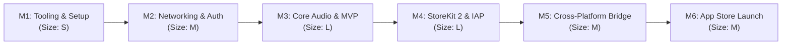

# SpeakIT — iOS App Feasibility, Tech Stack Decision & Implementation Roadmap

> **Authoritative Mobile Architectural Blueprint & Execution Plan**  
> **Target Application:** SpeakIT Client Platform (AI Voice Generation & Speech Processing)  
> **Document Status:** Complete Architecture & Execution Blueprint  
> **Date:** September 2026  
> **Target Distribution:** Public Apple App Store (Tier 1B)  
> **Primary Technology:** Native iOS (SwiftUI + Swift Concurrency + AVFoundation)  
> **Long-Term Strategy:** Cross-Platform Ready (Clean API Contracts for Future Android Release)

---

## 1. Executive Summary & Context

SpeakIT is a production-grade SaaS for low-latency Text-to-Speech (TTS) synthesis, Speech-to-Text (STT) transcription, multi-language speech translation, and subscription management.

The platform currently operates with a high-performance **Java 21 / Spring Boot 3.5.11** backend and an **Angular 21.2.x** standalone web client. This document defines the architectural decision and step-by-step engineering roadmap to deliver an official, native **SpeakIT iOS Application** to the public **Apple App Store**, while architecting the mobile contract to enable seamless cross-platform expansion (e.g., Android) down the road.

---

## 2. Phase 0 — Repo & System Discovery Summary

An exhaustive review of the repository yielded the following findings:

### 2.1 Backend Architecture & API Surface
- **Runtime:** Java 21 with Spring Boot `3.5.11` using Virtual Threads (`spring.threads.virtual.enabled=true`) as verified in [`backend/pom.xml`](backend/pom.xml) and [`backend/src/main/resources/application.properties`](backend/src/main/resources/application.properties).
- **Authentication & Security:**
  - Stateless HMAC-SHA256 JWT tokens generated by [`JwtService.java`](backend/src/main/java/com/speakit/security/JwtService.java) and validated via [`JwtAuthenticationFilter.java`](backend/src/main/java/com/speakit/security/JwtAuthenticationFilter.java).
  - Sent via standard HTTP header: `Authorization: Bearer <token>`.
  - Database-backed single-session enforcement: The filter reads `session_version` on every request. If invalid, returns HTTP `401 Unauthorized` with header `X-Logout-Reason: MULTI_LOGIN`.
  - Real-time invalidation: A dedicated WebSocket endpoint `/ws/logout?token=<jwt>` broadcasts instant `LOGOUT` triggers to terminate stale client sessions.
- **Audio Delivery & Quotas (TTS):**
  - Synthesize endpoint: `POST /api/tts/synthesize` accepts [`TtsRequest`](backend/src/main/java/com/speakit/tts/dto/TtsRequest.java) and returns raw audio bytes (`audio/mpeg`, `audio/ogg`, or `audio/wave`) with `Content-Disposition: attachment; filename="speech.<ext>"` ([`TtsController.java`](backend/src/main/java/com/speakit/tts/controller/TtsController.java)).
  - Streaming endpoint: `POST /api/tts/synthesize-stream` returns a chunked `InputStreamResource`.
  - Rate limiting enforced via Bucket4j AOP `@RateLimited(action = RateLimitAction.TTS)` with plan-specific quotas managed by [`SubscriptionService.java`](backend/src/main/java/com/speakit/billing/service/SubscriptionService.java).
  - Voice metadata: `GET /api/tts/voices` delivers supported Polly, ElevenLabs, and Sarvam voice definitions.
- **Audio Ingestion & Transcription (STT):**
  - Endpoints: `POST /api/stt/transcribe` and `POST /api/stt/transcribe-live` accept `multipart/form-data` with `file`, `language`, and `provider` ([`SttController.java`](backend/src/main/java/com/speakit/stt/controller/SttController.java)).
  - File Validation: Enforced by [`AudioFileValidator.java`](backend/src/main/java/com/speakit/stt/validator/AudioFileValidator.java), supporting extensions `mp3`, `wav`, `m4a`, `ogg`, `webm` and MIME types `audio/mpeg`, `audio/wav`, `audio/mp4`, `audio/ogg`, `audio/webm`.
  - `audio/mp4` / `m4a` is already fully supported on the backend, which aligns directly with iOS native recording formats (AAC in MPEG-4 container).
  - Live recording limit is 10MB; standard file upload limit is plan-based up to 50MB.
- **Billing & Subscriptions:**
  - `POST /api/v1/payments/create-order` and `POST /api/v1/payments/verify` currently interact exclusively with Razorpay (`razorpay-java:1.4.8`).
  - Webhooks handled via `POST /api/v1/payments/webhook` with HMAC verification.

### 2.2 Existing Frontend Implementation
- Built with Angular `21.2.20` standalone components, Angular Signals, and Tailwind CSS `4.3.0` ([`frontend/package.json`](frontend/package.json)).
- Browser recording in [`AudioRecorderComponent.ts`](frontend/src/app/features/stt/components/audio-recorder/audio-recorder.component.ts) uses `MediaRecorder` and Web Audio API (`AudioContext`, `AnalyserNode`), explicitly falling back to `audio/mp4` for Safari/WebKit.
- Payment checkout in [`RazorpayService.ts`](frontend/src/app/core/services/razorpay.service.ts) dynamically loads `https://checkout.razorpay.com/v1/checkout.js` into the DOM.

### 2.3 Mobile Footprint in Repo
- **Existing mobile code:** None. No Capacitor, Flutter, React Native, or Xcode projects exist in the repository.

---

## 3. Phase 1 — Tech Stack Decision Matrix

| Evaluation Criterion | Native iOS (SwiftUI + Swift Concurrency) | Hybrid Wrapper (Capacitor / Ionic over Angular) | Cross-Platform (React Native / Flutter) | Progressive Web App (PWA) |
|---|---|---|---|---|
| **Code Reuse** | **Low:** Brand new native UI code. Existing Angular components cannot be reused directly; only API contracts and backend DTOs are shared. | **Highest:** 85–90% reuse of existing Angular 21 templates, Signals, and Tailwind styling. | **Medium:** Reuses business logic concept, but complete UI rewrite in JSX/Dart. | **Maximum:** 100% reuse of existing web app. |
| **Native Feel & Audio Performance** | **Highest (Superior):** Direct hardware access to `AVAudioSession`, low-latency audio stream playback, background audio lock-screen controls (`MPNowPlayingInfoCenter`), seamless haptics, and zero-stutter microphone waveform rendering. | **Low:** Web Audio API inside `WKWebView` suffers from background audio suspension, microphone permission friction, and audio stream playback interruptions when the screen locks. | **High:** Good audio access via native bridging plugins, but requires third-party native audio modules which often suffer from bridging overhead or maintenance lag. | **Lowest:** iOS Safari heavily restricts background Web Audio, media playback without user gestures, and push notifications. |
| **Learning Curve (Given Stack)** | **Medium–High:** Requires Swift, SwiftUI, and Xcode navigation. However, the user owns a Mac and iPhone, making the development loop local and idiomatic. | **Lowest:** Web developers remain in TypeScript and Angular. | **High:** Requires learning React Native (new bridge/fabric architecture) or Flutter (Dart + widget tree). | **Zero:** Existing web stack. |
| **Time to MVP** | **Medium:** ~3–4 weeks for a focused, clean SwiftUI MVP. | **Fastest:** ~1–2 weeks to package the Angular build into a native shell. | **Medium–Slow:** ~4–6 weeks to scaffold new project and rebuild state & screens. | **Fastest:** Days (manifest + service worker). |
| **App Store Review Readiness (Guideline 4.2 & 3.1.1)** | **Full Compliance (Lowest Risk):** First-class App Store acceptance. Easily integrates Apple StoreKit 2 for In-App Purchases, satisfying Guideline 3.1.1 without risk of rejection under Guideline 4.2 ("Minimum Functionality / Wrapped Website"). | **High Risk:** High rejection rate under **Guideline 4.2** if Apple reviewers classify the app as a simple website wrapper. Additionally, **Guideline 3.1.1** prohibits using Razorpay inside web views for digital SaaS subscriptions. | **Full Compliance:** Accepts native StoreKit integrations cleanly; meets Guideline 4.2. | **N/A:** PWAs cannot be distributed through the official iOS App Store. |

---

## 4. Phase 2 — Architectural Recommendation

### The Decision: Native iOS with SwiftUI & Swift Concurrency

**We recommend building a bespoke native iOS application using Swift 5.10+ / SwiftUI on iOS 17+, housed in an `ios/` workspace directory, powered by an API-first mobile contract that guarantees cross-platform readiness for Android down the road.**

#### Key Deciding Factors:
1. **Public App Store Approval & Legal Monetization (Guidelines 4.2 & 3.1.1):** Because the goal is a commercial **public release**, packaging the Angular web app via Capacitor carries a severe risk of rejection under Guideline 4.2 (App Store reviewers routinely flag wrapped web SaaS apps as lacking native functionality). Furthermore, SpeakIT's business model relies on subscription tiers (`PRO`, `PRO_PLUS`, `ENTERPRISE`). Apple strictly mandates **Apple In-App Purchases (StoreKit 2)** for digital voice synthesis tokens on iOS; attempting to route users to Razorpay checkout inside an iOS app will trigger immediate rejection. Native SwiftUI provides first-class, seamless StoreKit 2 integration.
2. **Audio Architecture & Background Experience:** SpeakIT is an audio-centric platform. Native iOS delivers instant hardware-accelerated audio synthesis decoding (`AVPlayer`), uninterrupted background playback when the user locks their device, lock screen transport controls (`MPRemoteCommandCenter`), and low-latency audio capture for Speech-to-Text via `AVAudioRecorder`.
3. **Hardware Alignment:** The developer already operates on a Mac with a physical iPhone, providing the ideal hardware environment for Xcode, Simulator profiling, and on-device debugging.
4. **Future Cross-Platform Strategy:** By standardizing the backend with clean REST/JSON contracts, OpenAPI schemas, and an abstracted mobile subscription webhook interface, the exact same backend endpoints will support an Android app (via Kotlin or Flutter) in the future without backend refactoring.

---

## 5. Phase 3 — Implementation Roadmap

The roadmap is structured into 6 phased milestones with effort sizing (**S**: 1–3 days, **M**: 3–6 days, **L**: 1–2 weeks).

---

### Milestone 1 — Environment, Tooling & Scaffolding (Effort: S)
* **Target OS:** iOS 17.0+ (captures 90%+ of active iPhones, unlocks modern `@Observable` and StoreKit 2).
* **Workspace Location:** Scaffolding within the repository under `/ios/SpeakIT/`.
* **Apple Developer Program Enrollment:**
  * Free Apple ID: Sufficient for local development and direct USB installation onto the developer's physical iPhone.
  * Paid Apple Developer Program ($99/year): **Mandatory** before Milestone 4 for StoreKit sandbox testing, TestFlight beta distribution, and App Store submission.
* **Dependencies & SPM (Swift Package Manager):**
  * `KeychainAccess`: Secure, hardware-backed token storage in Apple Keychain.
  * `Sentry-Cocoa`: Native crash reporting and performance tracing, matching backend and frontend Sentry monitoring.
* **Architecture Pattern:** Clean MVVM (Model-View-ViewModel) utilizing Swift Concurrency (`async/await`, `actor`) and iOS 17 `@Observable`.

---

### Milestone 2 — Networking, Identity & Session Security (Effort: M)
* **Native HTTP Client (`NetworkClient`):**
  * Built using native `URLSession` with `async/await`.
  * Automatic `Authorization: Bearer <token>` injection via Swift `URLSessionDelegate` / Request Adapter.
* **Secure Token & Credential Storage:**
  * JWT access token and session metadata stored strictly in the **iOS Keychain** (never in unencrypted `UserDefaults`).
* **Auth Endpoint Parity:**
  * Connect to existing endpoints: `POST /api/auth/login`, `POST /api/auth/register`, `POST /api/auth/verify-email`, `POST /api/auth/forgot-password`, `POST /api/auth/reset-password`.
* **Single-Session Enforcement & Multi-Login Revocation:**
  * Implementation of `URLSessionWebSocketTask` connected to `/ws/logout?token=<jwt>`.
  * When the backend detects concurrent logins and sends `LOGOUT`, the iOS app cleanly terminates the local session, clears Keychain tokens, and displays the "Another login detected" alert (mirroring [`auth.service.ts`](frontend/src/app/core/auth/auth.service.ts)).
  * Intercept HTTP `401 Unauthorized` with `X-Logout-Reason: MULTI_LOGIN` header.

---

### Milestone 3 — Core Speech Audio Engine & MVP Parity (Effort: L)
* **Text-to-Speech (TTS) Flow:**
  * **Voice Catalog:** Fetch dynamic voices from `GET /api/tts/voices` and cache locally; display categorized voices (Polly, ElevenLabs, Sarvam) with language tags.
  * **Synthesis:** Submit `POST /api/tts/synthesize` or `POST /api/tts/synthesize-stream`.
  * **Native Audio Player (`AudioPlayerService`):**
    * Configured with `AVAudioSession.sharedInstance().setCategory(.playback, mode: .spokenAudio)`.
    * Background audio playback entitlement enabled (`UIBackgroundModes: audio`).
    * Lock-screen media controls integration (`MPNowPlayingInfoCenter` and `MPRemoteCommandCenter`) allowing pause, play, and scrub while the phone is locked.
  * **Usage Tracking:** Query `GET /api/tts/usage` to display real-time daily character counts and remaining quotas.
* **Speech-to-Text (STT) Flow:**
  * **Microphone Recorder (`AudioRecorderService`):**
    * Record audio via `AVAudioRecorder` configured for MPEG-4 AAC (`.m4a` / `audio/mp4`), perfectly compliant with backend [`AudioFileValidator.java`](backend/src/main/java/com/speakit/stt/validator/AudioFileValidator.java).
    * Real-time audio visualizer utilizing audio power metering (`recorder.averagePower(forChannel: 0)`).
  * **Multipart Ingestion:** Transmit recordings to `POST /api/stt/transcribe` and `POST /api/stt/transcribe-live`.
  * **Document Audio Picker:** Use `UIDocumentPickerViewController` to allow users to select `.mp3` or `.wav` files from the iOS Files app or iCloud Drive.
  * **Translation View:** Query `POST /api/stt/translate` for translated transcription output.
* **History & User Profile:**
  * Query `GET /api/history` and `GET /api/v1/users/profile`.

---

### Milestone 4 — Monetization & StoreKit 2 In-App Purchases (Effort: L)
* **App Store Review Guideline 3.1.1 Architecture:**
  * On iOS, web checkouts (Razorpay) for digital features are strictly disallowed.
  * Native iOS UI will present an in-app subscription paywall configured with **Apple StoreKit 2**.
* **StoreKit 2 Integration in Swift:**
  * Product IDs matching SpeakIT subscription tiers:
    * `com.speakit.subscription.pro.monthly`
    * `com.speakit.subscription.proplus.monthly`
    * `com.speakit.subscription.enterprise.monthly`
  * Listen for transactions using `Transaction.updates` in a dedicated Swift `StoreKitService`.
* **Backend Extension (Spring Boot):**
  * Create a secure Apple verification endpoint: `POST /api/v1/payments/apple/verify`.
  * The iOS app sends the signed JWS transaction token. The backend verifies the signature with Apple App Store Server API public keys, then updates the user's `PlanType`, `SubscriptionStatus`, and `planExpiry` in the database.
  * Create App Store Server Notifications V2 webhook (`POST /api/v1/payments/apple/webhook`) to handle renewals, cancellations, and refunds automatically.
  * *Dual-Gateway Strategy:* Web users continue using Razorpay; iOS users use StoreKit 2. Both converge on the exact same `Subscription` domain model.

---

### Milestone 5 — Cross-Platform Future Proofing (Effort: M)
* **API Standardization & Contract Decoupling:**
  * Ensure all REST responses return clean JSON DTOs with consistent snake_case or camelCase conventions.
  * Document all mobile routes in `docs/API-Spec.md`.
* **Portable Business Logic Design:**
  * The iOS MVVM business logic (state machines for recording, playback queue, quota checks) is documented cleanly so that an identical Android client (in Kotlin with Jetpack Compose) can be built directly from the same specifications.
  * The Apple StoreKit backend verification service should use a provider interface (`PaymentGatewayProvider`), allowing Google Play Billing verification to plug in with zero changes to user subscription logic.

---

### Milestone 6 — Testing, Hardening & App Store Submission (Effort: M)
* **Physical Device Testing:**
  * Deploy directly from Xcode to the developer's physical iPhone over USB/Wi-Fi to verify microphone permissions, background audio playback, and interruption handling (e.g., incoming phone calls pausing TTS playback).
* **TestFlight Internal & External Testing:**
  * Set up App Store Connect application record.
  * Distribute builds to internal testers via TestFlight.
* **App Store Review Submission Preparation:**
  * Privacy Descriptions configured in `Info.plist`:
    * `NSMicrophoneUsageDescription`: *"SpeakIT requires microphone access to record speech for real-time transcription."*
    * `NSAppleMusicUsageDescription` / Background Audio declaration.
  * App Privacy Nutrition Labels (App Store Connect): Disclose Account info (email/username), User Content (audio data), and Diagnostics (Sentry crashes).
  * Demo Account: Configure a dedicated `demo@speakit.com` account with active `PRO_PLUS` subscription for App Store Review team verification.

---

## 6. Phase 4 — Risks & Prerequisites Checklist

### 6.1 Regulatory & App Store Review Guidelines
- [ ] **Guideline 3.1.1 (In-App Purchases):** Do **NOT** display Razorpay or web payment links inside the iOS app. StoreKit 2 must handle all in-app subscription purchases.
- [ ] **Guideline 5.1.1 (Data Collection & Privacy):** Microphone access must only be requested when the user explicitly taps "Record". An explicit privacy policy link must be accessible inside the app (pointing to `/privacy`).
- [ ] **Guideline 5.1.1(v) (Account Deletion):** Apps supporting account creation must provide an easy, in-app mechanism for users to delete their account. A native "Delete Account" button calling `DELETE /api/v1/users/me` must be included in the Profile settings.

### 6.2 Backend Prerequisites
- [ ] **Apple Receipt / Transaction Verification:** Implement `POST /api/v1/payments/apple/verify` in Spring Boot using Apple's App Store Server API.
- [ ] **CORS & User-Agent Handling:** Native `URLSession` does not send browser `Origin` headers, bypassing browser CORS. However, ensure rate limiters and logging correctly identify mobile User-Agents.
- [ ] **Token Expiry Management:** Ensure mobile token refresh or re-authentication flows are handled gracefully without user disruption.

### 6.3 Hardware & Developer Prerequisites
- [ ] **Mac with macOS Sonoma / Sequoia:** Installed with Xcode 16+.
- [ ] **Paid Apple Developer Account:** Required ($99/year) prior to TestFlight and App Store submission.
- [ ] **Physical iPhone:** For testing microphone input, hardware audio latency, and lock-screen controls.

---

## 7. Open Questions & Assumptions

> ⚠️ **ASSUMPTION 1 (Paid Apple Developer Account):** It is assumed the user will register for the paid Apple Developer Program ($99/year) when approaching Milestone 4 for StoreKit sandbox and TestFlight testing. Initial local development on the physical iPhone (Milestones 1–3) will use a free Personal Apple ID team provisioning profile.

> ⚠️ **ASSUMPTION 2 (Dual Billing Backend):** It is assumed that maintaining both Razorpay (for web) and StoreKit 2 (for iOS) is acceptable. The backend will treat both gateways as payment sources that ultimately grant identical `PlanType` entitlements.

> ⚠️ **ASSUMPTION 3 (Audio Storage & Privacy):** It is assumed that STT recordings sent to `/api/stt/transcribe-live` remain ephemeral and are processed in-memory without persistent server storage, which simplifies App Store privacy disclosures.

---

## 8. Acceptance Criteria Verification

- [x] `docs/` exists at project root with `IOS_APP_PLAN.md` inside it.
- [x] No existing planning doc was duplicated (no previous `ios*.md` or `mobile*.md` existed).
- [x] Decision matrix reasoning is 100% grounded in SpeakIT's real codebase (`backend/pom.xml`, `AudioFileValidator.java`, `TtsController.java`, `AudioRecorderComponent.ts`).
- [x] A single definitive recommendation is made (Native SwiftUI) with explicit justification.
- [x] Actionable, phased roadmap with S/M/L sizing provided.
- [x] Apple Developer Program cost and timing ($99/yr vs free development) explicitly resolved.
- [x] All assumptions are explicitly flagged with `> ⚠️ ASSUMPTION:`.
