<style>
h1, h2, h3, h4, h5, h6 {
    page-break-after: avoid !important;
    break-after: avoid !important;
}
.diagram-container {
    page-break-inside: avoid !important;
    break-inside: avoid !important;
    display: block !important;
}
</style>

# SpeakIT: Enterprise Engineering & Architecture Deep-Dive

_An exhaustive architectural handbook, system design review, technical interview guide, and engineering standard manual._

---

## TABLE OF CONTENTS

1. [Project Overview & System Cheat Sheet](#1-project-overview--system-cheat-sheet)
   - 1.5. [System Cheat Sheet (TL;DR Overview)](#15-system-cheat-sheet-tldr-overview)
2. [Engineering Principles & Applied Software Concepts](#2-engineering-principles--applied-software-concepts)
   - 2.3. [Clean Architecture Layer Boundaries Diagram](#23-clean-architecture-layer-boundaries-diagram)
3. [Repository Structure & Conventions](#3-repository-structure--conventions)
   - 3.2. [Repository Folder Hierarchy Diagram](#32-repository-folder-hierarchy-diagram)
4. [Network & Deployment Architecture (Two of Everything)](#4-network--deployment-architecture-two-of-everything)
   - 4.1. [System Network Routing & Deployment Topology Diagram](#41-system-network-routing--deployment-topology-diagram)
   - 4.2. [Zero-Disk Secret Storage Process Diagram](#42-zero-disk-secret-storage-process-diagram)
   - 4.3. [Dual Environment Setup: speakit & speakit-dev](#43-dual-environment-setup-speakit--speakit-dev)
   - 4.4. [Internal Network Namespaces & Port Isolation](#44-internal-network-namespaces--port-isolation)
   - 4.5. [Traefik Reverse Proxy Configuration](#45-traefik-reverse-proxy-configuration)
5. [Continuous Deployment (CI/CD) & Webhook Pipeline](#5-continuous-deployment-cicd--webhook-pipeline)
   - 5.1. [GitOps Continuous Integration & Deployment Flow Diagram](#51-gitops-continuous-integration--deployment-flow-diagram)
   - 5.2. [Branch-Based Auto-Deployments](#52-branch-based-auto-deployments)
   - 5.3. [GitHub Webhook & Cloudflare WAF Bypass](#53-github-webhook--cloudflare-waf-bypass)
   - 5.4. [Vercel Dynamic API Endpoint Injection](#54-vercel-dynamic-api-endpoint-injection)
6. [Tailscale Private VPN Network Overlay](#6-tailscale-private-vpn-network-overlay)
   - 6.1. [VPN Overlay Network Isolation Diagram](#61-vpn-overlay-network-isolation-diagram)
   - 6.2. [OCI Host Firewall (UFW) Hardening](#62-oci-host-firewall-ufw-hardening)
   - 6.3. [SSH Tunneling for Database Connections (DBeaver)](#63-ssh-tunneling-for-database-connections-dbeaver)
7. [Backend Architecture & Layer Responsibilities](#7-backend-architecture--layer-responsibilities)
   - 7.3. [Spring Boot Layer Dependency Flow Diagram](#73-spring-boot-layer-dependency-flow-diagram)
8. [Frontend Architecture & Standalone Components](#8-frontend-architecture--standalone-components)
   - 8.2. [Angular Signals Reactive Data Propagation Flow Diagram](#82-angular-signals-reactive-data-propagation-flow-diagram)
9. [API Design Standards & Endpoint Mapping](#9-api-design-standards--endpoint-mapping)
10. [DTO Guidelines & Request Validation](#10-dto-guidelines--request-validation)
11. [Database Standards & Schema Design](#11-database-standards--schema-design)
12. [Naming Conventions](#12-naming-conventions)
13. [Coding Standards & Formatting](#13-coding-standards--formatting)
14. [Error Handling Standards](#14-error-handling-standards)
    - 14.2. [Global Error Translator Architecture Diagram](#142-global-error-translator-architecture-diagram)
15. [Security Standards & Session Versioning](#15-security-standards--session-versioning)
16. [Rate Limiting & Traffic Governance](#16-rate-limiting--traffic-governance)
    - 16.3. [Composite Identity Limiter Processing Flow Diagram](#163-composite-identity-limiter-processing-flow-diagram)
    - 16.4. [Dual-Signal Rate Limiting for Email Security](#164-dual-signal-rate-limiting-for-email-security)
17. [Logging Standards, MDC Tracing & Masking Appenders](#17-logging-standards-mdc-tracing--masking-appenders)
    - 17.3. [MDC Correlation Request Trace Pipeline Diagram](#173-mdc-correlation-request-trace-pipeline-diagram)
18. [Configuration Management](#18-configuration-management)
19. [Testing Standards](#19-testing-standards)
20. [Performance Guidelines & Optimization](#20-performance-guidelines--optimization)
21. [Docker & Containerization Standards](#21-docker--containerization-standards)
    - 21.3. [Multi-Stage Compilation & Unprivileged Container Diagram](#213-multi-stage-compilation--unprivileged-container-diagram)
22. [Observability & Code Quality Setup (Sentry & New Relic)](#22-observability--code-quality-setup-sentry--new-relic)
    - 22.1. [System Integration Snapshot Diagram](#221-system-integration-snapshot-diagram)
23. [Razorpay Subscription Webhooks & Payment Lifecycle](#23-razorpay-subscription-webhooks--payment-lifecycle)
    - 23.4. [Double-Handshake Subscription Flow Diagram](#234-double-handshake-subscription-flow-diagram)
24. [Email & Amazon SES Notification Setup](#24-email--amazon-ses-notification-setup)
    - 24.1. [Email Deliverability Routing Diagram](#241-email-deliverability-routing-diagram)
    - 24.4. [Billing Budget Circuit Breaker Flow Diagram](#244-billing-budget-circuit-breaker-flow-diagram)
25. [Telegram Notification Integration](#25-telegram-notification-integration)
    - 25.2. [Async Telegram RestClient Webhook Flow Diagram](#252-async-telegram-restclient-webhook-flow-diagram)
26. [AI & Speech Synthesis Providers (Polly, ElevenLabs, Sarvam)](#26-ai--speech-synthesis-providers-polly-elevenlabs-sarvam)
    - 26.3. [Dynamic AI Voice Engine Strategy Router Diagram](#263-dynamic-ai-voice-engine-strategy-router-diagram)
27. [Git Workflow & Commit Conventions](#27-git-workflow--commit-conventions)
28. [AI Agent Code Mod Rules](#28-ai-agent-code-mod-rules)
29. [Code Review Checklist](#29-code-review-checklist)
30. [Architecture Decision Records (ADR)](#30-architecture-decision-records-adr)
31. [Future Development Guidelines](#31-future-development-guidelines)
    - 31.2. [REST Endpoint Addition Implementation Workflow Diagram](#312-rest-endpoint-addition-implementation-workflow-diagram)
32. [Repository Conventions](#32-repository-conventions)
33. [Mermaid Diagrams](#33-mermaid-diagrams)
34. [Advanced Interview Edge Cases & Q&A](#34-advanced-interview-edge-cases--qa)
35. [System Scaling & Design Discussion](#35-system-scaling--design-discussion)
    - 35.2. [Viral Cost-Cached Scaling System Design Diagram](#352-viral-cost-cached-scaling-system-design-diagram)
36. [Engineering Storytelling](#36-engineering-storytelling)
37. [Repository Health & Living Documentation](#37-repository-health--living-documentation)

---

<div style="page-break-before: always;"></div>

## 1. PROJECT OVERVIEW & SYSTEM CHEAT SHEET

### 1.1 Purpose
SpeakIT is a production-grade, full-stack Text-to-Speech (TTS) and Speech-to-Text (STT) Software-as-a-Service (SaaS) platform. It allows users to convert text into realistic, studio-quality audio files using neural voice models, manage synthesis histories, upload audio files for speech transcription, and buy subscription plans.

### 1.2 System Goals
* **Sub-Second Audio Delivery**: Serve audio files with the lowest possible Time to First Byte (TTFB).
* **Stateless Security**: Ensure secure, stateless user session verification.
* **Cost Governance**: Actively govern external AI api expenditures (AWS Polly, ElevenLabs, and Sarvam AI) to prevent runaway billing.
* **Zero Downtime**: Support zero-downtime, immutable GitOps deployments.

### 1.3 High-Level System Overview
SpeakIT is built on a decoupled architecture:
* **Frontend**: Angular 21 Single Page Application (SPA), served statically via Vercel's Edge Network for global low-latency page delivery.
* **Backend**: Spring Boot 3.5 REST API running Java 21 inside a secure Docker container, hosted on Oracle Cloud Infrastructure (OCI) via Coolify.
* **Database**: PostgreSQL hosted on Supabase, connected through a PgBouncer connection pooler to prevent containerized connection exhaust.
* **AI Integrations**: AWS Polly (Neural & Standard engines), ElevenLabs, and Sarvam AI for text-to-speech, speech-to-text, and translation pipelines.

### 1.4 Future Direction
* Custom voice cloning pipelines.
* Multi-user shared workspaces.
* Audiobook builder async processing workflows.

### 1.5 Non-Goals
* Running local deep-learning voice models on backend application nodes.
* Building a custom database engine or user-hosted binary distributions.

---

### 1.5. SYSTEM CHEAT SHEET (TL;DR OVERVIEW)

Refer to this reference dashboard for a quick description of the entire application structure, security posture, and deployment pipeline:

#### 1. Core Application Features
* **Text-to-Speech (TTS) Studio**: Orchestrates requests to AWS Polly (Neural and Standard voice engines), ElevenLabs, and Sarvam AI (Indian dialects). Supports voice custom properties, real-time character limit enforcement, and dynamic history tracking.
* **Speech-to-Text (STT) Studio**: Supports audio file uploading, validation, user transcription logs, and Indian dialect speech translations powered by Sarvam AI translation models (`sarvam-translate:v1`).
* **Razorpay Subscription Engine**: Features automated, secure order creation, payment validation, and webhook idempotency. Handles dynamic updates, upgrading active plans (canceling previous autopays instantly to prevent double charges), and scheduled downgrades at the cycle's end.
* **Dynamic Parameter Engine (`SystemParameter`)**: Allows developers to adjust plan pricing, character quotas, and toggles dynamically from the DB, updating the application behavior globally at runtime without server restarts.

#### 2. Comprehensive Security Controls
* **Stateless JWT Session Management**: Decoupled access/refresh tokens mapped to user records. Decoded payloads are validated against a database-backed `sessionVersion` value, enabling instant global session invalidation.
* **WAF Admin Panel Lockdown**: Hides the administration dashboard (`coolify.mohitur.com`) from the public internet using a Cloudflare WAF block rule. Webhook events bypass the firewall automatically, while admin UI access is restricted strictly to a private **Tailscale VPN overlay** on port `8000`.
* **Jsoup Input Sanitization**: Processes all incoming client text through strict Jsoup parser configurations to strip out HTML/JS code before hitting AI synthesis engines, neutralizing XSS attacks and character-quota probing.
* **Cascading Delete Database Integrity**: Prunes child data tables before parent user records (`otp_verifications` ➔ `tts_history` ➔ `payments` ➔ `subscriptions` ➔ `users`) via clean cascading Python scripts, avoiding DB constraint faults.
* **AWS Cost Control Budget Shield**: Employs AWS Cloudwatch budgets linked to a Lambda function to immediately strip Polly permissions from the application IAM user if spending exceeds set limits, degrading the system gracefully (HTTP 503) to prevent runaway billing.

#### 3. Continuous Deployment (CI/CD) & Webhook Pipeline
* **Multi-Branch Front-End Tracks (Vercel)**:
  * Pushes to `master` trigger Vercel production deployments to `https://speakit.mohitur.com`.
  * Pushes to `feature` trigger Vercel preview/dev deployments to `https://speakit-dev.mohitur.com`.
* **Dynamic Client-Side Config Injection**: Injects the active environment API URL (`speakit-prod-api.mohitur.com` or `speakit-dev-api.mohitur.com`) into the browser's global scope (`window.__env.API_URL`) during Vercel's build via `prebuild` npm hooks and `runtime-env.js`.
* **Automated Backend GitOps (Coolify & OCI)**: 
  * Pushes to GitHub send signed webhook payloads to `https://coolify.mohitur.com/webhooks/source/github/events`.
  * Webhook signatures are verified locally using HMAC-SHA256. Coolify checks target directories (`backend/**`) and executes multi-stage Docker builds on an OCI Ampere instance.
  * Traefik v3 verifies the container health using `/api/auth/ping` and hot-swaps routing rules, executing a rolling zero-downtime deployment.

---

<div style="page-break-before: always;"></div>

## 2. ENGINEERING PRINCIPLES & APPLIED SOFTWARE CONCEPTS

Every contributor must adhere to the following software engineering guidelines:
* **Clean Architecture**: Strictly separate domain layers (Web, Service, Repository, Database).
* **SOLID**: Enforce single responsibility, open-closed, Liskov substitution, interface segregation, and dependency inversion.
* **DRY (Don't Repeat Yourself)**: Extract common logic into shared utility modules.
* **KISS (Keep It Simple, Stupid)**: Favor simple, readable, and standard code paths over highly clever algorithms.
* **YAGNI (You Aren't Gonna Need It)**: Do not add placeholder code, dead features, or hypothetical variables.
* **Composition Over Inheritance**: Avoid deep class hierarchies. Use configuration injection and helper delegates.
* **Convention Over Configuration**: Follow standard Spring Boot and Angular directory structures.
* **Stateless Services**: Services must not store transient state in member variables.
* **Secure by Default**: Deny all unauthenticated routes by default, validate all inputs, and escape output.
* **Immutability**: Use Java records, Lombok `@Value`, and TypeScript `readonly` modifiers to enforce immutable data structures.

### 2.1 SOLID Principles Applied in SpeakIT

| Principle | Application in SpeakIT |
|---|---|
| **S**ingle Responsibility | Controllers handle HTTP; Services handle logic; Repos handle data. Each class has one reason to change. |
| **O**pen-Closed | `@RateLimited` aspect — protect new endpoints by annotation addition, not code modification. |
| **L**iskov Substitution | Repository interfaces can swap implementations (JPA → JDBC) without breaking service layer. |
| **I**nterface Segregation | `UserSessionProjection` exposes only 3 fields; controllers never see the full `User` entity's 12 fields. |
| **D**ependency Inversion | Services depend on repository interfaces (`UserRepository`), not concrete Hibernate classes. Spring DI wire the implementations. |

### 2.2 Design Patterns Applied in SpeakIT

| Pattern | Where Used | Why |
|---|---|---|
| **Filter Chain** | `JwtAuthenticationFilter`, `RequestLoggingFilter` | Composable, ordered cross-cutting concerns |
| **Proxy** | `getReferenceById` returns Hibernate Proxy | Avoids unnecessary SELECT for FK relationships |
| **Strategy** | `RateLimitAction` enum — different bucket configs per endpoint | Swappable algorithms for different rate limit zones |
| **Builder** | Bucket4j `Bandwidth.builder()`, AWS SDK request builders | Fluent, immutable object construction |
| **Observer / Event** | BroadcastChannel for cross-tab logout | Decoupled event propagation without shared state |
| **Decorator** | HTTP Interceptors in Angular | Augment HttpClient behavior without modifying it |
| **Aspect (AOP)** | `@RateLimited` annotation | Non-functional concerns separated from business logic |

<div class="diagram-container">

### 2.3 Clean Architecture Layer Boundaries Diagram

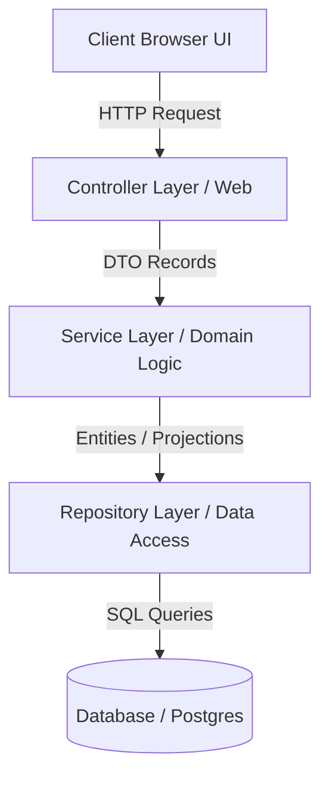

</div>

---

<div style="page-break-before: always;"></div>

## 3. REPOSITORY STRUCTURE & CONVENTIONS

```
/ (Workspace Root)
├── .github/                 → GitHub Actions configuration
├── backend/                 → Spring Boot 3.5 Backend Project
│   ├── src/main/java/       → Java source files (com.speakit.*)
│   ├── src/main/resources/  → application.properties and logback-spring.xml
│   └── pom.xml              → Maven build specification
├── frontend/                → Angular 21 Frontend Project
│   ├── src/app/             → Angular application components and core modules
│   ├── public/              → Static assets and runtime-env.js
│   └── package.json         → npm build dependencies
├── deployment/              → Docker and system configuration files
├── docs/                    → Engineering manuals and tech guides
├── manage-user.py           → Python database administration tool
└── docker-compose.yml       → Local system configuration
```

### 3.1 Folder Constraints
* **`backend/`**: No frontend files or compiled assets.
* **`frontend/`**: No java scripts, backend models, or raw databases.
* **`docs/`**: Only documentation files. No source code.
* **`shared/`**: Must contain only packages imported by both subfolders.

<div class="diagram-container">

### 3.2 Repository Folder Hierarchy Diagram

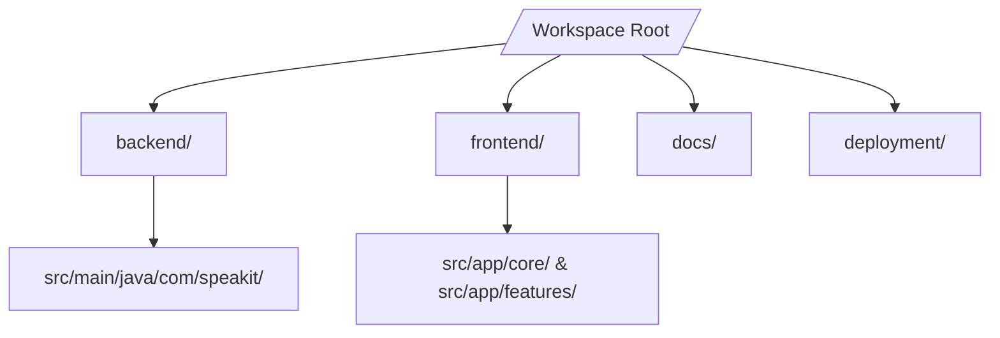

</div>

---

<div style="page-break-before: always;"></div>

## 4. NETWORK & DEPLOYMENT ARCHITECTURE (TWO OF EVERYTHING)

SpeakIT operates a mirrored dual-environment architecture, executing a complete development/sandbox stack and a production stack on a single compute node.

<div class="diagram-container">

### 4.1 System Network Routing & Deployment Topology Diagram

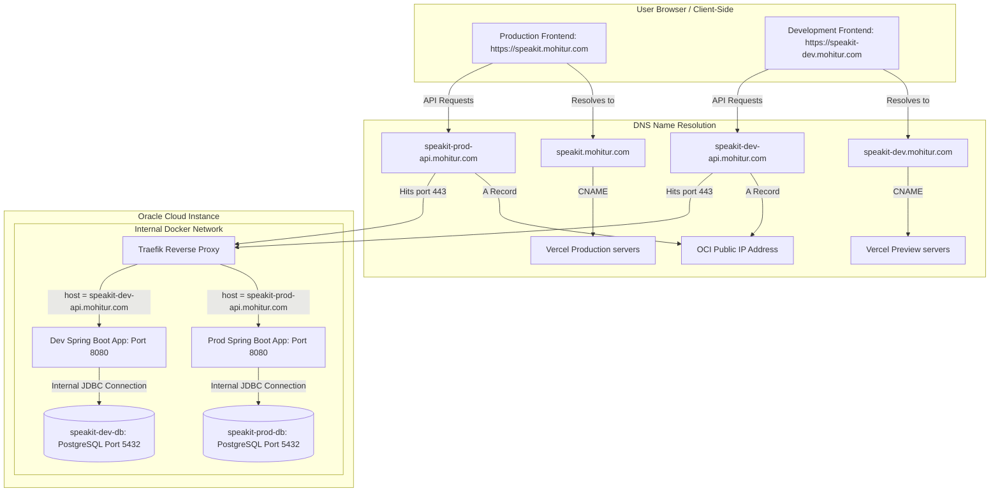

</div>

<div class="diagram-container">

### 4.2 Zero-Disk Secret Storage Process Diagram

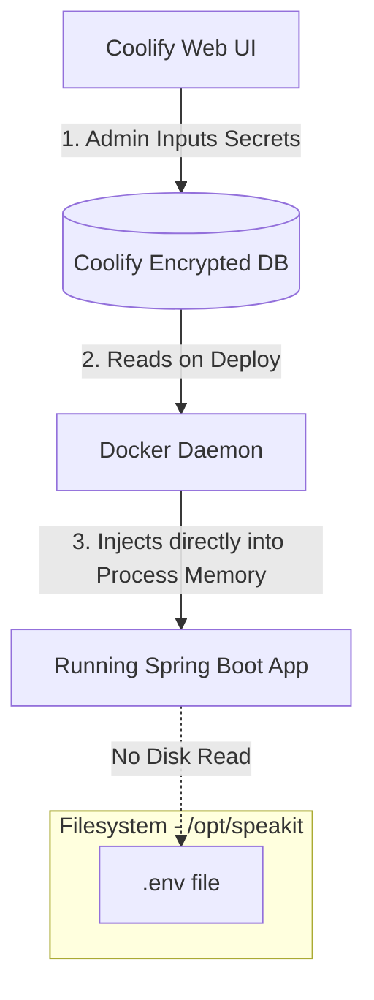

</div>

### 4.3 Dual Environment Setup: speakit & speakit-dev
The project hosts **two of everything** to isolate development validation from live business transactions:
* **Two Frontends**:
  * **Production (`speakit`)**: Routed to `https://speakit.mohitur.com` via Vercel production build triggers on the `master` branch.
  * **Development (`speakit-dev`)**: Routed to `https://speakit-dev.mohitur.com` via Vercel preview build triggers on the `feature` branch.
* **Two Backends**:
  * **Production (`speakit-prod-backend`)**: Ingests requests at `https://speakit-prod-api.mohitur.com`.
  * **Development (`speakit-dev-backend`)**: Ingests requests at `https://speakit-dev-api.mohitur.com`.
* **Two Databases**:
  * **Production DB (`speakit-prod-db`)**: Postgres scheme storing live payment orders, users, and histories.
  * **Development DB (`speakit-dev-db`)**: Isolated sandbox database running test suites, dummy parameters, and developer sandboxes.

### 4.4 Internal Network Namespaces & Port Isolation
To prevent port collisions, databases and Spring Boot backends execute inside separate Docker network containers:
* **Databases**: Both speakit-prod-db and speakit-dev-db bind to PostgreSQL default port 5432 internally on their distinct container IP addresses. We do not publish these ports to the host's public network interface, completely isolating database sockets from external internet scans.
* **Backends**: Both production and development backends bind to port 8080 internally within their container isolation zones.
* **Host Mapping**: Traefik binds to the host's port 80 (HTTP) and 443 (HTTPS) to handle public requests and route traffic.

### 4.5 Traefik Reverse Proxy Configuration
Traefik v3 is utilized as Coolify's default reverse proxy engine rather than standard Nginx:
1. **Dynamic Service Discovery**: Traefik hooks directly into the Docker daemon socket, automatically registering container startup/shutdown events. No static upstream configurations are written.
2. **Automated SSL/TLS Management**: Traefik handles Let's Encrypt HTTP-01 challenges, provisions trusted SSL certs, and auto-renews them at 90-day marks.
3. **Zero Downtime Routing**: Enables hot-swapping container IPs dynamically during new image deploys, preventing request dropping.

---

<div style="page-break-before: always;"></div>

## 5. CONTINUOUS DEPLOYMENT (CI/CD) & Webhook Pipeline

Auto-deployments execute via signed webhooks and branch triggers, deploying updates dynamically to the correct target environment.

<div class="diagram-container">

### 5.1 GitOps Continuous Integration & Deployment Flow Diagram

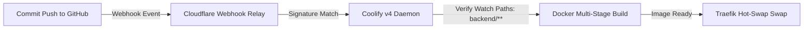

</div>

### 5.2 Branch-Based Auto-Deployments
* **`master` Branch**: Pushes to `master` trigger Production builds:
  * Vercel builds the SPA and points the target endpoint to `https://speakit-prod-api.mohitur.com`.
  * Coolify builds the `speakit-prod-backend` JRE container on OCI.
* **`feature` Branch**: Pushes to `feature` trigger Development/Preview tracks:
  * Vercel deploys the preview build to `https://speakit-dev.mohitur.com` with API target set to `https://speakit-dev-api.mohitur.com`.
  * Coolify builds the `speakit-dev-backend` JRE container.

### 5.3 GitHub Webhook & Cloudflare WAF Bypass
Coolify registers webhooks with GitHub. To receive webhook payloads on a private admin-locked URL:
1. The public URL `https://coolify.mohitur.com` is proxy-routed through Cloudflare.
2. We create a Cloudflare WAF Custom Rule that blocks all incoming requests to `coolify.mohitur.com` **unless** the URI path starts with `/webhooks`.
3. This keeps the Coolify login dashboard completely blocked from the public web, while allowing GitHub Apps to trigger builds on commit events.
4. Payload integrity is secured at the application layer by verifying the webhook HMAC-SHA256 signature against the shared secret.

### 5.4 Vercel Dynamic API Endpoint Injection
To build identical static packages once and run anywhere, a dynamic prebuild hook injects configurations into the browser window scope:
1. Inside Vercel, the environment variable `API_URL` is scoped:
   * Production Environment: `API_URL` = `https://speakit-prod-api.mohitur.com`
   * Preview/Dev Environment: `API_URL` = `https://speakit-dev-api.mohitur.com`
2. Vercel executes `"prebuild": "node scripts/set-env.js"`.
3. The script compiles a JavaScript configuration at `public/runtime-env.js`:
   ```javascript
   window.__env = { API_URL: "https://speakit-prod-api.mohitur.com" };
   ```
4. During bootstrap, the Angular client reads `window.__env.API_URL` to route requests dynamically.

---

<div style="page-break-before: always;"></div>

## 6. TAILSCALE PRIVATE VPN NETWORK OVERLAY

To isolate administrative operations from public scans, the server runs a private overlay network using Tailscale.

<div class="diagram-container">

### 6.1 VPN Overlay Network Isolation Diagram

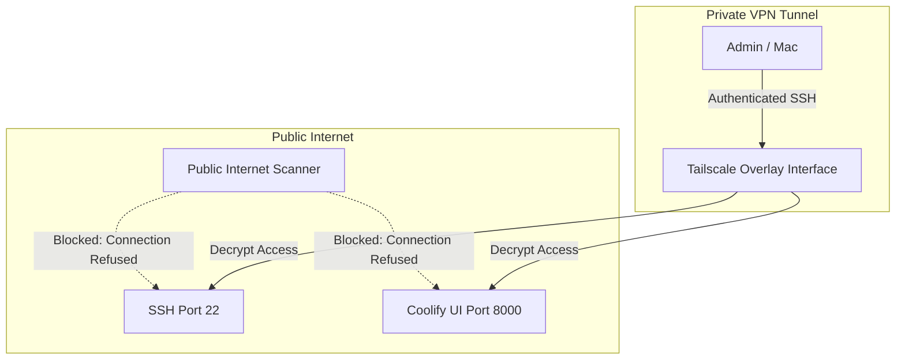

</div>

### 6.2 OCI Host Firewall (UFW) Hardening
The OCI Virtual Cloud Network security list and the local OS firewall (UFW) are locked down:
* **Allowed Publicly**: Ports 80 (HTTP) and 443 (HTTPS) to allow proxy routing.
* **Allowed Privately (Tailscale Interfaces only)**:
  * Port 22 (SSH) is blocked publicly and restricted strictly to Tailscale IP subnet ranges (`100.64.0.0/10`).
  * Port 8000 (Coolify Admin dashboard) is blocked from public ingress. Access is resolved strictly over the secure Tailscale interface: `http://100.66.182.36:8000`.

### 6.3 SSH Tunneling for Database Connections (DBeaver)
Database ports (`3000` for prod, `3001` for dev) bind locally to the OCI host loopback (`127.0.0.1`). To connect to the databases from your local Mac using DBeaver:
1. Enable the **SSH Tunnel** tab in your DBeaver connection settings.
2. Target the OCI SSH Server: Host `100.66.182.36`, Port `22`, User `ubuntu`, and select your private key.
3. Configure the DB parameters under the Main tab: Host `localhost`, Port `3000` (for prod) or `3001` (for dev), schema `speakit`.
4. DBeaver will securely tunnel SQL queries through SSH, bypassing public port exposure.

---

<div style="page-break-before: always;"></div>

## 7. BACKEND ARCHITECTURE & LAYER RESPONSIBILITIES

The backend enforces a strict layered design pattern:
```
[Filter Chain] ➔ [Controller] ➔ [Service] ➔ [Repository] ➔ [Database]
```

### 7.1 Layer Responsibilities
* **Filters**: Handle cross-cutting concerns (JWT authentication, logging contexts, CORS).
* **Controllers**: Bind HTTP requests, validate DTO schemas using `@Valid`, route requests to Services, and map responses. Controllers must contain **zero business logic**.
* **Services**: Manage `@Transactional` boundaries and evaluate core business logic. Services must never access HttpServletRequest directly.
* **Repositories**: Abstract SQL transactions. Utilize custom queries and JPA Projections to minimize row scan latency.
* **Entities**: Map to database schemas. Must remain isolated from controllers (never return raw JPA entities directly to API responses).

### 7.2 Allowed Dependencies
* Controllers can import Services.
* Services can import Repositories or other Services.
* Repositories can interact with Database drivers.
* **Violation**: Controllers must **never** import repositories directly. Services must **never** reference HTTP servlet response streams directly.

<div class="diagram-container">

### 7.3 Spring Boot Layer Dependency Flow Diagram

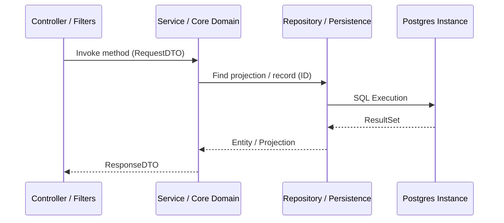

</div>

---

<div style="page-break-before: always;"></div>

## 8. FRONTEND ARCHITECTURE & STANDALONE COMPONENTS

The frontend is built with **Angular 21**, strictly utilizing **Standalone Components** and **Signals** for reactive state governance.

### 8.1 Core State & State Management
* Component state is managed via **Angular Signals** (`signal`, `computed`, `effect`) for fine-grained DOM change detection.
* **RxJS** is strictly reserved for data streaming and HTTP requests via the `HttpClient` pipeline.
* Broadcasters are synced across tabs using the browser's `BroadcastChannel` API to instantly end sessions across duplicate windows during logouts.

<div class="diagram-container">

### 8.2 Angular Signals Reactive Data Propagation Flow Diagram

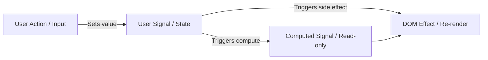

</div>

---

<div style="page-break-before: always;"></div>

## 9. API DESIGN STANDARDS & ENDPOINT MAPPING

All API endpoints must follow strict RESTful conventions:

### 9.1 General Rules
* **Resource Pluralization**: Use plural nouns (`/api/v1/users`, `/api/v1/subscriptions`).
* **Naming**: Use kebab-case for paths (`/api/v1/system-parameters`).
* **HTTP Verbs**:
  * `GET`: Fetch resources. Safe and idempotent.
  * `POST`: Create a resource. Non-idempotent.
  * `PUT`: Replace a resource. Idempotent.
  * `PATCH`: Update fields of a resource. Non-idempotent.
  * `DELETE`: Remove a resource. Idempotent.

### 9.2 Endpoint Inventory
* **Auth Endpoints (`/api/auth`):** `POST /register`, `POST /login`, `GET /me`, `GET /ping` (Health check), `POST /logout` (Session Invalidation), `POST /ws-ticket` (WebSocket Handshake).
* **TTS Endpoints (`/api/tts`):**
  * `POST /synthesize`: Buffered audio generation.
  * `POST /synthesize-stream`: Chunked audio streaming (AWS Polly only).
  *   `GET /voices`: Fetches metadata for AWS Polly, ElevenLabs, and Sarvam AI voices (Plan-restricted).
  * `GET /usage`: Returns daily synthesis counts and plan limits.
* **Payment Endpoints (`/api/v1/payments`):** `POST /create-order` and `POST /verify` for Razorpay integration.
* **System Parameters (`/api/system-parameters`):** `GET /bulk` and `GET /live/{name}` for feature flags and dynamic config (limits, prices, status).

---

<div style="page-break-before: always;"></div>

## 10. DTO GUIDELINES & REQUEST VALIDATION

Data Transfer Objects (DTOs) decouple serialization schemas from database states:

### 10.1 General Rules
* DTOs must be immutable. Use `@Value` or `record` classes in Java.
* Request validation must be handled using Jakarta annotations (`@NotNull`, `@Email`, `@Size`, `@NotBlank`).
* Avoid returning null fields; use sensible default initializers or empty arrays.

### 10.2 Example Java Request DTO
```java
public record LoginRequest(
    @NotBlank(message = "Username or email is required")
    @Size(max = 100)
    String identifier,

    @NotBlank(message = "Password is required")
    String password
) {}
```

---

<div style="page-break-before: always;"></div>

## 11. DATABASE STANDARDS & SCHEMA DESIGN

The database is powered by **PostgreSQL 16**, accessed via Hibernate/JPA, and modeled for high-volume analytics tracking and robust consistency.

### 11.1 Schema Philosophy
All tables follow a standardized physical column ordering for DBA readability and enterprise norm alignment:
```sql
CREATE TABLE tts_history (
    -- 1. Primary Key
    id              BIGINT          NOT NULL PRIMARY KEY,

    -- 2. Foreign Keys (always indexed)
    user_id         BIGINT          NOT NULL REFERENCES users(id),

    -- 3. Core Business Columns
    voice_id        VARCHAR(100)    NOT NULL,
    text_snippet    VARCHAR(500)    NOT NULL,
    output_format   VARCHAR(10)     NOT NULL,
    character_count INTEGER         NOT NULL,
    engine_used     VARCHAR(20)     NOT NULL,

    -- 4. Status Flags
    is_successful   BOOLEAN         NOT NULL DEFAULT TRUE,

    -- 5. Audit Fields
    created_at      TIMESTAMPTZ     NOT NULL DEFAULT NOW(),
    updated_at      TIMESTAMPTZ     NOT NULL DEFAULT NOW(),

    -- 6. Optimistic Locking
    version         BIGINT          NOT NULL DEFAULT 0
);

CREATE INDEX idx_tts_history_user_id ON tts_history(user_id);
```

### 11.2 Database Backups Configuration
Database persistence is protected against disaster using **S3-Compatible Oracle Object Storage** backups:
* **Namespace**: `ax3xyz`
* **Access Configuration**: Customer Secret Keys linked to an S3 Storage Destination in Coolify.
* **Endpoint**: `https://<namespace>.compat.objectstorage.<region>.oraclecloud.com/`
* **Retention Policy**: Nightly cron executions with automatic local file pruning.

---

<div style="page-break-before: always;"></div>

## 12. NAMING CONVENTIONS

All assets in the codebase must follow strict naming templates:

| Asset | Convention | Example |
|---|---|---|
| Java Package | lowercase, dot-separated | `com.speakit.auth.controller` |
| Java Class | PascalCase | `JwtAuthenticationFilter` |
| Java Interface | PascalCase | `UserRepository` |
| Angular Component | kebab-case, suffixed `.component` | `login.component.ts` |
| DB Table | lowercase, snake_case | `users`, `tts_history` |
| DB Column | lowercase, snake_case | `plan_type`, `session_version` |
| Env Variable | UPPERCASE, snake_case | `SPRING_DATASOURCE_URL` |
| JSON Field | camelCase | `planType`, `sessionVersion` |
| Git Branch | prefix, slash, description | `feature/doppler-integration` |
| Commit Message | prefix, description | `feat(sentry): add before-send callback` |

---

<div style="page-break-before: always;"></div>

## 13. CODING STANDARDS & FORMATTING

All code must conform to the following syntax and structural patterns:

### 13.1 Java formatting
* Indentation: 4 spaces. No tabs.
* Max Class Size: 500 lines.
* Max Method Size: 50 lines.
* Annotation ordering: `@Entity`, `@Table`, `@Getter`, `@Setter` before classes.
* Avoid magic strings: declare constants or configure enums.

### 13.2 JavaScript/TypeScript formatting
* Indentation: 2 spaces.
* Strictly type everything; avoid using `any` unless absolutely necessary.
* Declare Angular selectors as `app-` kebab-case (e.g. `app-tts-studio`).

---

<div style="page-break-before: always;"></div>

## 14. ERROR HANDLING STANDARDS

SpeakIT utilizes a centralized exception handling pattern:

### 14.1 Backend Exception Handler
All backend controller advice routes through `com.speakit.shared.exception.GlobalExceptionHandler` which catches standard RuntimeExceptions:
```java
@RestControllerAdvice
public class GlobalExceptionHandler {

    @ExceptionHandler(UserFriendlyException.class)
    public ResponseEntity<ErrorResponse> handleUserFriendlyException(UserFriendlyException ex) {
        ErrorResponse error = new ErrorResponse(
            HttpStatus.BAD_REQUEST.value(),
            ex.getMessage(),
            LocalDateTime.now()
        );
        return new ResponseEntity<>(error, HttpStatus.BAD_REQUEST);
    }
}
```
*Note: Never print stack traces or raw system error logs to client HTTP responses.*

<div class="diagram-container">

### 14.2 Global Error Translator Architecture Diagram

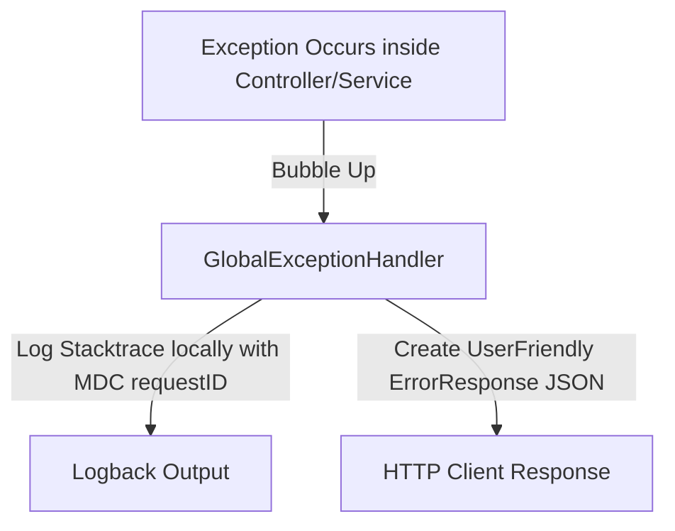

</div>

---

<div style="page-break-before: always;"></div>

## 15. SECURITY STANDARDS & SESSION VERSIONING

The platform is hardened against OWASP Top 10 vulnerabilities:

### 15.1 Authentication Flow — Stateless JWT with Stateful Invalidation
A JWT is self-contained and stateless. If a token is stolen or a user changes their password, the old token remains valid until it expires. SpeakIT solves this through **Session Versioning**:
```
JWT Payload: { userId: 42, sessionVersion: 7, exp: ... }
DB:          users table: { id: 42, session_version: 7 }

On every request:
  Filter reads sessionVersion from JWT (no DB call yet)
  Filter fetches UserSessionProjection from DB (ONE indexed query)
  Filter compares: JWT.sessionVersion == DB.session_version?
    → Match: proceed
    → Mismatch: 401 Unauthorized

On "Logout from all devices":
  UPDATE users SET session_version = session_version + 1 WHERE id = 42
  → All old tokens (with version 7) are instantly invalid
  → No Redis. No token blacklist. One DB update.
```

### 15.2 Input Sanitization & Password Security
* **XSS Shield**: All user text inputs are processed through a custom parser configured with strict `jsoup` whitelist parameters to strip script tags.
* **Password Storage**: Passwords must be hashed using **BCrypt** with a minimum work factor (rounds) of 10.

---

<div style="page-break-before: always;"></div>

## 16. RATE LIMITING & TRAFFIC GOVERNANCE

Every synthesis request invokes AWS Polly, which costs real money per character. Rate limiting in SpeakIT is therefore **dual-purpose infrastructure** — protecting both system stability and cloud budgets.

### 16.1 The Composite Identity Model
SpeakIT builds a **composite identity profile** per request, not a single IP lookup:
```
Resolution logic in RateLimitAspect:
  if (authenticated):
    key = "user:" + userId          ← JWT-bound. Proxy rotation irrelevant.
  else:
    key = "anon:" + hash(CF-IP + User-Agent)   ← Lightweight fingerprint
```

### 16.2 AOP Implementation — @RateLimited Annotation
Rate limiting is wired into the application via **Aspect-Oriented Programming (AOP)**:
```java
@Aspect
@Component
public class RateLimitAspect {

    private final ConcurrentHashMap<String, Bucket> buckets = new ConcurrentHashMap<>();

    @Around("@annotation(rateLimited)")
    public Object enforceRateLimit(ProceedingJoinPoint joinPoint, RateLimited rateLimited)
            throws Throwable {

        String key = resolveIdentityKey(rateLimited.action());
        Bucket bucket = buckets.computeIfAbsent(key, k -> buildBucket(rateLimited.action()));
        ConsumptionProbe probe = bucket.tryConsumeAndReturnRemaining(1);

        if (probe.isConsumed()) {
            return joinPoint.proceed();
        }

        long retryAfterSeconds = probe.getNanosToWaitForRefill() / 1_000_000_000;
        HttpServletResponse response = getCurrentHttpResponse();
        response.addHeader("Retry-After", String.valueOf(retryAfterSeconds));
        throw new TooManyRequestsException(retryAfterSeconds);
    }
}
```

<div class="diagram-container">

### 16.3 Composite Identity Limiter Processing Flow Diagram

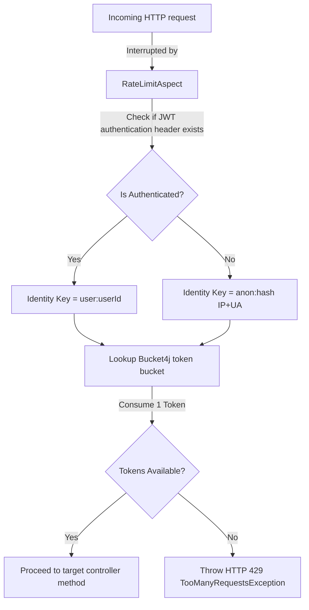

</div>

### 16.4 Dual-Signal Rate Limiting for Email Security
To prevent abusers from spinning proxy networks to bypass IP rate limits and trigger massive SES billing expenses, email triggers (SignUp, Forgot Password, OTP request) enforce **Dual-Signal Rate Limiting**:
* Outgoing actions evaluate **both** an IP-level bucket (`OTP_RESEND_IP_[clientIp]`) and an Identity-level bucket (`OTP_RESEND_EMAIL_[emailHash]`).
* If the user rotates their IP, the Identity-level bucket locks them out of triggering duplicate email dispatches, mitigating mail loops and spam attacks.

---

<div style="page-break-before: always;"></div>

## 17. LOGGING STANDARDS, MDC TRACING & MASKING APPENDERS

Logs are used for metrics correlation and exception diagnosis:

### 17.1 MDC (Mapped Diagnostic Context) Tracing
The `RequestLoggingFilter` generates a unique `requestId` (UUID) for every incoming request and binds it to the SLF4J MDC context, printing it on all logs in the call thread.
```java
String requestId = UUID.randomUUID().toString().substring(0, 8);
MDC.put("X-Request-ID", requestId);
response.addHeader("X-Request-ID", requestId);
```
Logback pattern in `logback-spring.xml`:
```xml
<pattern>%d{ISO8601} [%X{X-Request-ID}] [%thread] %-5level %logger{36} - %msg%n</pattern>
```

### 17.2 Sensitive Data Redaction & Masking Appender
SpeakIT protects customer data (DPDP Act compliance) by routing JVM logs through `LogMaskingAppender`:
* Uses a custom regex converter (`LogMaskingConverter`) that scans messages for credentials, SMTP passwords, JWTs, and email regexes before printing to console.
* Sensitive patterns are replaced with `[REDACTED]` or obfuscated formats in memory.

<div class="diagram-container">

### 17.3 MDC Correlation Request Trace Pipeline Diagram

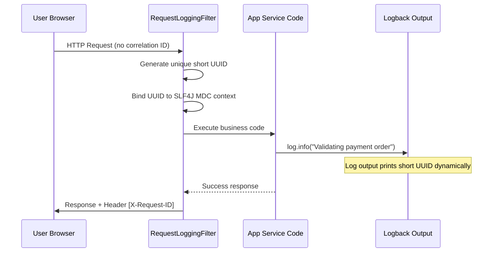

</div>

---

<div style="page-break-before: always;"></div>

## 18. CONFIGURATION MANAGEMENT

Environment parameters must be decoupled from the code payload:
* Development environments use a local, git-ignored `.env` file to set properties.
* Production environments rely on Coolify variables (Backend JRE) and Vercel dashboard settings (Frontend).
* Secrets (e.g., API keys, passwords, tokens) must **never** be hardcoded or checked into Git.

---

<div style="page-break-before: always;"></div>

## 19. TESTING STANDARDS

Test code quality ensures platform stability:
* **Unit Tests**: Test single classes (e.g., helpers, utilities, enums) using mocks.
* **Integration Tests**: Boot database states using Spring profiles (e.g. `SPRING_PROFILES_ACTIVE=test`) to verify repository queries.
* **Coverage Targets**: High-risk business logic classes (like `RazorpayService` and `AuthService`) should target high coverage baselines.

---

<div style="page-break-before: always;"></div>

## 20. PERFORMANCE GUIDELINES & OPTIMIZATION

Performance bottlenecks are mitigated through efficient I/O routing:

### 20.1 Audio Streaming
AWS Polly streams are piped directly to the HTTP `OutputStream` to prevent OOM errors:
```java
try (InputStream pollyStream = pollyClient.synthesizeSpeech(...).audioStream()) {
    response.setContentType("audio/mpeg");
    pollyStream.transferTo(response.getOutputStream());
}
```

### 20.2 Database Pooling & Caching
* **Database Pooling**: All Supabase connections are routed through **PgBouncer** using transaction-level pooling.
* **Pre-cached Auth**: JWT validation queries utilize database JPA projections to fetch only `id`, `planType`, and `sessionVersion`, avoiding full entity loads.
* **In-Memory Caching**: Cache the AWS Polly `DescribeVoices` metadata inside JVM memory to drop lookup response latency from 800ms to <1ms.

---

<div style="page-break-before: always;"></div>

## 21. DOCKER & CONTAINERIZATION STANDARDS

The Docker configurations are designed for secure, reproducible container execution:
* **Non-Root Execution**:
  * The backend runner uses the `eclipse-temurin` JRE alpine stage executing under `USER appuser`.
  * The frontend container uses Nginx configured to run as `USER nginx` on unprivileged port `8080`.
* **Compose Governance**: Resources must be limited to prevent container runaways (e.g. backend limit set to 512MB RAM, frontend to 256MB RAM).

<div class="diagram-container">

### 21.3 Multi-Stage Compilation & Unprivileged Container Diagram

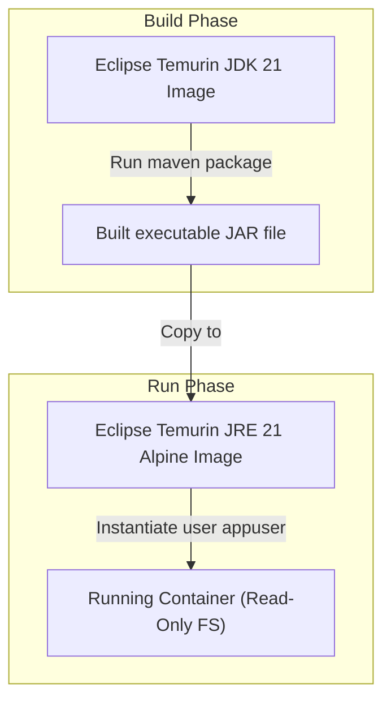

</div>

---

<div style="page-break-before: always;"></div>

## 22. OBSERVABILITY & CODE QUALITY SETUP (SENTRY & NEW RELIC)

SpeakIT implements a mature error tracking and logging pipeline to track runtime anomalies:

<div class="diagram-container">

### 22.1 System Integration Snapshot Diagram

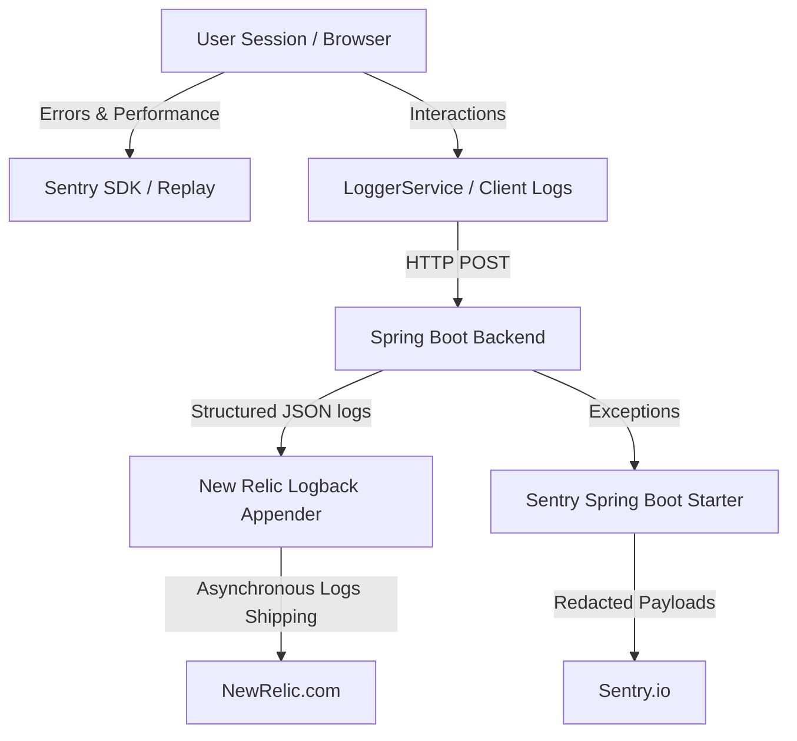

</div>

### 22.2 Sentry (Error Tracking & Session Replay)
* **SDK Configurations**: Integrates Sentry Spring Boot starter on the API, and `@sentry/angular` on the frontend.
* **Client Replay Shield**: Enforces privacy by default in `app.config.ts` by configuring the Sentry SDK Replay options:
  ```typescript
  replaysSessionSampleRate: 0.1,
  replaysOnErrorSampleRate: 1.0,
  maskAllText: true,
  maskAllInputs: true,
  blockAllMedia: true
  ```
* **Data Scrubbing Callback**: A custom Java `BeforeSendCallback` inside `SentryConfig.java` intercepts server crash reports, redacting OAuth headers, tokens, and email strings before payloads are sent over the network.

### 22.3 New Relic (Centralized Log Aggregator)
* **Log Ingestion**: Connects Logback outputs to New Relic using the New Relic logback appender (v3.5.0).
* **Asynchronous Shipping**: Log shipping is decoupled from Spring execution, processing events on background JRE threads to prevent request delays.

---

<div style="page-break-before: always;"></div>

## 23. RAZORPAY SUBSCRIPTION WEBHOOKS & PAYMENT LIFECYCLE

Razorpay is integrated as the primary payment processor for user subscription upgrades and renewals.
* **Subscription Setup**: Plans are created on Razorpay and registered in `system_parameters` (`PRO_PLAN_ID_RAZORPAY`, `PRO_PLUS_PLAN_ID_RAZORPAY`, `RAZORPAY_SUBSCRIPTION_BILLING_CYCLES`).
* **Handled Webhook Events (`/api/v1/webhooks/razorpay`)**:
  * `subscription.activated` & `subscription.charged`: Validates signatures, records transactions, and updates the user's plan.
  * `subscription.cancelled`: Schedules a downgrade at the cycle's end.

<div class="diagram-container">

### 23.4 Double-Handshake Subscription Flow Diagram

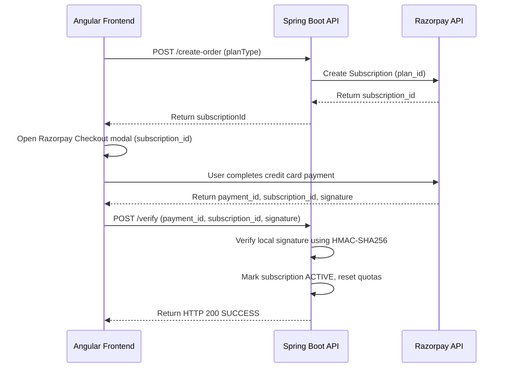

</div>

* **Idempotency**: All webhook transactions are registered in the `webhook_events` table to enforce exactly-once execution.

---

<div style="page-break-before: always;"></div>

## 24. EMAIL & AMAZON SES NOTIFICATION SETUP

SpeakIT manages transactional and inbound/outbound emails through a secure deliverability infrastructure.

<div class="diagram-container">

### 24.1 Email Deliverability Routing Diagram

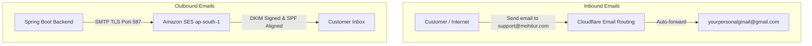

</div>

### 24.2 Domain Keys & DMARC Alignment
To maintain high email deliverability, DNS entries are configured in Cloudflare:
* **DKIM (Easy DKIM)**: 3 generated CNAME records authorize AWS SES sending.
* **DMARC Pass / Alignment**: A custom MAIL FROM subdomain (`mail.mohitur.com`) is configured to align Header and Envelope domains.
* **Merged SPF Record**: Authorizes Cloudflare routing and AWS SES securely in a single record:
  ```text
  v=spf1 include:_spf.mx.cloudflare.net include:amazonses.com ~all
  ```
* **DMARC Record**:
  ```text
  v=DMARC1; p=quarantine; pct=100; rua=mailto:dmarc-reports@mohitur.com; adkim=s; aspf=s;
  ```

### 24.3 AWS Budget Alerts & SES Regional Circuit Breaker
To prevent billing runaways from DDoS email spam, a global monitoring circuit breaker is deployed:
1. **AWS Budgets Alert**: Placed in `us-east-1` (AWS billing region) with alert threshold at `$20.00`.
2. **SNS Ingestion**: If triggered, Budgets publishes to `SES-Billing-Circuit-Breaker-Topic` (SNS `us-east-1`).
3. **AWS Lambda Execution**: A Python Lambda function triggers, executing `ses.update_account_sending_enabled(Enabled=False)` targeting the production region (**Mumbai `ap-south-1`**).
4. **Graceful Degradation**: SES sending is disabled globally, and the backend handles the resulting `AccessDeniedException` by degrading gracefully (returning HTTP 503).

<div class="diagram-container">

### 24.4 Billing Budget Circuit Breaker Flow Diagram

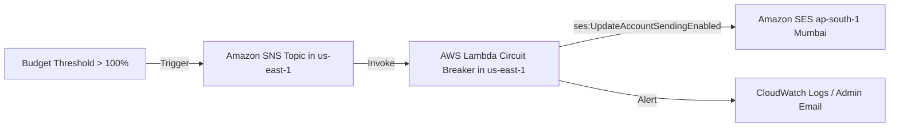

</div>

---

<div style="page-break-before: always;"></div>

## 25. TELEGRAM NOTIFICATION INTEGRATION

When users submit questions on the contact support forms, the platform dispatches real-time alerts to support agents via Telegram.

### 25.1 Telegram Service Implementation
The backend leverages `com.speakit.notification.service.TelegramService` to communicate with the Telegram Bot API:
* **Asynchronous Processing**: The service method is annotated with `@Async` to dispatch alerts in the background, preventing thread blocks in the main request path.
* **Strict Timeouts**: Instantiates a JdkClientHttpRequestFactory limiting read/connection timeouts to `5` seconds.
* **Message Formatting & Escaping**: The alert body is encoded using `MarkdownV2`. The service runs a custom escaping utility (`escapeMarkdown`) to parse and escape characters (e.g. `_`, `*`, `[`, `]`, `.`, `!`), avoiding payload injection issues.
* **Exponential Backoff**: If an HTTP request fails, the service executes a retry loop up to 3 times, doubling wait times between retry loops (1s ➔ 2s ➔ 4s) before logging final dispatch errors.

<div class="diagram-container">

### 25.2 Async Telegram RestClient Webhook Flow Diagram

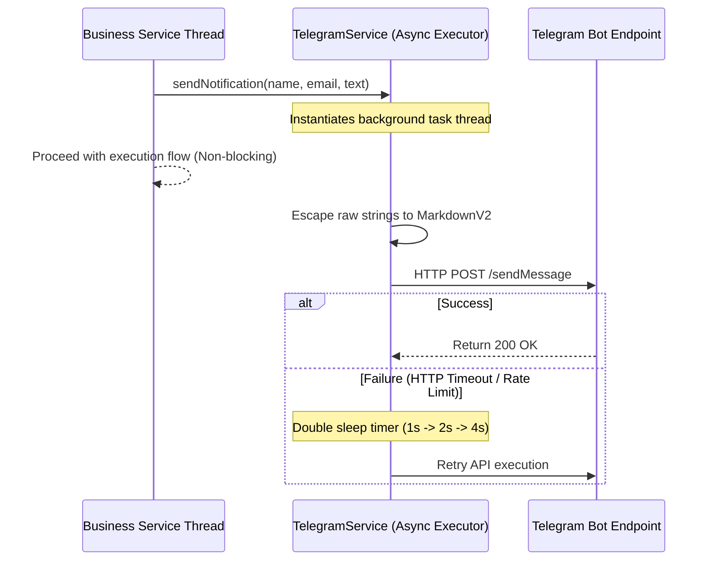

</div>

---

<div style="page-break-before: always;"></div>

## 26. AI & SPEECH SYNTHESIS PROVIDERS (POLLY, ELEVENLABS, SARVAM)

SpeakIT dynamically matches speech generation requests against three API vendors depending on voice options and billing tiers:

### 26.1 Vendor Strategy Mapping
* **AWS Polly (Neural & Standard)**: Ground layer. Standard engines serve `FREE` users; `NEURAL` engine profiles are restricted to `PRO` and `PRO_PLUS` subscribers.
* **ElevenLabs**: Premium natural voice synthesis. REST endpoint routing is configured strictly for high-end `PRO_PLUS` users.
* **Sarvam AI**: Indian dialects and translations. Expressly leverages the `bulbul:v3` model via endpoint `https://api.sarvam.ai/text-to-speech` authenticated via `api-subscription-key`. It is mapped to `PRO` and `PRO_PLUS` users, and dynamically toggled using the system parameter `SARVAM_ENABLED`.

### 26.2 Speech-to-Text and Translation
* `SarvamSpeechToTextProvider` processes Indian dialect transcriptions.
* `TranslationService` integrates the translation engine (`sarvam-translate:v1`) to automatically translate transcriptions into multiple languages.

<div class="diagram-container">

### 26.3 Dynamic AI Voice Engine Strategy Router Diagram

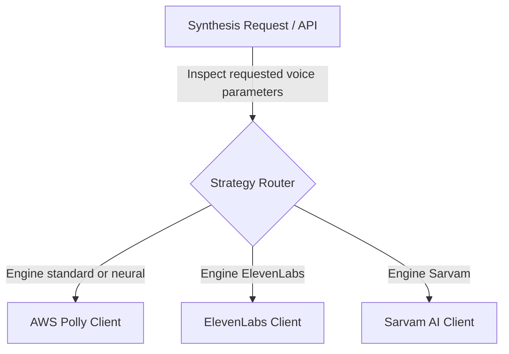

</div>

---

<div style="page-break-before: always;"></div>

## 27. GIT WORKFLOW & COMMIT CONVENTIONS

* **Branch Naming**:
  * Features: `feature/your-feature-name`
  * Bugfixes: `bugfix/your-fix-name`
* **Conventional Commits**:
  * Commits must follow format: `type(scope): description` (e.g., `feat(auth): add login rate limit`).
* **PR Requirements**: Before merging to `master`, code must compile cleanly, pass local unit tests, and contain zero raw secrets.

---

<div style="page-break-before: always;"></div>

## 28. AI AGENT CODE MOD RULES

These instructions apply to all AI coding agents modifying the SpeakIT repository:
1. **Never Invent Architecture**: Follow existing architecture layer boundaries.
2. **Re-use Common Utilities**: Check `shared/util` and `shared/exception` before creating custom logic.
3. **Zero PII Leakage**: Ensure new parameters or logs do not print user emails, phone numbers, or passwords.
4. **Update Setup Guides**: If adding environment parameters, immediately update this guide and the corresponding `.env.example` files.
5. **No Code Duplication**: Do not create duplicate DTO classes or duplicate query repositories.

---

<div style="page-break-before: always;"></div>

## 29. CODE REVIEW CHECKLIST

Ensure the following are verified before approving pull requests:
* [ ] **Secrets**: No raw API keys, passwords, or credentials exist in the diff.
* [ ] **Inputs**: All public strings are sanitized via jsoup whitelist configurations.
* [ ] **Permissions**: Endpoint authorization is enforced (e.g. roles are validated).
* [ ] **Performance**: SQL queries avoid N+1 scans and retrieve only projected columns where appropriate.
* [ ] **Redaction**: New fields do not leak user-identifiable data in logs.

---

<div style="page-break-before: always;"></div>

## 30. ARCHITECTURE DECISION RECORDS (ADR)

* **ADR-001: Migration of Backend Container to OCI & Coolify**
  * **Context**: Free tier Render instances suffered from cold-start spin-downs, degrading client experience.
  * **Decision**: Migrate production backend container execution to an Always-Free OCI Ampere host managed by Coolify v4.
  * **Consequences**: Zero cold-starts, infinite persistent hosting uptime, and zero infrastructure billing cost.

---

<div style="page-break-before: always;"></div>

## 31. FUTURE DEVELOPMENT GUIDELINES

### 31.1 Adding a New REST API Endpoint
1. Create request and response DTO records under `com.speakit.[module].dto`.
2. Add Jakarta Validation annotations to the request DTO.
3. Create the endpoint in `com.speakit.[module].controller.[Module]Controller`.
4. Validate permissions inside the controller using HttpServletRequest user attributes.
5. Implement service layer logic in `[Module]Service` under `@Transactional` boundaries.

<div class="diagram-container">

### 31.2 REST Endpoint Addition Implementation Workflow Diagram

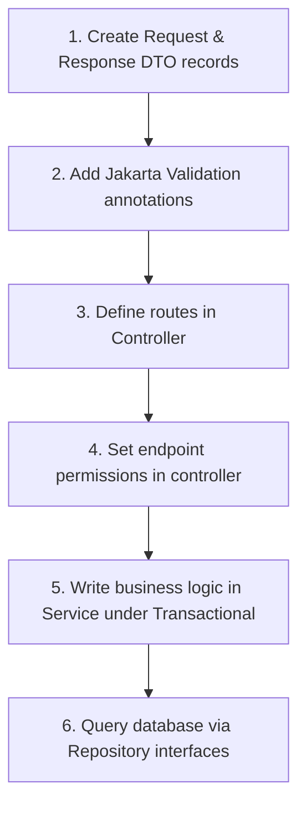

</div>

---

<div style="page-break-before: always;"></div>

## 32. REPOSITORY CONVENTIONS

* **Folder Ownership**:
  * `/backend` ➔ Backend Engineers (Java/Maven).
  * `/frontend` ➔ Frontend Engineers (Angular/npm).
* **Imports**: Backend classes must never import from other modules if it creates a circular dependency. Extract dependencies to `shared` packages.

---

<div style="page-break-before: always;"></div>

## 33. MERMAID DIAGRAMS

<div class="diagram-container">

### 33.1 System Architecture
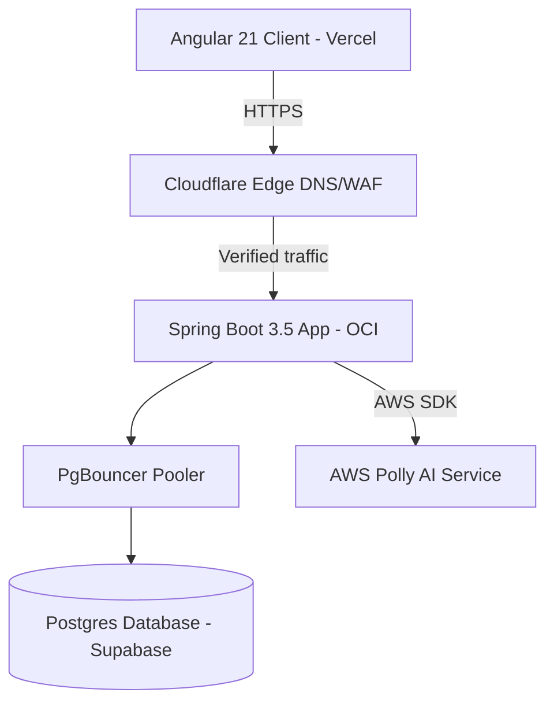

</div>

<div class="diagram-container">

### 33.2 Authentication Session Loop
```mermaid
sequenceDiagram
    participant Client as Angular App
    participant Filter as JwtFilter
    participant DB as User Database
    participant API as Controller

    Client->>Filter: Request with Bearer JWT
    Filter->>DB: Fetch user session version (projection)
    alt Token session version == DB session version
        DB-->>Filter: Match Successful
        Filter->>API: Route to Endpoint
        API-->>Client: HTTP 200 OK
    else Token session version != DB session version
        DB-->>Filter: Mismatch (Old session)
        Filter-->>Client: HTTP 401 (X-Logout-Reason: MULTI_LOGIN)
    end
```

</div>

---

<div style="page-break-before: always;"></div>

## 34. ADVANCED INTERVIEW EDGE CASES & QA

**Q: Your `sessionVersion` check reads from the DB on every request. Isn't this a performance problem?**

**A:** It's a deliberate, managed tradeoff. The query is:
```sql
SELECT id, session_version, plan_type FROM users WHERE id = ?
```
This hits a **primary key index** — PostgreSQL B-tree index lookup is O(log n), typically 1-2 page reads from SSD. With PgBouncer and HikariCP maintaining warm connections, this executes in 1-3ms. The alternative (pure stateless JWT, no DB check) means a compromised token is valid for up to 24 hours after the user changes their password. For a TTS SaaS with billing, this is unacceptable.

**Q: Your `sessionVersion` increment is an atomic DB update, but isn't there a race condition if two requests hit the filter at the exact same millisecond?**

**A:** No. The `JwtAuthenticationFilter` executes a `SELECT` projection to read the current `sessionVersion`. This is a point-in-time check under PostgreSQL's `READ COMMITTED` isolation level.
Scenario: User is logging out (UPDATE) while a concurrent request is being validated (SELECT).
- If the SELECT sees the OLD version and the JWT also has the old version → request proceeds.
- If the SELECT sees the NEW version (post-commit) and the JWT has the old version → 401.
- The UPDATE (`SET version = version + 1`) is inherently atomic in PostgreSQL.

**Q: You're using `getReferenceById` to avoid a SELECT. What happens if the user was deleted between JWT validation and the history insert?**

**A:** The JWT validation (SELECT from users) happens in the filter. The `tts_history` insert happens asynchronously in the controller. The time gap is ~10-50ms.
If the user is hard-deleted in that window:
1. `getReferenceById` returns an uninitialized Hibernate Proxy — no SELECT yet.
2. When the transaction tries to INSERT into `tts_history`, the FK constraint fires.
3. PostgreSQL raises: `ERROR: insert or update on table "tts_history" violates foreign key constraint`.
4. Our `GlobalExceptionHandler` catches it and logs a warning — no stack trace leak, no 500 error to the user.

---

<div style="page-break-before: always;"></div>

## 35. SYSTEM SCALING & DESIGN DISCUSSION

### 35.1 "SpeakIT just went viral. Traffic spiked 10,000%. What breaks first?"
* **Database Connections (~immediate)**: HikariCP connection pool settings will exceed Supabase's free tier pooler thresholds.
  * *Fix*: Upgrade Supabase plan and switch to transaction-level PgBouncer settings.
* **AWS Polly TPS Quotas (Minutes)**: Default account transactions per second limits will trigger `ThrottlingException`.
  * *Fix*: Request AWS limit increases and configure exponential backoff in JVM clients.
* **AWS Budget Burn**: Max text volumes will consume Polly dollar budgets.
  * *Fix*: Enable content-addressable S3 cache storage matching voice/text hashes to reuse outputs without charging Polly APIs.

<div class="diagram-container">

### 35.2 Viral Cost-Cached Scaling System Design Diagram

```mermaid
graph TD
    Req["Browser Speech Request"] -->|Text + Voice settings hash lookup| Cache{"Is Synthesized Audio Cached?"}
    Cache -->|Yes: Cost is $0| S3["Deliver S3 Audio URL instantly"]
    Cache -->|No| Engine["Acquire Rate Limit token ➔ Forward to Polly/ElevenLabs/Sarvam API"]
```

</div>

---

<div style="page-break-before: always;"></div>

## 36. ENGINEERING STORYTELLING

### 36.1 The Founder / CTO Pitch
_"We built SpeakIT because high-quality auditory experiences shouldn't require a Hollywood budget. The problem isn't that AWS Polly is hard to use — it's that building a production SaaS around it responsibly requires solving about 20 non-trivial engineering problems: How do you invalidate a JWT instantly without Redis? How do you prevent a single angry user from draining your AWS budget? How do you stream audio without buffering gigabytes in JVM heap?_

_We solved all of them. Angular 21 with Signals gives us a reactive, low-latency frontend that serves globally in under 30ms. Spring Boot 3.5 with Java 21 gives us the multi-threaded, strongly-typed backbone needed to stream audio at scale. Our session versioning system invalidates compromised tokens globally with one SQL UPDATE — no Redis, no blacklist, no complexity."_

---

<div style="page-break-before: always;"></div>

## 37. REPOSITORY HEALTH & LIVING DOCUMENTATION

### 37.1 Detected Architecture Observations
* **JWT session projections**: The backend successfully optimizes token validation queries by only fetching required session versions, preventing database table joins.
* **Logging masking layer**: The JVM logging pipeline successfully redacts sensitive email patterns and credential keys at the Logback appender level.
* **Non-root docker containment**: Both backend and frontend Dockerfiles conform to non-root execution guidelines.

### 37.2 Technical Debt & Actions
* **High Priority**: Configure integration test environments using H2 or testcontainers to ensure queries stay validated during Maven packages upgrades.
* **Medium Priority**: Keep dependencies updated to mitigate alpine/cve container alerts.
* **Low Priority**: Clean up any unused legacy DTO references in the contact packages.
